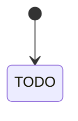

# PLAN — <kebab-name>

Architectural sketch. All four mermaid diagrams + the component table are required.

---

## Component graph

```mermaid
flowchart TB
  classDef agent fill:#0e1e2a,stroke:#7EC8E3,color:#7EC8E3;
  classDef wf fill:#1c1330,stroke:#A855F7,color:#A855F7;
  classDef ese fill:#1f1900,stroke:#F5C518,color:#F5C518;
  classDef view fill:#0e2010,stroke:#3fb950,color:#3fb950;
  classDef cons fill:#251503,stroke:#F97316,color:#F97316;
  classDef ta fill:#1a1c20,stroke:#aab3bd,color:#aab3bd;
  classDef ep fill:#161616,stroke:#fff,color:#fff;

  %% TODO — nodes per component
```

## Interaction sequence

```mermaid
sequenceDiagram
  autonumber
  %% TODO — primary user-journey sequence with Note over blocks for paused states
```

## State machine



## Entity model

```mermaid
erDiagram
  %% TODO — entities, events emitted, view projections
```

## Component table

| Component | Path (generated) |
|---|---|
| TODO | `application/<Component>.java` |

## Concurrency notes

- TODO — timeouts (step-level and workflow-level)
- TODO — idempotency keys
- TODO — saga/compensation logic if any
