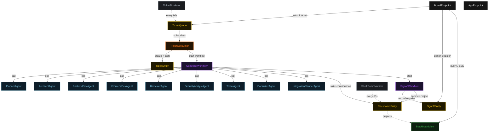
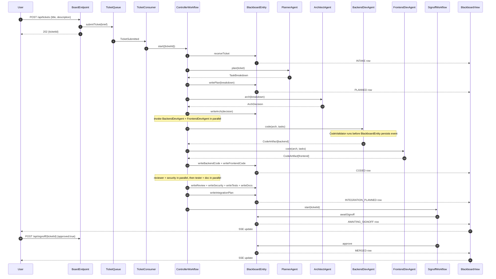
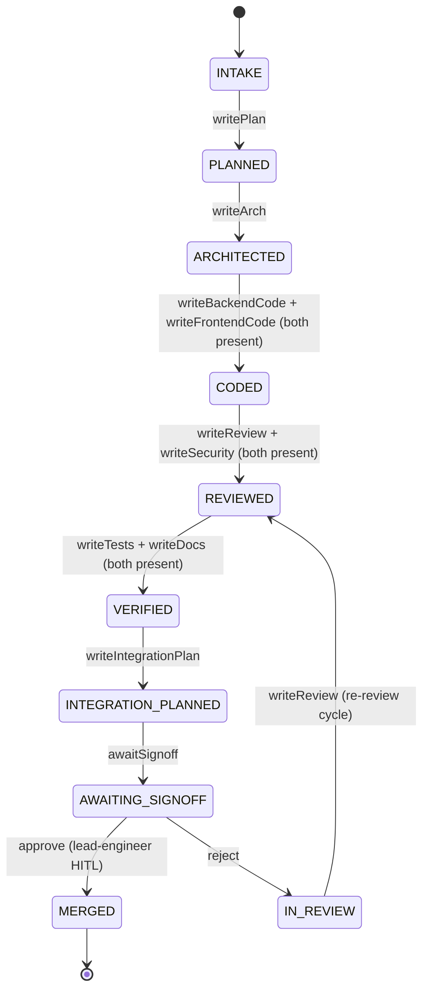
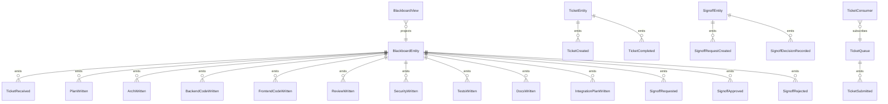

# PLAN — blackboard-swe-coordination

Architectural sketch consumed by `/akka:plan` (or skipped if `/akka:specify` covers it). Diagrams are rendered on the generated system's Architecture tab with the Akka theme variables and the Lesson 24 state-label CSS overrides.

---

## Component graph

Solid arrows are synchronous commands; dashed arrows are event subscriptions and scheduled ticks. The nine specialist agents are all distinct `AutonomousAgent` classes, each with its own `BoardTasks` constant. The `ControllerWorkflow` is the only component that calls agents; specialists never communicate directly.

## Interaction sequence — J1 (happy path)

## State machine — `BlackboardEntity`

## Entity model

## Component table — Java file targets

| Component | Path (generated) |
|---|---|
| `PlannerAgent` | `application/PlannerAgent.java` |
| `ArchitectAgent` | `application/ArchitectAgent.java` |
| `BackendDevAgent` | `application/BackendDevAgent.java` |
| `FrontendDevAgent` | `application/FrontendDevAgent.java` |
| `ReviewerAgent` | `application/ReviewerAgent.java` |
| `SecurityAnalystAgent` | `application/SecurityAnalystAgent.java` |
| `TesterAgent` | `application/TesterAgent.java` |
| `DocWriterAgent` | `application/DocWriterAgent.java` |
| `IntegrationPlannerAgent` | `application/IntegrationPlannerAgent.java` |
| `BoardTasks` | `application/BoardTasks.java` |
| `CodeValidator` | `application/CodeValidator.java` |
| `ControllerWorkflow` | `application/ControllerWorkflow.java` |
| `SignoffWorkflow` | `application/SignoffWorkflow.java` |
| `BlackboardEntity` | `application/BlackboardEntity.java` (state in `domain/Blackboard.java`, events in `domain/BlackboardEvent.java`) |
| `TicketEntity` | `application/TicketEntity.java` (state in `domain/Ticket.java`) |
| `SignoffEntity` | `application/SignoffEntity.java` |
| `TicketQueue` | `application/TicketQueue.java` |
| `BlackboardView` | `application/BlackboardView.java` |
| `TicketConsumer` | `application/TicketConsumer.java` |
| `TicketSimulator` | `application/TicketSimulator.java` |
| `StuckBoardMonitor` | `application/StuckBoardMonitor.java` |
| `BoardEndpoint` | `api/BoardEndpoint.java` |
| `AppEndpoint` | `api/AppEndpoint.java` |
| `Bootstrap` | `Bootstrap.java` |

Akka component count: **9 autonomous-agent · 2 workflow · 4 event-sourced-entity · 1 view · 1 consumer · 2 timed-action · 2 http-endpoint · 1 service-setup**.

## Concurrency notes

- **Single blackboard writer.** `BlackboardEntity` is a single-writer EventSourcedEntity. All specialist writes are serialised through it — no two specialists can corrupt the board by writing simultaneously.
- **Before-state-write guardrail.** The `BlackboardEntity.writeBackendCode` and `writeBackendCode` command handlers call `CodeValidator` before emitting the event. A failing validation returns an error reply; the controller logs it and retries the agent once with the validation message.
- **Parallel agent invocation.** `ControllerWorkflow.codeStep` invokes `BackendDevAgent` and `FrontendDevAgent` concurrently; `reviewStep` invokes `ReviewerAgent` and `SecurityAnalystAgent` concurrently; `verifyStep` invokes `TesterAgent` and `DocWriterAgent` concurrently. Each parallel pair waits for both results before the step completes.
- **HITL pause.** `SignoffWorkflow.waitStep` pauses the workflow durably. The board stays in `AWAITING_SIGNOFF` indefinitely until a human POSTs a decision. No polling, no timeout — the decision is a durable external event.
- **Rejection cycle.** On rejection, the controller re-enters from `reviewStep`, allowing the reviewer and security analyst to re-examine the board with any new context. This avoids re-running the planner and architect.
- **Stuck detection.** `StuckBoardMonitor` uses a wall-clock check against `createdAt` on the board row. It does not force state transitions — it only marks `stuckAlert` so an operator can investigate.
- **Step timeouts.** All agent-calling steps set explicit timeouts (90–120 s) to prevent the default 5 s timeout from expiring mid-LLM-call (Lesson 4).
- **Dependency ordering.** Stages encode the dependency graph: backend and frontend code cannot start until architecture is written; review cannot start until both code layers are present. No runtime dependency check is needed — the stage machine enforces it.
