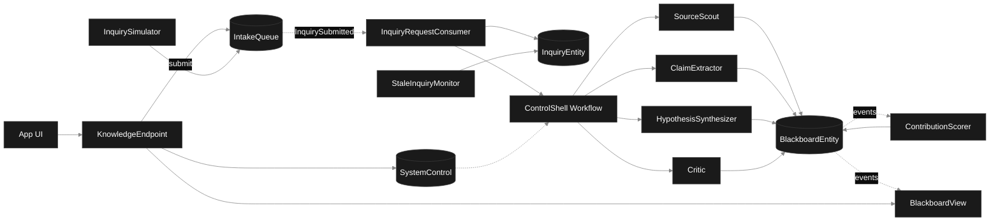
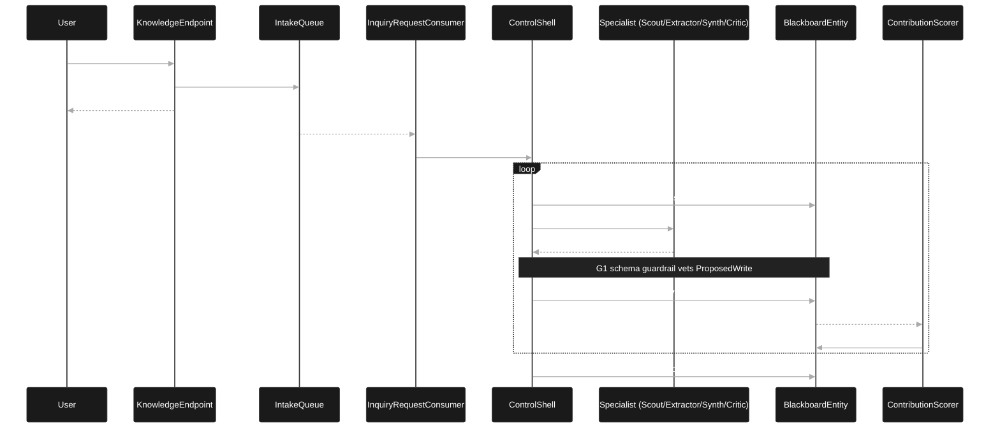
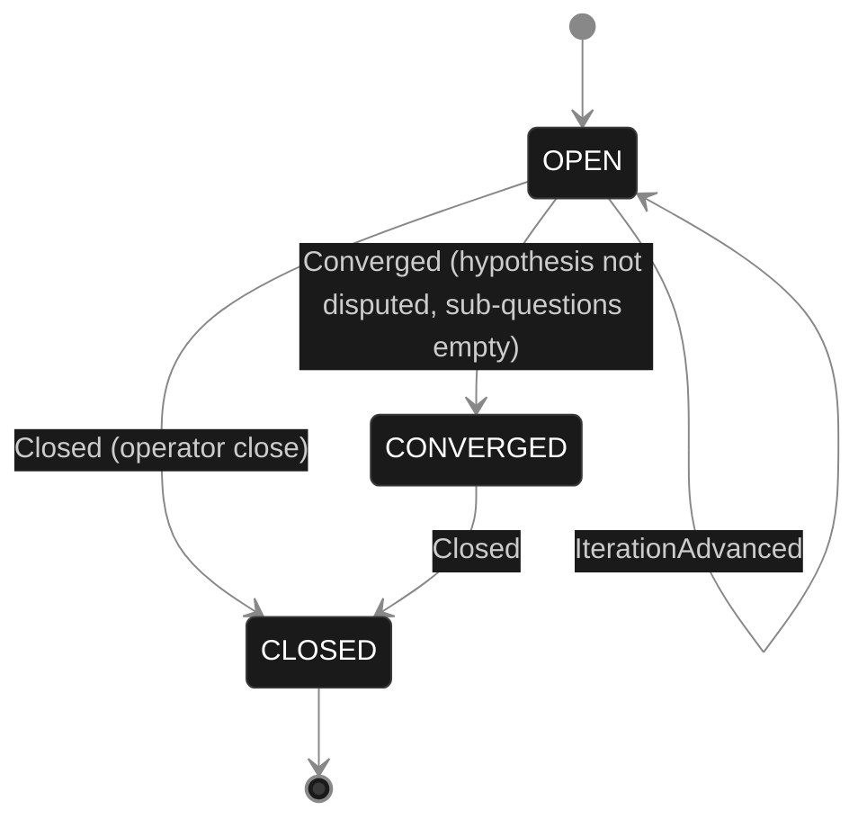
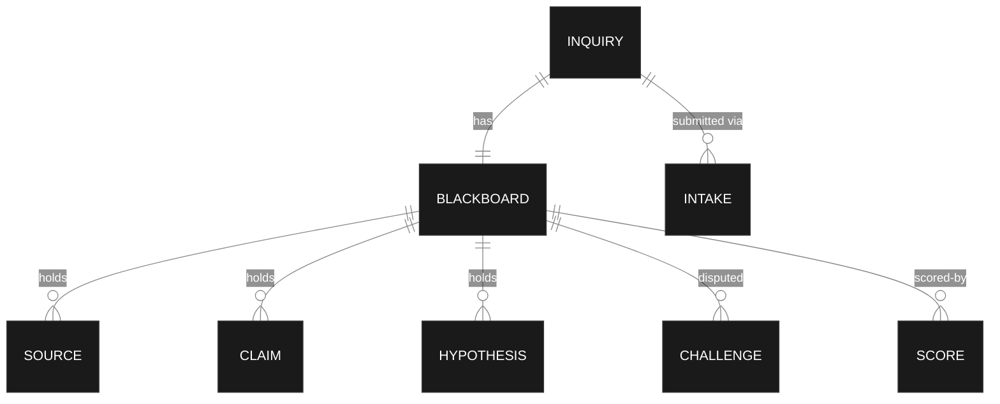

# Blackboard Knowledge Discovery — PLAN

## Component graph

Solid arrows are synchronous commands; dashed arrows are event subscriptions and scheduled ticks. `ControlShell` runs one instance per active inquiry; it never invokes another specialist's workflow — it reads the blackboard, picks a specialist, runs it, and commits the result.

## Interaction sequence — J1 (happy path)

## State machine — `BlackboardEntity`

> CSS overrides (Lesson 24): `.stateLabel { fill: #ffffff !important; color: #ffffff !important; }` and `g.edgeLabel foreignObject { overflow: visible; }` and `g.edgeLabel { color: #cccccc !important; }`. Without these the state names render dark-on-dark and transition labels clip.

## Entity model

- `BlackboardEntity` emits 10 event types; projected by `BlackboardView`
- `InquiryEntity` emits 5 event types
- `IntakeQueue` emits `InquirySubmitted`; consumed by `InquiryRequestConsumer`
- `ContributionScorer` subscribes to `BlackboardEntity` events and writes `ContributionScore` back

## Component table — Java file targets

| Component | Path |
|---|---|
| ControlShell | application/ControlShell.java |
| SourceScout | application/SourceScout.java |
| ClaimExtractor | application/ClaimExtractor.java |
| HypothesisSynthesizer | application/HypothesisSynthesizer.java |
| Critic | application/Critic.java |
| SchemaValidator | application/SchemaValidator.java |
| BlackboardEntity | application/BlackboardEntity.java (+ domain/Blackboard.java, domain/BlackboardEvent.java) |
| InquiryEntity | application/InquiryEntity.java (+ domain/Inquiry.java, domain/InquiryEvent.java) |
| IntakeQueue | application/IntakeQueue.java |
| SystemControl | application/SystemControl.java |
| BlackboardView | application/BlackboardView.java |
| InquiryRequestConsumer | application/InquiryRequestConsumer.java |
| ContributionScorer | application/ContributionScorer.java |
| InquirySimulator | application/InquirySimulator.java |
| StaleInquiryMonitor | application/StaleInquiryMonitor.java |
| KnowledgeEndpoint | api/KnowledgeEndpoint.java |
| AppEndpoint | api/AppEndpoint.java |
| Bootstrap | Bootstrap.java |

**Akka component count:** 4 autonomous-agent · 1 workflow · 3 event-sourced-entity · 1 key-value-entity · 1 view · 2 consumer · 2 timed-action · 2 http-endpoint · 1 service-setup

## Concurrency notes
- **Single-writer is the pattern.** `BlackboardEntity` serialises every accepted write. `ControlShell` issues one commit at a time; no two specialists race because the shell, not the specialists, drives writes.
- **Schema guardrail before commit.** `SchemaValidator` checks every `ProposedWrite` before the entity command runs. Malformed writes emit `WriteRejected`; entity state never sees the bad payload (control G1).
- **Specialist selection.** `ControlShell.selectStep` reads current `Blackboard` plus recent `ContributionScore`s. Selection rule: open sub-question without claims → `ClaimExtractor`; sources thin → `SourceScout`; enough claims, no live hypothesis → `HypothesisSynthesizer`; hypothesis present, not yet critiqued → `Critic`. Specialist whose last 3 scores fall below threshold is benched (control E1 feedback).
- **Workflow step timeouts.** `ControlShell.invokeSpecialistStep` carries an explicit 90 s `stepTimeout` (Lesson 4). Default 5 s would expire mid-LLM call.
- **Idle inquiries.** `ControlShell.tickStep` self-schedules a 5 s resume timer when halted or no eligible specialist remains, so an idle inquiry is a paused workflow, not a busy loop.
- **Liveness.** `StaleInquiryMonitor` closes an inquiry whose `Blackboard.lastWriteAt` is older than 5 min so a stuck control shell does not strand the inquiry.
- **Convergence rule.** `ControlShell.convergenceStep` checks: at least one hypothesis exists, the latest hypothesis is not in `disputed`, every entry in `openSubQuestions` has at least one supporting claim, iteration budget not exhausted. On true, commits `Converged` and `ReportRecorded`.
- **Halt.** `SystemControl.halted` is read at the top of `tickStep` and inside `SchemaValidator`; halt both stops new specialist invocations and rejects in-flight writes until resume.
- **Idempotency.** Deterministic `claimId` (inquiryId + ":c:" + index) and `hypothesisId` (inquiryId + ":h:" + index) make the commit retryable if `invokeSpecialistStep` retries after a network blip.
