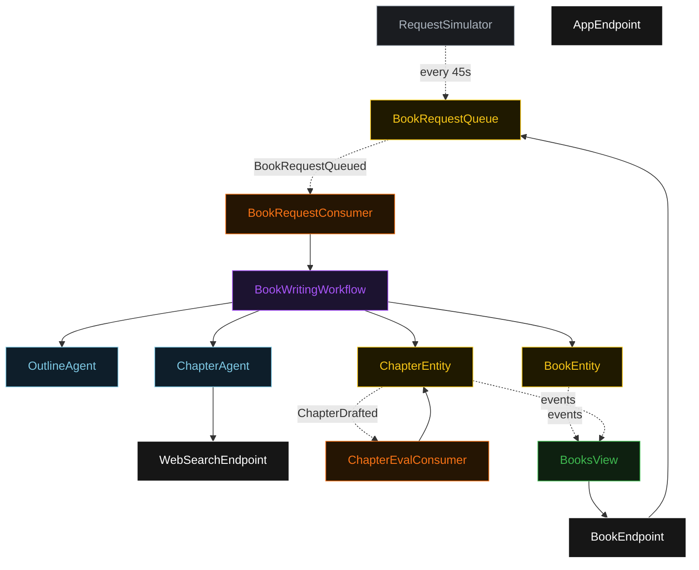
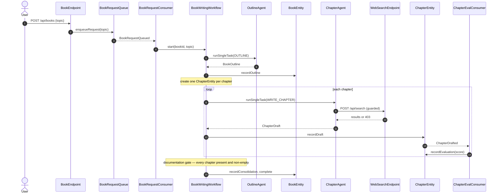
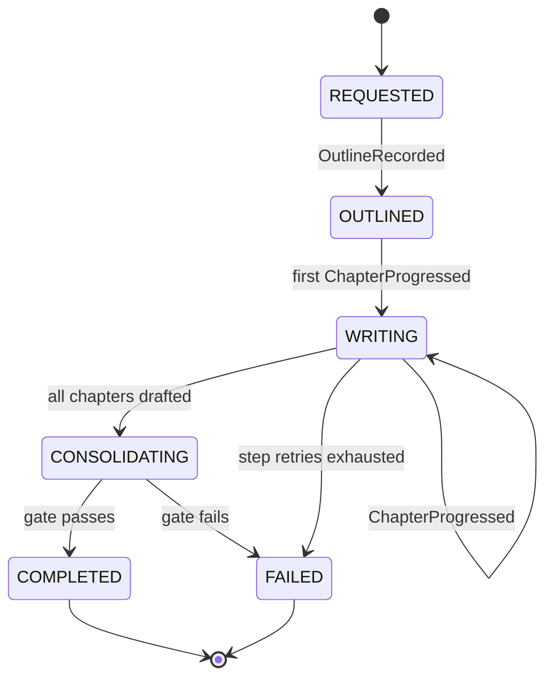
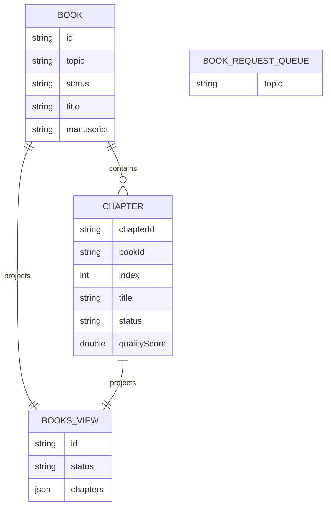

# PLAN — book-writer-fanout

Architectural sketch. All four mermaid diagrams render on the Architecture tab with the Lesson-24 theme variables and CSS overrides for state and edge labels.

---

## Component graph

Solid arrows are synchronous commands; dashed arrows are event subscriptions; dotted arrows are scheduled ticks.

## Interaction sequence

## State machine

## Entity model

## Component table

| Component | Kind | Path (generated) |
|---|---|---|
| OutlineAgent | AutonomousAgent | `application/OutlineAgent.java` |
| ChapterAgent | AutonomousAgent | `application/ChapterAgent.java` |
| BookWritingTasks | task definitions | `application/BookWritingTasks.java` |
| BookWritingWorkflow | Workflow | `application/BookWritingWorkflow.java` |
| BookEntity | EventSourcedEntity | `application/BookEntity.java` |
| ChapterEntity | EventSourcedEntity | `application/ChapterEntity.java` |
| BookRequestQueue | EventSourcedEntity | `application/BookRequestQueue.java` |
| BooksView | View | `application/BooksView.java` |
| BookRequestConsumer | Consumer | `application/BookRequestConsumer.java` |
| ChapterEvalConsumer | Consumer | `application/ChapterEvalConsumer.java` |
| RequestSimulator | TimedAction | `application/RequestSimulator.java` |
| WebSearchEndpoint | HttpEndpoint | `api/WebSearchEndpoint.java` |
| BookEndpoint | HttpEndpoint | `api/BookEndpoint.java` |
| AppEndpoint | HttpEndpoint | `api/AppEndpoint.java` |
| Bootstrap | service-setup | `Bootstrap.java` |
| Book, Chapter, BookStatus, ChapterStatus, events | domain | `domain/*.java` |

## Concurrency notes

- **Step timeouts.** `outlineStep`, `writeChaptersStep`, and `consolidateStep` each call agents; set `stepTimeout(120s)` per step (Lesson 4). `writeChaptersStep` drafts chapters sequentially, so its budget covers all chapters in one book — for the canned 3–5 chapter outlines this stays within 120s; for larger outlines split into one step per chapter keyed by index.
- **Idempotency.** ChapterEntity ids are deterministic (`chapter-{bookId}-{index}`), so a workflow retry re-targets the same chapter rather than creating duplicates. `recordDraft` is a no-op when the chapter is already `DRAFTED`.
- **Eval is non-blocking.** ChapterEvalConsumer scores out of band; `consolidateStep` reads whatever score is present and treats a missing score as unscored, never blocking on it. The blocking gate is completeness (every chapter has non-empty markdown), realised in `consolidateStep`.
- **Compensation.** A failed completeness gate records `BookFailed` with a reason rather than leaving the book mid-flight; `defaultStepRecovery(maxRetries(2).failoverTo(error))` routes exhausted retries to the same terminal failure.
