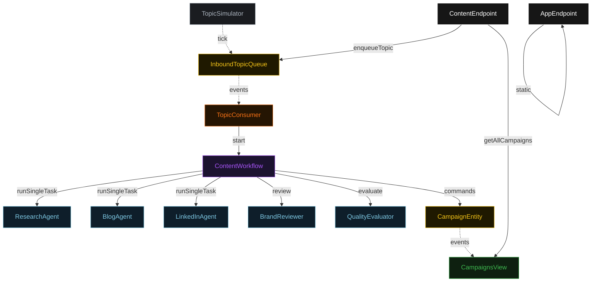
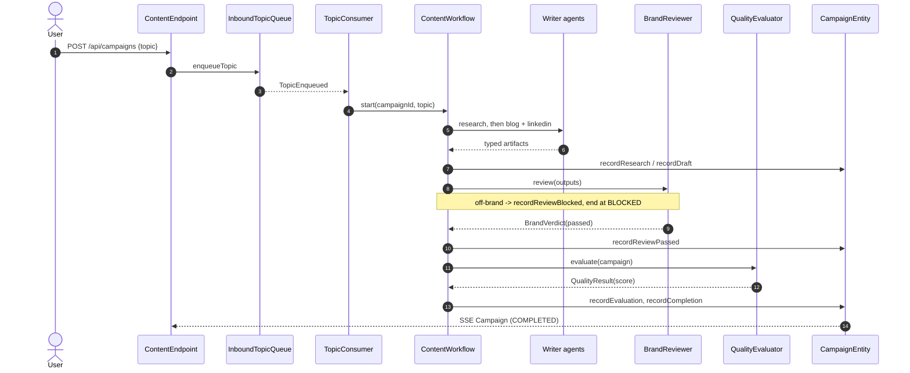
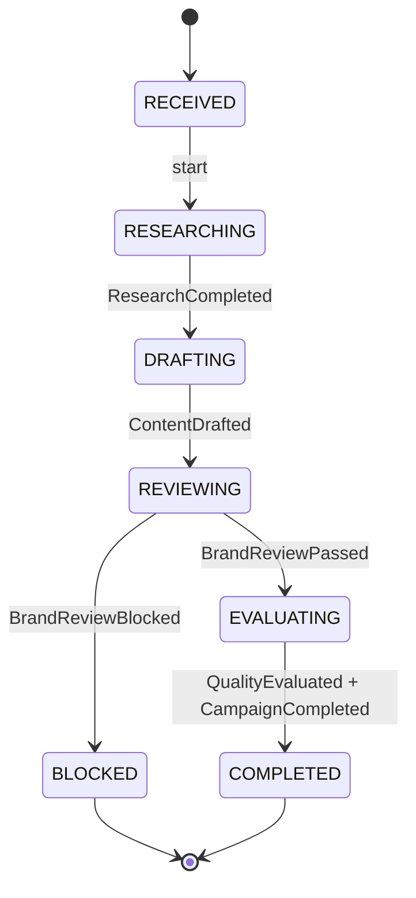
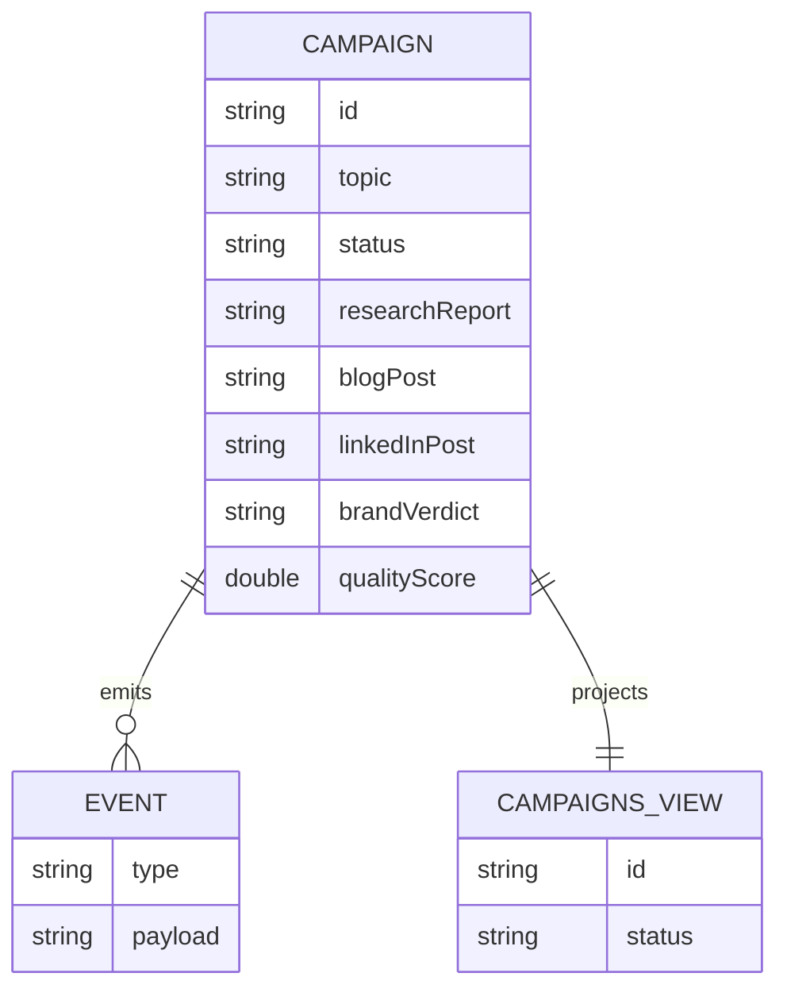

# PLAN — content-creator-flow

Architectural sketch. All four mermaid diagrams + the component table. The generated system renders these on the Architecture tab with the Lesson 24 theme variables and CSS overrides.

---

## Component graph

## Interaction sequence

## State machine

## Entity model

## Component table

| Component | Path (generated) |
|---|---|
| ResearchAgent | `application/ResearchAgent.java` |
| BlogAgent | `application/BlogAgent.java` |
| LinkedInAgent | `application/LinkedInAgent.java` |
| BrandReviewer | `application/BrandReviewer.java` |
| QualityEvaluator | `application/QualityEvaluator.java` |
| ContentTasks | `application/ContentTasks.java` |
| ContentWorkflow | `application/ContentWorkflow.java` |
| CampaignEntity | `domain/CampaignEntity.java` |
| InboundTopicQueue | `domain/InboundTopicQueue.java` |
| CampaignsView | `application/CampaignsView.java` |
| TopicConsumer | `application/TopicConsumer.java` |
| TopicSimulator | `application/TopicSimulator.java` |
| ContentEndpoint | `api/ContentEndpoint.java` |
| AppEndpoint | `api/AppEndpoint.java` |

## Concurrency notes

- **Step timeouts.** Every workflow step that calls an agent overrides the 5s default to 60s (Lesson 4): `researchStep`, `draftStep`, `reviewStep`, `evaluateStep`. `defaultStepRecovery(maxRetries(2).failoverTo(error))`.
- **Idempotency.** The campaign id is the workflow id; re-delivering a `TopicEnqueued` event with the same id is a no-op because the workflow is already started. The Consumer derives a deterministic id from the queue event offset where possible, otherwise a fresh UUID per topic.
- **No saga/compensation.** The pipeline is forward-only. The `BLOCKED` terminal state is a normal end, not a compensation — no outputs are published, so nothing needs rolling back.
- **View indexing.** `CampaignsView` exposes one query (`getAllCampaigns`) with no enum `WHERE` clause; status filtering happens client-side in the endpoint (Lesson 2).
