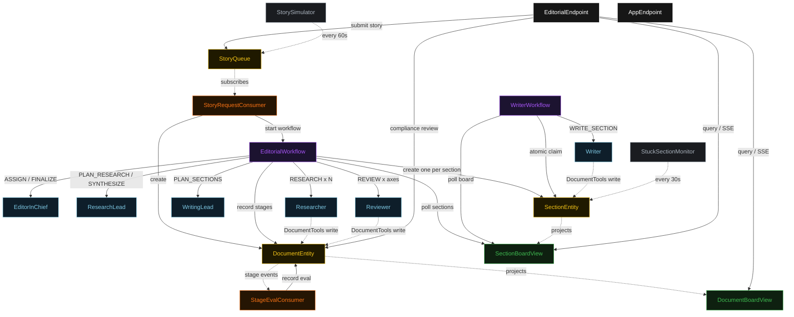
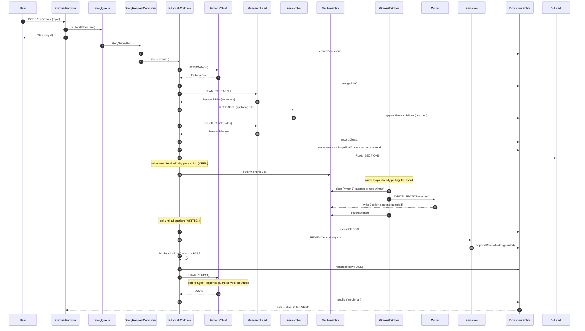
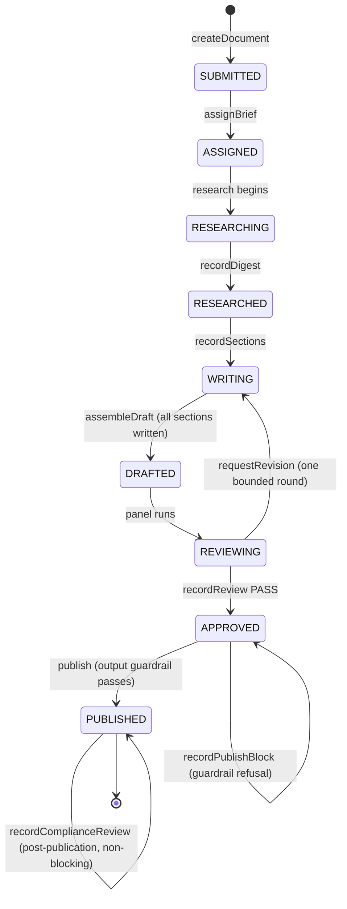
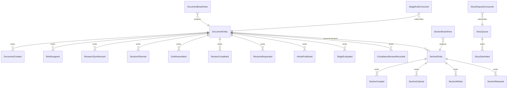

# PLAN — editorial-desk

Architectural sketch consumed by `/akka:plan` (or skipped if `/akka:specify` covers it). Diagrams are rendered on the generated system's Architecture tab with the Akka theme variables and the Lesson 24 state-label CSS overrides.

---

## Component graph



Solid arrows are synchronous commands; dashed arrows are event subscriptions, scheduled ticks, and guarded tool writes. `Researcher`, `Writer`, and `Reviewer` are each one agent class run as several instances — researcher instances per subtopic, `writer-1`/`writer-2`, and one reviewer per axis (`factcheck`, `style`, `legal`). The top-level `EditorialWorkflow` is the editor-in-chief; the three desks each run a different internal coordination capability: research delegates and fans in, writing is a team over the shared `SectionBoardView`, review is a moderated panel feeding `ModerationRule`.

## Interaction sequence — J1 (happy path)



## State machine — `DocumentEntity`



## Entity model



## Component table — Java file targets

| Component | Path (generated) |
|---|---|
| `EditorInChief` | `application/EditorInChief.java` |
| `ResearchLead` | `application/ResearchLead.java` |
| `Researcher` | `application/Researcher.java` |
| `WritingLead` | `application/WritingLead.java` |
| `Writer` | `application/Writer.java` |
| `Reviewer` | `application/Reviewer.java` |
| `EditorialTasks` | `application/EditorialTasks.java` |
| `DocumentTools` | `application/DocumentTools.java` |
| `ModerationRule` | `application/ModerationRule.java` |
| `StageEvaluator` | `application/StageEvaluator.java` |
| `EditorialWorkflow` | `application/EditorialWorkflow.java` |
| `WriterWorkflow` | `application/WriterWorkflow.java` |
| `DocumentEntity` | `application/DocumentEntity.java` (state in `domain/Document.java`, events in `domain/DocumentEvent.java`) |
| `SectionEntity` | `application/SectionEntity.java` (state in `domain/Section.java`, events in `domain/SectionEvent.java`) |
| `StoryQueue` | `application/StoryQueue.java` |
| `DocumentBoardView` | `application/DocumentBoardView.java` |
| `SectionBoardView` | `application/SectionBoardView.java` |
| `StoryRequestConsumer` | `application/StoryRequestConsumer.java` |
| `StageEvalConsumer` | `application/StageEvalConsumer.java` |
| `StorySimulator` | `application/StorySimulator.java` |
| `StuckSectionMonitor` | `application/StuckSectionMonitor.java` |
| `EditorialEndpoint` | `api/EditorialEndpoint.java` |
| `AppEndpoint` | `api/AppEndpoint.java` |
| `Bootstrap` | `Bootstrap.java` |

Akka component count: **6 autonomous-agent · 2 workflow · 3 event-sourced-entity · 2 view · 2 consumer · 2 timed-action · 2 http-endpoint · 1 service-setup**.

## Concurrency notes

- **Two coordination primitives sit under one pipeline.** The top-level `EditorialWorkflow` is a sequential delegation: each stage runs and writes its result onto the shared `DocumentEntity` before the next begins. The writing stage hands off to an independent team: the workflow seeds the board and then waits, while the per-writer `WriterWorkflow` loops claim and fill sections on their own clock.
- **Atomic claim is the writing-team primitive.** `SectionEntity` is a single-writer; `claim(writerId)` emits `SectionClaimed` only when the current status is `OPEN`. Two writer workflows that read the same `OPEN` section from the board and both call `claim` are serialised by the entity — the first wins, the second receives the already-claimed `Section` and returns to polling. No lock, no external queue.
- **The writing wait is a poll, not a block.** `EditorialWorkflow.writingStep` queries `SectionBoardView` for this story's sections; if any are not `WRITTEN`, it self-schedules a 5 s resume timer and pauses. An idle writing stage is a paused workflow, not a busy loop.
- **Workflow step timeouts:** every step that calls an agent sets an explicit `stepTimeout` (Lesson 4) — `briefStep` 60 s, `researchStep` 120 s (it fans out several researcher calls), `reviewStep` 90 s, `publishStep` 60 s, and `WriterWorkflow.writeStep` 90 s. The default 5 s timeout would expire mid-LLM-call.
- **Bounded revision loop.** A `REVISE` verdict resets the named sections to `OPEN` and returns the document to `WRITING`, but only once (`revisionCount < 1`); a second `REVISE` accepts the draft and proceeds to publish, so the pipeline always terminates.
- **The output guardrail can stall, not crash.** If the G1 before-agent-response guardrail refuses the final article, `publishStep` records the block and ends with the document left `APPROVED`; nothing is published and the reason is visible in the UI.
- **Release for liveness:** `StuckSectionMonitor` returns a section claimed-but-idle for more than two minutes to `OPEN`, so a writer that fails mid-section does not strand the board. `release` is a no-op unless the section is `CLAIMED`.
- **The stage eval is downstream and non-blocking.** `StageEvalConsumer` subscribes to `DocumentEntity` events and records a `StageEval` after a stage result lands; it never gates the pipeline (control E1).
- **Compliance review is on the loop.** `recordComplianceReview` is accepted only when the document is `PUBLISHED` and never changes that status (control HO1).
- **Idempotency:** deterministic `sectionId = storyId + "-s" + index` makes `createSection` idempotent if `writingStep` is retried; `storyId` is the `EditorialWorkflow` id so a redelivered `StorySubmitted` starts the same workflow, not a duplicate.
```
