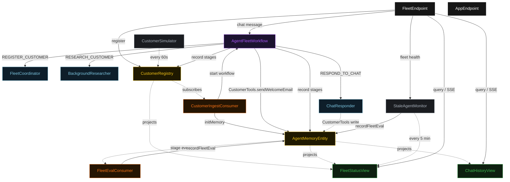
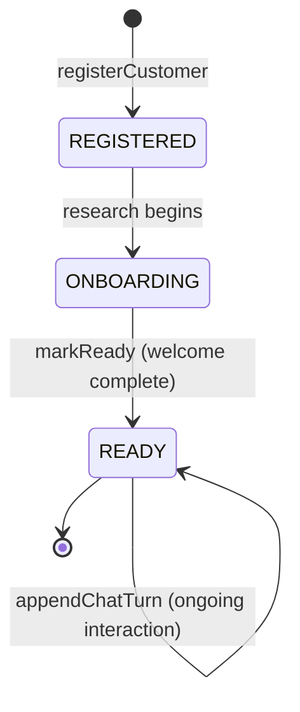
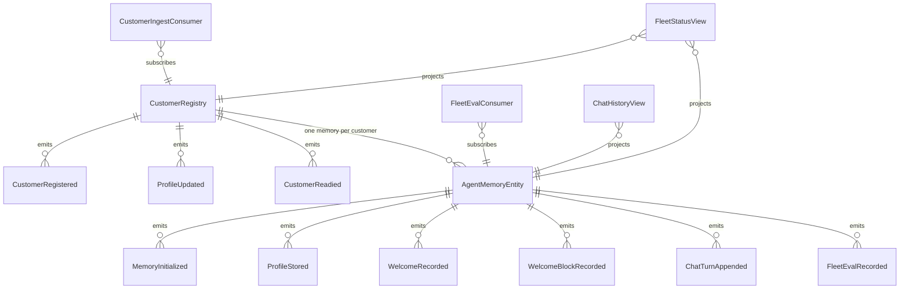

# PLAN — per-tenant-agent-fleet

Architectural sketch consumed by `/akka:plan` (or skipped if `/akka:specify` covers it). Diagrams are rendered on the generated system's Architecture tab with the Akka theme variables and the Lesson 24 state-label CSS overrides.

---

## Component graph



Solid arrows are synchronous commands; dashed arrows are event subscriptions, scheduled ticks, and guarded tool writes. `BackgroundResearcher` and `ChatResponder` are each one agent class run as one instance per customer (addressed by `customerId`). The `FleetCoordinator` is a single shared instance ("fleet") acting as the control plane. The `AgentFleetWorkflow` is the per-customer durable pipeline; after it reaches `READY`, each incoming `ChatMessage` resumes the workflow's `chatStep`.

## Interaction sequence — J1 (happy path)

```mermaid
sequenceDiagram
  autonumber
  participant U as User
  participant API as FleetEndpoint
  participant R as CustomerRegistry
  participant C as CustomerIngestConsumer
  participant WF as AgentFleetWorkflow
  participant FC as FleetCoordinator
  participant BR as BackgroundResearcher
  participant MEM as AgentMemoryEntity
  participant CT as CustomerTools
  participant CR as ChatResponder

  U->>API: POST /api/customers {name, email, tier}
  Note over API: PiiSanitizer strips sensitive fields
  API->>R: registerCustomer(brief)
  API-->>U: 202 {customerId}
  R->>C: CustomerRegistered
  C->>MEM: initMemory
  C->>WF: start({customerId})
  WF->>FC: REGISTER_CUSTOMER(brief)
  FC-->>WF: FleetEntry{status=SPAWNING}
  WF->>BR: RESEARCH_CUSTOMER(record)
  BR-->>WF: CustomerProfile
  WF->>MEM: storeProfile
  WF->>R: updateProfile
  WF->>CT: sendWelcomeEmail (guarded by G1)
  Note over CT: before-tool-call guardrail vets recipient + body
  CT-->>WF: WelcomeSendResult{sent=true}
  WF->>MEM: recordWelcome
  WF->>R: markReady
  Note over WF: stage enters READY; waits for chat
  MEM->>EvalC: WelcomeRecorded event
  Note over EvalC: FleetEvaluator scores welcome stage
  U->>API: POST /api/customers/{id}/chat {content}
  Note over API: PiiSanitizer strips sensitive fields
  API->>WF: resume chatStep(message)
  WF->>CR: RESPOND_TO_CHAT(message, memory)
  CR-->>WF: ChatReply
  WF->>MEM: appendChatTurn
  WF-->>API: ChatReply
  API-->>U: 200 {reply}
  R-->>API: SSE status=READY
```

## State machine — `CustomerRegistry`



## Entity model



## Component table — Java file targets

| Component | Path (generated) |
|---|---|
| `FleetCoordinator` | `application/FleetCoordinator.java` |
| `BackgroundResearcher` | `application/BackgroundResearcher.java` |
| `ChatResponder` | `application/ChatResponder.java` |
| `FleetTasks` | `application/FleetTasks.java` |
| `CustomerTools` | `application/CustomerTools.java` |
| `PiiSanitizer` | `application/PiiSanitizer.java` |
| `FleetEvaluator` | `application/FleetEvaluator.java` |
| `AgentFleetWorkflow` | `application/AgentFleetWorkflow.java` |
| `CustomerRegistry` | `application/CustomerRegistry.java` (state in `domain/Customer.java`, events in `domain/CustomerEvent.java`) |
| `AgentMemoryEntity` | `application/AgentMemoryEntity.java` (state in `domain/AgentMemory.java`, events in `domain/AgentMemoryEvent.java`) |
| `FleetStatusView` | `application/FleetStatusView.java` |
| `ChatHistoryView` | `application/ChatHistoryView.java` |
| `CustomerIngestConsumer` | `application/CustomerIngestConsumer.java` |
| `FleetEvalConsumer` | `application/FleetEvalConsumer.java` |
| `CustomerSimulator` | `application/CustomerSimulator.java` |
| `StaleAgentMonitor` | `application/StaleAgentMonitor.java` |
| `FleetEndpoint` | `api/FleetEndpoint.java` |
| `AppEndpoint` | `api/AppEndpoint.java` |
| `Bootstrap` | `Bootstrap.java` |

Akka component count: **3 autonomous-agent · 1 workflow · 2 event-sourced-entity · 2 view · 2 consumer · 2 timed-action · 2 http-endpoint · 1 service-setup**.

## Concurrency notes

- **One pipeline, one agent per customer.** `AgentFleetWorkflow` is keyed by `customerId`; there is one workflow instance per customer and one `BackgroundResearcher` / `ChatResponder` instance per customer (same key). Two registrations for different customers run fully in parallel; two registrations for the same customer are serialised by the workflow id.
- **Chat resumes the same workflow.** After `readyStep`, the workflow self-suspends. Each `POST /api/customers/{id}/chat` routes through `FleetEndpoint` to the already-running `AgentFleetWorkflow` for that customer, resuming `chatStep`. This means chat turns are serialised per customer without a separate chat workflow.
- **PII sanitization is at the boundary.** `PiiSanitizer` is a synchronous pure function called at `FleetEndpoint` on every inbound payload and at the start of `registerStep` before any agent sees the data. No raw PII enters the workflow or entity state.
- **Guardrail does not cancel the pipeline.** If the G1 before-tool-call guardrail refuses `sendWelcomeEmail`, `welcomeStep` records the block reason via `AgentMemoryEntity.recordWelcomeBlock` and proceeds to `readyStep`. The customer's agent becomes `READY` and can answer chat even though no welcome email was sent. The block is surfaced on the fleet card.
- **Fleet eval is downstream and non-blocking.** `FleetEvalConsumer` subscribes to memory events and records a `FleetEval` after each welcome or chat-turn event; it never gates the workflow (control E1).
- **Stale monitoring is read-only.** `StaleAgentMonitor` reads `FleetStatusView` and records an informational eval; it never modifies `CustomerStatus` or terminates any agent. The deployer consults the health panel to decide on outreach.
- **Workflow step timeouts:** every step that calls an agent sets an explicit `stepTimeout` (Lesson 4) — `registerStep` 30 s, `researchStep` 90 s, `welcomeStep` 60 s, `chatStep` 60 s. The default 5 s timeout would expire mid-LLM-call.
```
