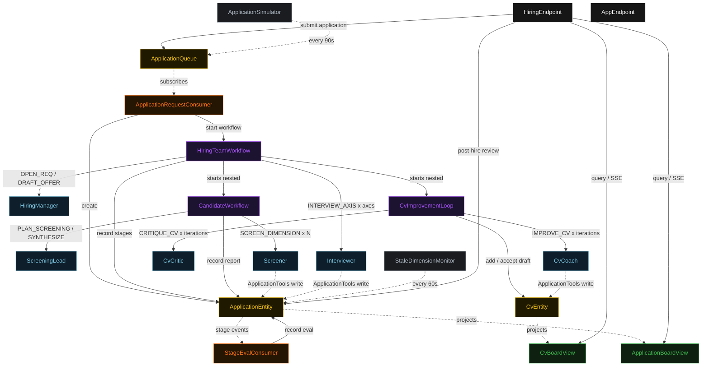
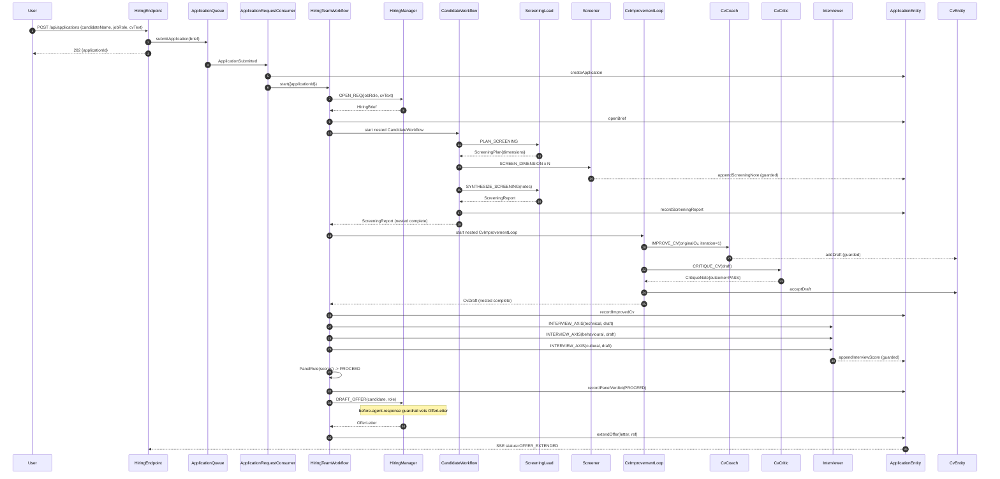
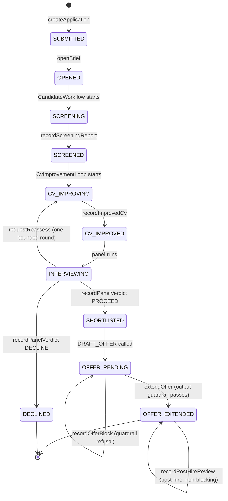
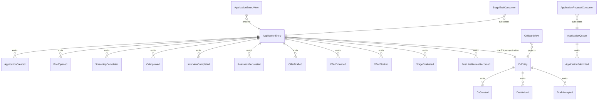

# PLAN — composed-hiring-workflow

Architectural sketch consumed by `/akka:plan` (or skipped if `/akka:specify` covers it). Diagrams are rendered on the generated system's Architecture tab with the Akka theme variables and the Lesson 24 state-label CSS overrides.

---

## Component graph

Solid arrows are synchronous commands; dashed arrows are event subscriptions, scheduled ticks, and guarded tool writes. `Screener` and `Interviewer` are each one agent class run as several instances. The `HiringTeamWorkflow` is the top-level orchestrator; it nests two workflows — `CandidateWorkflow` (screening delegation) and `CvImprovementLoop` (coach-critic feedback) — before running the interview panel (moderation).

## Interaction sequence — J1 (happy path)

## State machine — `ApplicationEntity`

## Entity model

## Component table — Java file targets

| Component | Path (generated) |
|---|---|
| `HiringManager` | `application/HiringManager.java` |
| `ScreeningLead` | `application/ScreeningLead.java` |
| `Screener` | `application/Screener.java` |
| `CvCoach` | `application/CvCoach.java` |
| `CvCritic` | `application/CvCritic.java` |
| `Interviewer` | `application/Interviewer.java` |
| `HiringTasks` | `application/HiringTasks.java` |
| `ApplicationTools` | `application/ApplicationTools.java` |
| `PanelRule` | `application/PanelRule.java` |
| `StageEvaluator` | `application/StageEvaluator.java` |
| `HiringTeamWorkflow` | `application/HiringTeamWorkflow.java` |
| `CandidateWorkflow` | `application/CandidateWorkflow.java` |
| `CvImprovementLoop` | `application/CvImprovementLoop.java` |
| `ApplicationEntity` | `application/ApplicationEntity.java` (state in `domain/Application.java`, events in `domain/ApplicationEvent.java`) |
| `CvEntity` | `application/CvEntity.java` (state in `domain/CvIteration.java`, events in `domain/CvEvent.java`) |
| `ApplicationQueue` | `application/ApplicationQueue.java` |
| `ApplicationBoardView` | `application/ApplicationBoardView.java` |
| `CvBoardView` | `application/CvBoardView.java` |
| `ApplicationRequestConsumer` | `application/ApplicationRequestConsumer.java` |
| `StageEvalConsumer` | `application/StageEvalConsumer.java` |
| `ApplicationSimulator` | `application/ApplicationSimulator.java` |
| `StaleDimensionMonitor` | `application/StaleDimensionMonitor.java` |
| `HiringEndpoint` | `api/HiringEndpoint.java` |
| `AppEndpoint` | `api/AppEndpoint.java` |
| `Bootstrap` | `Bootstrap.java` |

Akka component count: **6 autonomous-agent · 3 workflow · 3 event-sourced-entity · 2 view · 2 consumer · 2 timed-action · 2 http-endpoint · 1 service-setup**.

## Concurrency notes

- **Three coordination capabilities under one pipeline.** `HiringTeamWorkflow` is a sequential orchestrator; it delegates to two nested workflows before running the moderation panel. Each nested workflow has its own state and lifecycle separate from the outer workflow.
- **Nested workflows are bounded sub-pipelines.** `CandidateWorkflow` runs the screening delegation and returns a `ScreeningReport`; `CvImprovementLoop` runs the coach-critic cycle and returns the accepted `CvDraft`. The top-level workflow awaits each nested workflow's completion before proceeding.
- **The coach-critic loop is bounded.** `CvImprovementLoop` increments an `iterationCount` on each pass; at 3 iterations or on a `PASS` critique it accepts the current draft and ends. The pipeline always terminates.
- **Moderation panel under contention.** Three `Interviewer` instances run against the same application concurrently. Each writes its `InterviewScore` via `ApplicationTools`, which is gated by the G1 before-agent-invocation guardrail. `PanelRule` is a deterministic pure function — no LLM call — so the verdict is reproducible.
- **Workflow step timeouts.** Every step that calls an agent sets an explicit `stepTimeout` (Lesson 4) — `openStep` 60 s, `screenStep` 180 s (nests `CandidateWorkflow`), `improveStep` 180 s (nests `CvImprovementLoop`), `interviewStep` 120 s (fans out three interviewer calls), `offerStep` 60 s. `coachStep` and `criticStep` inside `CvImprovementLoop` each set 90 s and 60 s respectively.
- **The output guardrail can stall, not crash.** If the G2 before-agent-response guardrail refuses the `OfferLetter`, `offerStep` records the block and ends with the application left `OFFER_PENDING`; nothing is extended and the reason is visible in the UI.
- **Release for liveness.** `StaleDimensionMonitor` resets a screening dimension idle for more than three minutes to `OPEN` so a failed screener does not strand the pipeline.
- **The stage eval is downstream and non-blocking.** `StageEvalConsumer` subscribes to `ApplicationEntity` events and records a `StageEval` after each stage result lands; it never gates the pipeline (control E1).
- **Post-hire review is on the loop.** `recordPostHireReview` is accepted only when the application is `OFFER_EXTENDED` and never changes that status (control HO1).
- **Idempotency.** Deterministic `dimensionId = applicationId + "-d" + index` makes `appendScreeningDimension` idempotent if `planStep` is retried; `applicationId` is the `HiringTeamWorkflow` id so a redelivered `ApplicationSubmitted` starts the same workflow, not a duplicate.
