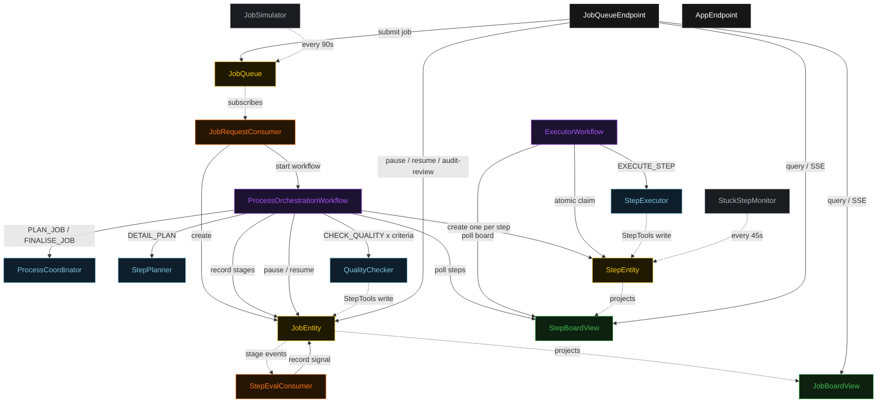
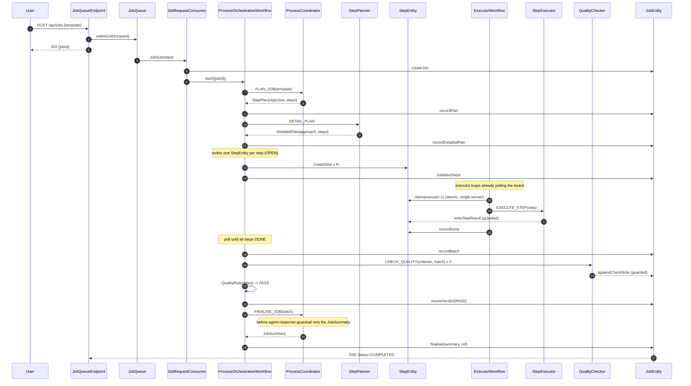
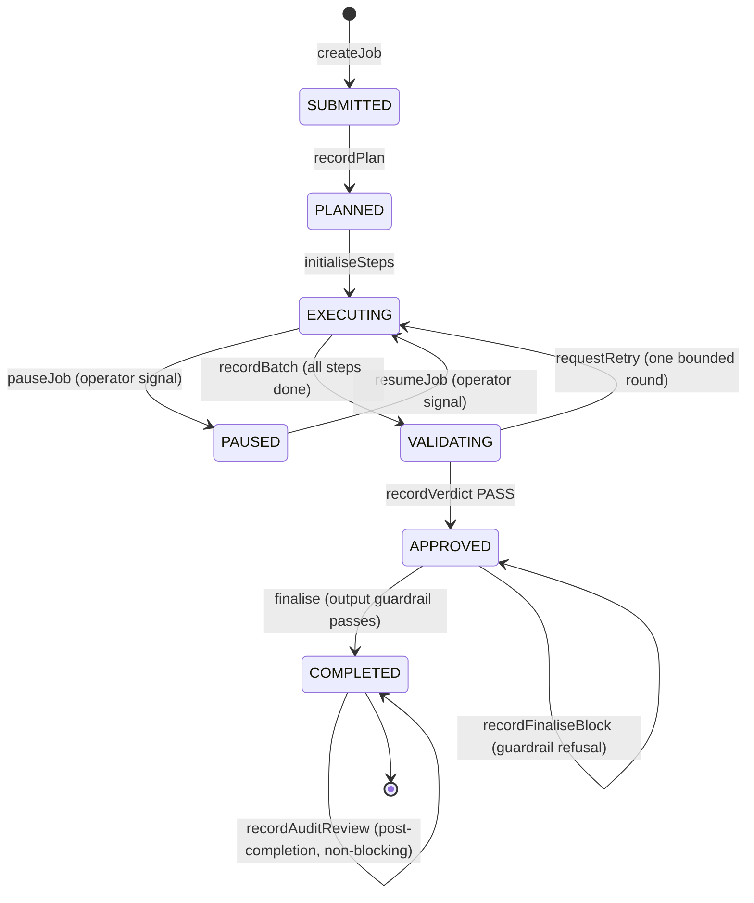
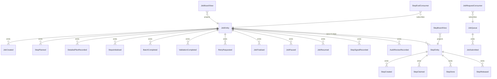

# PLAN — sk-process

Architectural sketch consumed by `/akka:plan` (or skipped if `/akka:specify` covers it). Diagrams are rendered on the generated system's Architecture tab with the Akka theme variables and the Lesson 24 state-label CSS overrides.

---

## Component graph

Solid arrows are synchronous commands; dashed arrows are event subscriptions, scheduled ticks, and guarded tool writes. `StepExecutor` and `QualityChecker` are each one agent class run as several instances — `executor-1`/`executor-2`/`executor-3` and one checker per criterion (`format`, `completeness`, `policy`). The top-level `ProcessOrchestrationWorkflow` is the coordinator; the three desks each run a different internal coordination capability: planning delegates to the planner agent, execution is a team over the shared `StepBoardView`, validation is a moderated panel feeding `QualityRule`.

## Interaction sequence — J1 (happy path)

## State machine — `JobEntity`

## Entity model

## Component table — Java file targets

| Component | Path (generated) |
|---|---|
| `ProcessCoordinator` | `application/ProcessCoordinator.java` |
| `StepPlanner` | `application/StepPlanner.java` |
| `StepExecutor` | `application/StepExecutor.java` |
| `QualityChecker` | `application/QualityChecker.java` |
| `ProcessTasks` | `application/ProcessTasks.java` |
| `StepTools` | `application/StepTools.java` |
| `QualityRule` | `application/QualityRule.java` |
| `StepEvaluator` | `application/StepEvaluator.java` |
| `ProcessOrchestrationWorkflow` | `application/ProcessOrchestrationWorkflow.java` |
| `ExecutorWorkflow` | `application/ExecutorWorkflow.java` |
| `JobEntity` | `application/JobEntity.java` (state in `domain/Job.java`, events in `domain/JobEvent.java`) |
| `StepEntity` | `application/StepEntity.java` (state in `domain/Step.java`, events in `domain/StepEvent.java`) |
| `JobQueue` | `application/JobQueue.java` |
| `JobBoardView` | `application/JobBoardView.java` |
| `StepBoardView` | `application/StepBoardView.java` |
| `JobRequestConsumer` | `application/JobRequestConsumer.java` |
| `StepEvalConsumer` | `application/StepEvalConsumer.java` |
| `JobSimulator` | `application/JobSimulator.java` |
| `StuckStepMonitor` | `application/StuckStepMonitor.java` |
| `JobQueueEndpoint` | `api/JobQueueEndpoint.java` |
| `AppEndpoint` | `api/AppEndpoint.java` |
| `Bootstrap` | `Bootstrap.java` |

Akka component count: **4 autonomous-agent · 2 workflow · 3 event-sourced-entity · 2 view · 2 consumer · 2 timed-action · 2 http-endpoint · 1 service-setup**.

## Concurrency notes

- **Two coordination primitives sit under one pipeline.** The top-level `ProcessOrchestrationWorkflow` is sequential delegation: each stage runs and writes its result onto the shared `JobEntity` before the next begins. The execution stage hands off to an independent team: the workflow seeds the board and then waits, while the per-executor `ExecutorWorkflow` loops claim and fill steps on their own clock.
- **Atomic claim is the execution-team primitive.** `StepEntity` is a single-writer; `claim(executorId)` emits `StepClaimed` only when the current status is `OPEN`. Two executor workflows that read the same `OPEN` step from the board and both call `claim` are serialised by the entity — the first wins, the second receives the already-claimed `Step` and returns to polling. No lock, no external queue.
- **The execution wait is a poll, not a block.** `ProcessOrchestrationWorkflow.executionStep` queries `StepBoardView` for this job's steps; if any are not `DONE`, it self-schedules a 5 s resume timer and pauses. An idle execution stage is a paused workflow, not a busy loop.
- **Pause/resume is a checkpoint, not a restart.** When a pause signal arrives during `executionStep`, the workflow emits `JobPaused`, saves current state, and suspends. Executor workflows detect the job is `PAUSED` and stop polling new steps (they complete any currently-claimed step). A resume signal re-enters `executionStep` from the same checkpoint — no steps are replanned or lost.
- **Workflow step timeouts:** `planStep` 60 s, `detailStep` 60 s, `validationStep` 120 s (it fans out three checker calls), `finaliseStep` 60 s, and `ExecutorWorkflow.executeStep` 120 s. The default 5 s timeout would expire mid-LLM-call (Lesson 4).
- **Bounded retry loop.** A `RETRY` verdict resets the named steps to `OPEN` and returns the job to `EXECUTING`, but only once (`retryCount < 1`); a second `RETRY` accepts the batch and proceeds to finalise, so the pipeline always terminates.
- **The output guardrail can stall, not crash.** If the G1 before-agent-response guardrail refuses the `JobSummary`, `finaliseStep` records the block and ends with the job left `APPROVED`; nothing is finalised and the reason is visible in the UI.
- **Release for liveness:** `StuckStepMonitor` returns a step claimed-but-idle for more than three minutes to `OPEN`, so an executor that fails mid-step does not strand the board. `release` is a no-op unless the step is `CLAIMED`.
- **The step eval signal is downstream and non-blocking.** `StepEvalConsumer` subscribes to `JobEntity` events and records a `StepSignal` after a stage result lands; it never gates the pipeline.
- **Audit review is on the loop.** `recordAuditReview` is accepted only when the job is `COMPLETED` and never changes that status.
- **Idempotency:** deterministic `stepId = jobId + "-p" + index` makes `createStep` idempotent if `detailStep` is retried; `jobId` is the `ProcessOrchestrationWorkflow` id so a redelivered `JobSubmitted` starts the same workflow, not a duplicate.
