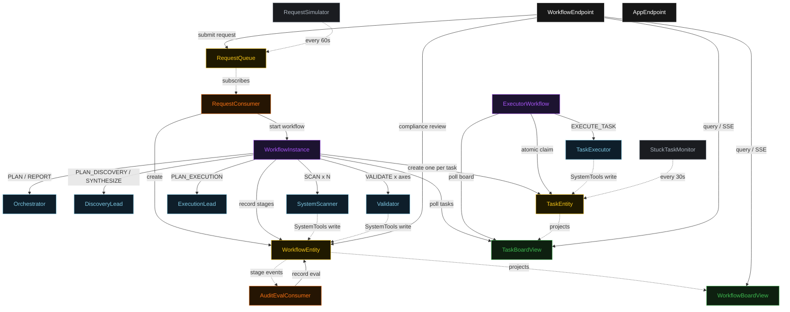
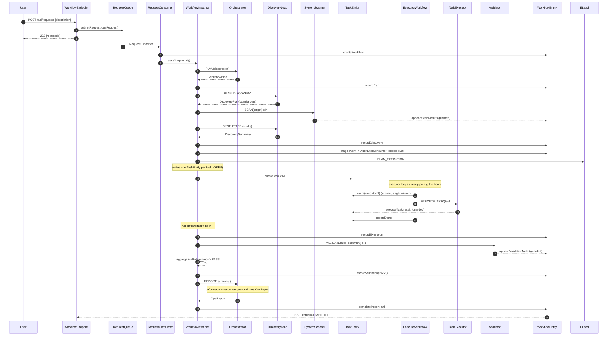
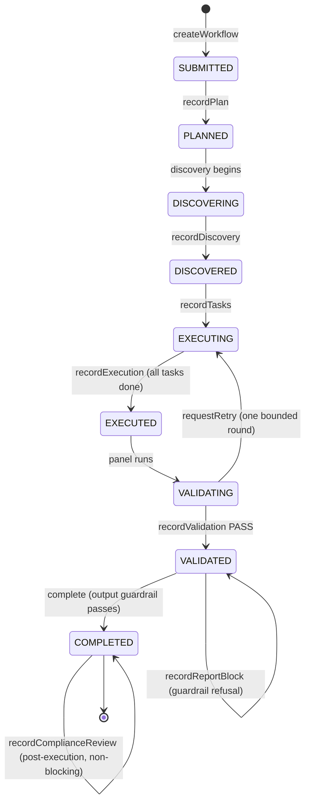
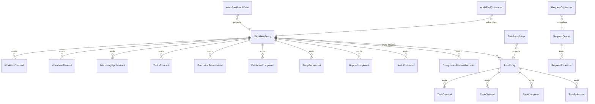

# PLAN — hierarchical-workflow-automation

Architectural sketch consumed by `/akka:plan` (or skipped if `/akka:specify` covers it). Diagrams are rendered on the generated system's Architecture tab with the Akka theme variables and the Lesson 24 state-label CSS overrides.

---

## Component graph

Solid arrows are synchronous commands; dashed arrows are event subscriptions, scheduled ticks, and guarded tool writes. `SystemScanner`, `TaskExecutor`, and `Validator` are each one agent class run as several instances — scanner instances per target system, `executor-1`/`executor-2`, and one validator per axis (`correctness`, `safety`, `compliance`). The top-level `WorkflowInstance` is the orchestrator; the three teams each run a different internal coordination capability: discovery delegates and fans in, execution is a team over the shared `TaskBoardView`, validation is a moderated panel feeding `AggregationRule`.

## Interaction sequence — J1 (happy path)

## State machine — `WorkflowEntity`

## Entity model

## Component table — Java file targets

| Component | Path (generated) |
|---|---|
| `Orchestrator` | `application/Orchestrator.java` |
| `DiscoveryLead` | `application/DiscoveryLead.java` |
| `SystemScanner` | `application/SystemScanner.java` |
| `ExecutionLead` | `application/ExecutionLead.java` |
| `TaskExecutor` | `application/TaskExecutor.java` |
| `Validator` | `application/Validator.java` |
| `WorkflowTasks` | `application/WorkflowTasks.java` |
| `SystemTools` | `application/SystemTools.java` |
| `AggregationRule` | `application/AggregationRule.java` |
| `ResultEvaluator` | `application/ResultEvaluator.java` |
| `WorkflowInstance` | `application/WorkflowInstance.java` |
| `ExecutorWorkflow` | `application/ExecutorWorkflow.java` |
| `WorkflowEntity` | `application/WorkflowEntity.java` (state in `domain/WorkflowState.java`, events in `domain/WorkflowEvent.java`) |
| `TaskEntity` | `application/TaskEntity.java` (state in `domain/Task.java`, events in `domain/TaskEvent.java`) |
| `RequestQueue` | `application/RequestQueue.java` |
| `WorkflowBoardView` | `application/WorkflowBoardView.java` |
| `TaskBoardView` | `application/TaskBoardView.java` |
| `RequestConsumer` | `application/RequestConsumer.java` |
| `AuditEvalConsumer` | `application/AuditEvalConsumer.java` |
| `RequestSimulator` | `application/RequestSimulator.java` |
| `StuckTaskMonitor` | `application/StuckTaskMonitor.java` |
| `WorkflowEndpoint` | `api/WorkflowEndpoint.java` |
| `AppEndpoint` | `api/AppEndpoint.java` |
| `Bootstrap` | `Bootstrap.java` |

Akka component count: **6 autonomous-agent · 2 workflow · 3 event-sourced-entity · 2 view · 2 consumer · 2 timed-action · 2 http-endpoint · 1 service-setup**.

## Concurrency notes

- **Two coordination primitives sit under one pipeline.** The top-level `WorkflowInstance` is a sequential delegation: each stage runs and writes its result onto the shared `WorkflowEntity` before the next begins. The execution stage hands off to an independent team: the workflow seeds the board and then waits, while the per-executor `ExecutorWorkflow` loops claim and carry out tasks on their own clock.
- **Atomic claim is the execution-team primitive.** `TaskEntity` is a single-writer; `claim(executorId)` emits `TaskClaimed` only when the current status is `OPEN`. Two executor workflows that read the same `OPEN` task from the board and both call `claim` are serialised by the entity — the first wins, the second receives the already-claimed `Task` and returns to polling. No lock, no external queue.
- **The execution wait is a poll, not a block.** `WorkflowInstance.executionStep` queries `TaskBoardView` for this request's tasks; if any are not `DONE`, it self-schedules a 5 s resume timer and pauses. An idle execution stage is a paused workflow, not a busy loop.
- **Workflow step timeouts:** every step that calls an agent sets an explicit `stepTimeout` (Lesson 4) — `planStep` 60 s, `discoveryStep` 120 s (it fans out several scanner calls), `validationStep` 90 s, `reportStep` 60 s, and `ExecutorWorkflow.executeStep` 90 s.
- **Bounded retry loop.** A `RETRY` verdict resets the named tasks to `OPEN` and returns the workflow to `EXECUTING`, but only once (`retryCount < 1`); a second `RETRY` accepts the summary and proceeds to reporting, so the pipeline always terminates.
- **The output guardrail can stall, not crash.** If the G1 before-agent-response guardrail refuses the final report, `reportStep` records the block and ends with the workflow left `VALIDATED`; nothing is completed and the reason is visible in the UI.
- **Release for liveness:** `StuckTaskMonitor` returns a task claimed-but-idle for more than two minutes to `OPEN`, so an executor that fails mid-task does not strand the board. `release` is a no-op unless the task is `CLAIMED`.
- **The audit eval is downstream and non-blocking.** `AuditEvalConsumer` subscribes to `WorkflowEntity` events and records an `AuditEval` after a stage result lands; it never gates the pipeline (control E1).
- **Compliance review is on the loop.** `recordComplianceReview` is accepted only when the workflow is `COMPLETED` and never changes that status (control HO1).
- **Idempotency:** deterministic `taskId = requestId + "-t" + index` makes `createTask` idempotent if `executionStep` is retried; `requestId` is the `WorkflowInstance` id so a redelivered `RequestSubmitted` starts the same workflow, not a duplicate.
