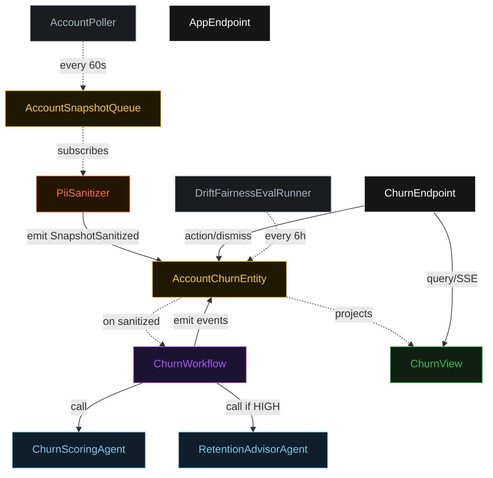
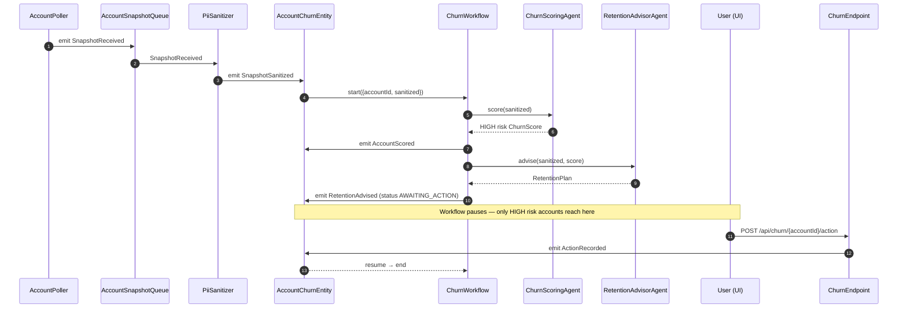
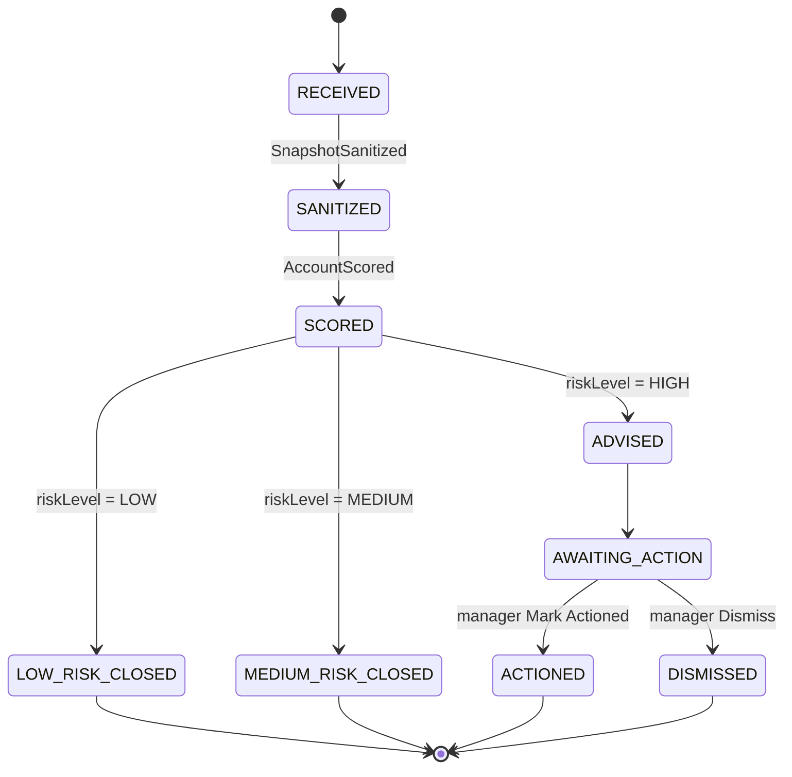
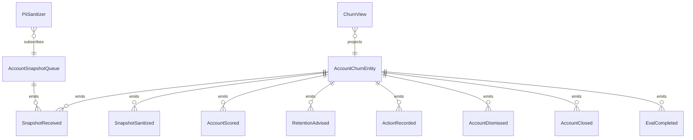

# PLAN — churn-monitor

Architectural sketch consumed by `/akka:plan` and rendered on the generated system's Architecture tab.

---

## Component graph

## Interaction sequence — J1 + J2

## State machine — `AccountChurnEntity`

## Entity model

## Component table — Java file targets

| Component | Path (generated) |
|---|---|
| `AccountPoller` | `application/AccountPoller.java` |
| `AccountSnapshotQueue` | `application/AccountSnapshotQueue.java` |
| `PiiSanitizer` | `application/PiiSanitizer.java` |
| `ChurnScoringAgent` | `application/ChurnScoringAgent.java` |
| `RetentionAdvisorAgent` | `application/RetentionAdvisorAgent.java` |
| `ChurnWorkflow` | `application/ChurnWorkflow.java` |
| `AccountChurnEntity` | `application/AccountChurnEntity.java` (state in `domain/AccountChurnState.java`, events in `domain/AccountChurnEvent.java`) |
| `ChurnView` | `application/ChurnView.java` |
| `DriftFairnessEvalRunner` | `application/DriftFairnessEvalRunner.java` |
| `ChurnEndpoint` | `api/ChurnEndpoint.java` |
| `AppEndpoint` | `api/AppEndpoint.java` |
| Bootstrap | `Bootstrap.java` |

## Concurrency notes

- **Per-step timeout**: scorer 15 s, advisor 30 s. On timeout, treat as HIGH and escalate to AWAITING_ACTION with an error note in the retention plan.
- **HITL gate**: `ChurnWorkflow` pauses in AWAITING_ACTION only for HIGH risk accounts, using the workflow's poll-the-entity idiom; on each poll, if `decision.isPresent()` it advances.
- **Auto-close**: LOW and MEDIUM risk accounts emit `AccountClosed` from within the workflow without entering AWAITING_ACTION — no human attention required.
- **Idempotency**: every workflow uses `accountId` as the workflow id so duplicate sanitize events fold into one workflow.
- **Eval batching**: per tick, DriftFairnessEvalRunner picks up to 50 accounts scored since the last eval run, oldest-first, sends them as a single batch to DriftFairnessEvalJudge.
