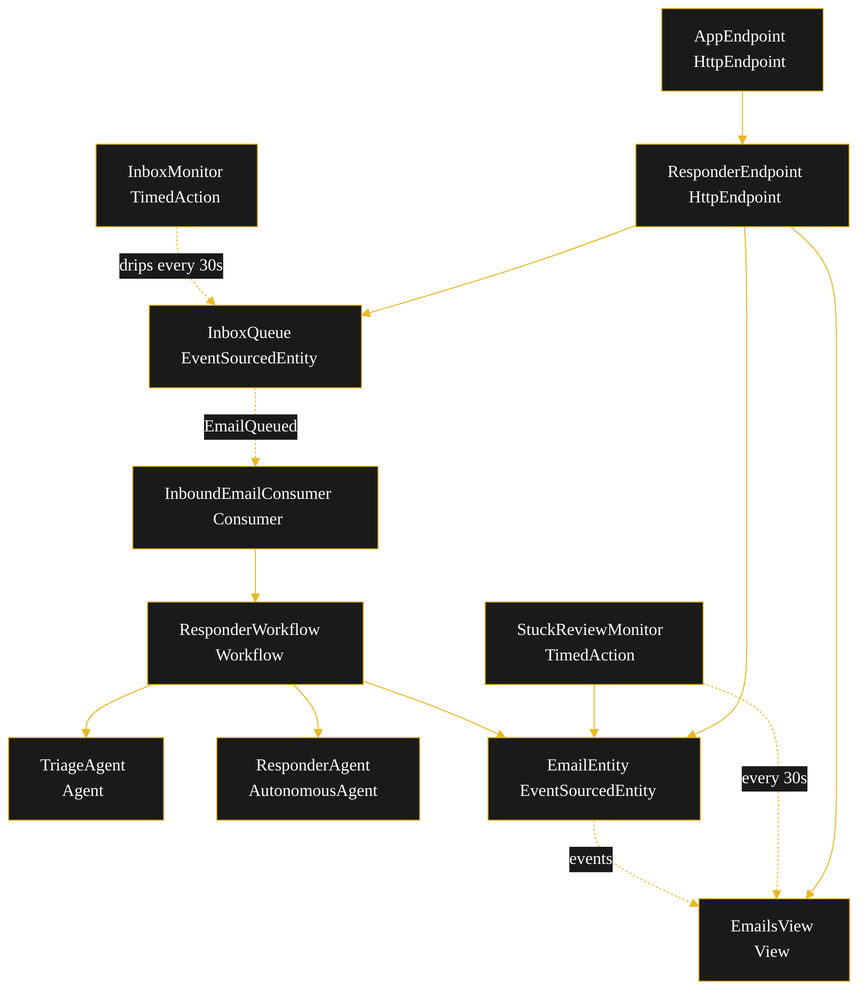
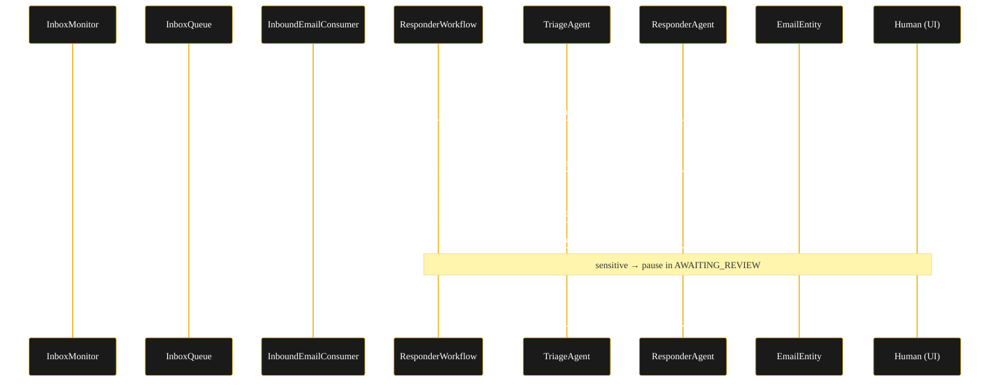
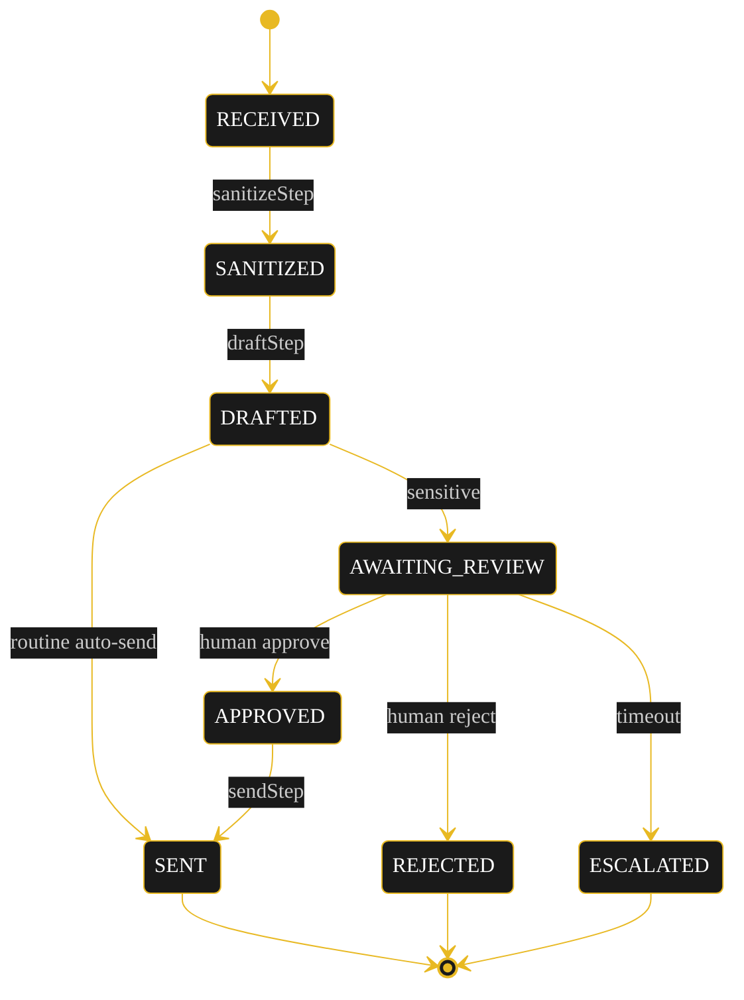
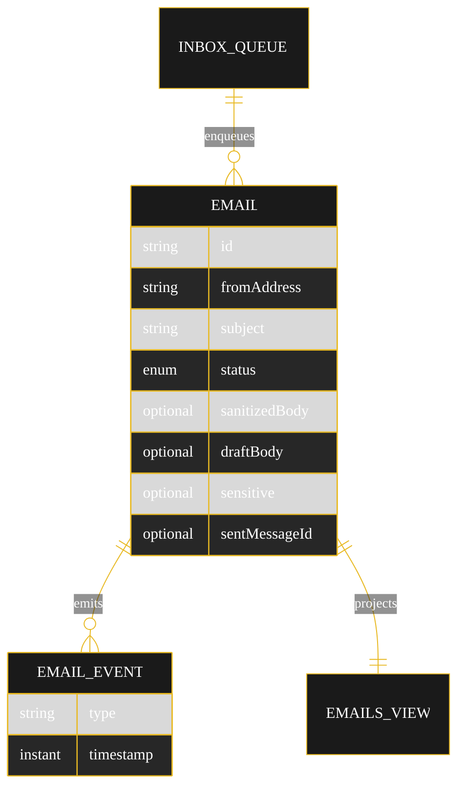

# Implementation Plan — `email-auto-responder`

The architecture this blueprint resolves to once [`SPEC.md`](./SPEC.md) is run through `/akka:specify` → `/akka:plan`.

---

## Component graph

Solid arrows are synchronous commands; dashed arrows are event subscriptions; dotted arrows are scheduled ticks.

## Interaction sequence

## State machine

State-label and transition-label colours require the Lesson 24 CSS overrides in the generated UI; the theme variables above reduce flicker before the CSS lands.

## Entity model

## Component table

| Component | Kind | File |
|---|---|---|
| `ResponderAgent` | AutonomousAgent | `application/ResponderAgent.java` |
| `ResponderTasks` | task definitions | `application/ResponderTasks.java` |
| `TriageAgent` | Agent | `application/TriageAgent.java` |
| `ResponderWorkflow` | Workflow | `application/ResponderWorkflow.java` |
| `EmailEntity` | EventSourcedEntity | `application/EmailEntity.java` |
| `InboxQueue` | EventSourcedEntity | `application/InboxQueue.java` |
| `EmailsView` | View | `application/EmailsView.java` |
| `InboundEmailConsumer` | Consumer | `application/InboundEmailConsumer.java` |
| `InboxMonitor` | TimedAction | `application/InboxMonitor.java` |
| `StuckReviewMonitor` | TimedAction | `application/StuckReviewMonitor.java` |
| `ResponderEndpoint` | HttpEndpoint | `api/ResponderEndpoint.java` |
| `AppEndpoint` | HttpEndpoint | `api/AppEndpoint.java` |
| `Bootstrap` | service-setup | `Bootstrap.java` |
| `Email`, `EmailStatus`, `EmailEvent` | domain | `domain/*.java` |

Akka component count: **2 http-endpoint · 2 timed-action · 1 view · 1 workflow · 1 service-setup · 1 autonomous-agent · 1 agent · 1 consumer · 2 event-sourced-entity**.

## Concurrency notes

- `ResponderWorkflow.settings()` sets `stepTimeout` 60s on `draftStep` and `sendStep` (LLM-calling and side-effecting), 10s on `sanitizeStep` and `reviewGateStep` (Lesson 4). `WorkflowSettings` is nested in `Workflow` — no import.
- `reviewGateStep` self-schedules a 5s resume timer while sensitive emails sit in `AWAITING_REVIEW`; it ends on `APPROVED`, `REJECTED`, or `ESCALATED`.
- Idempotency: the workflow keys on the email id; `InboundEmailConsumer` ingests the `EmailEntity` before starting the workflow so a redelivered `EmailQueued` re-uses the same entity.
- Compensation: there is no real external mail server; the send action is in-process, so no saga rollback is needed. The guardrail makes the send the only side-effecting step and gates it on status.
- `EmailsView` has one query with no enum `WHERE` clause (Lesson 2); status filtering happens client-side in the endpoint and `StuckReviewMonitor`.
