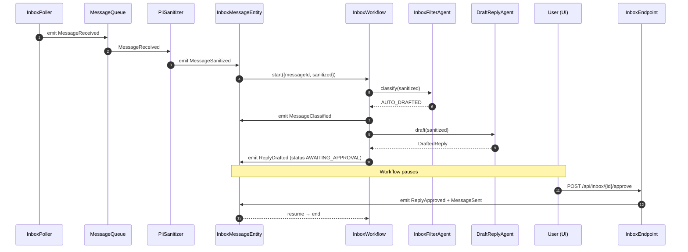
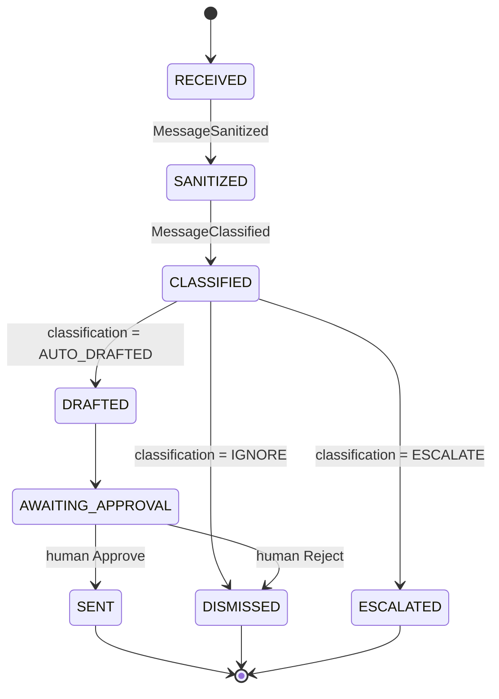
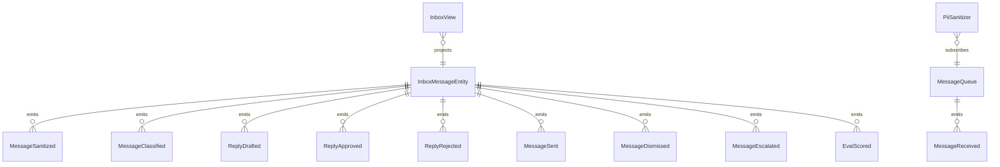

# PLAN — inbox-watcher

Architectural sketch consumed by `/akka:plan` and rendered on the generated system's Architecture tab.

---

## Component graph

```mermaid
flowchart TB
  classDef agent fill:#0e1e2a,stroke:#7EC8E3,color:#7EC8E3;
  classDef wf fill:#1c1330,stroke:#A855F7,color:#A855F7;
  classDef ese fill:#1f1900,stroke:#F5C518,color:#F5C518;
  classDef view fill:#0e2010,stroke:#3fb950,color:#3fb950;
  classDef cons fill:#251503,stroke:#F97316,color:#F97316;
  classDef ta fill:#1a1c20,stroke:#aab3bd,color:#aab3bd;
  classDef ep fill:#161616,stroke:#fff,color:#fff;

  Poller[InboxPoller]:::ta
  Queue[MessageQueue]:::ese
  Sanitizer[PiiSanitizer]:::cons
  Filter[InboxFilterAgent]:::agent
  Drafter[DraftReplyAgent]:::agent
  WF[InboxWorkflow]:::wf
  Entity[InboxMessageEntity]:::ese
  View[InboxView]:::view
  EvalRunner[EvalRunner]:::ta
  API[InboxEndpoint]:::ep
  App[AppEndpoint]:::ep

  Poller -.->|every 15s| Queue
  Queue -.->|subscribes| Sanitizer
  Sanitizer -->|emit MessageSanitized| Entity
  Entity -.->|on sanitized| WF
  WF -->|call| Filter
  WF -->|call (if AUTO_DRAFTED)| Drafter
  WF -->|emit events| Entity
  Entity -.->|projects| View
  API -->|approve/reject| Entity
  API -->|query/SSE| View
  EvalRunner -.->|every 30m| Entity
```

## Interaction sequence — J1 + J2



## State machine — `InboxMessageEntity`



## Entity model



## Component table — Java file targets

| Component | Path (generated) |
|---|---|
| `InboxPoller` | `application/InboxPoller.java` |
| `MessageQueue` | `application/MessageQueue.java` |
| `PiiSanitizer` | `application/PiiSanitizer.java` |
| `InboxFilterAgent` | `application/InboxFilterAgent.java` |
| `DraftReplyAgent` | `application/DraftReplyAgent.java` |
| `InboxWorkflow` | `application/InboxWorkflow.java` |
| `InboxMessageEntity` | `application/InboxMessageEntity.java` (state in `domain/InboxMessage.java`, events in `domain/InboxMessageEvent.java`) |
| `InboxView` | `application/InboxView.java` |
| `EvalRunner` | `application/EvalRunner.java` |
| `InboxEndpoint` | `api/InboxEndpoint.java` |
| `AppEndpoint` | `api/AppEndpoint.java` |
| Bootstrap | `Bootstrap.java` |

## Concurrency notes

- **Per-step timeout**: classifier 10 s, drafter 30 s. On timeout, escalate.
- **HITL gate**: `InboxWorkflow` pauses in AWAITING_APPROVAL using the workflow's poll-the-entity idiom; on each poll, if `decision.isPresent()` it advances.
- **Idempotency**: every workflow uses `messageId` as the workflow id so duplicate sanitize events fold into one workflow.
- **Eval sampling**: per tick, EvalRunner picks up to 5 SENT messages with no `evalScore`, oldest-first.
