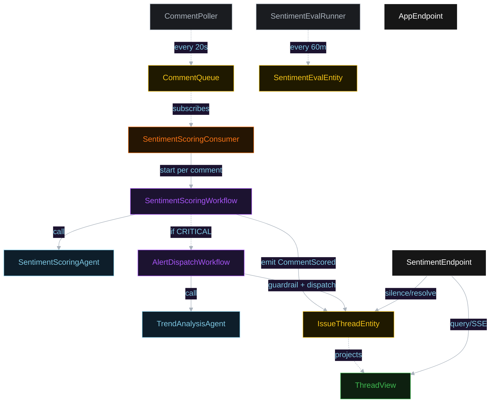
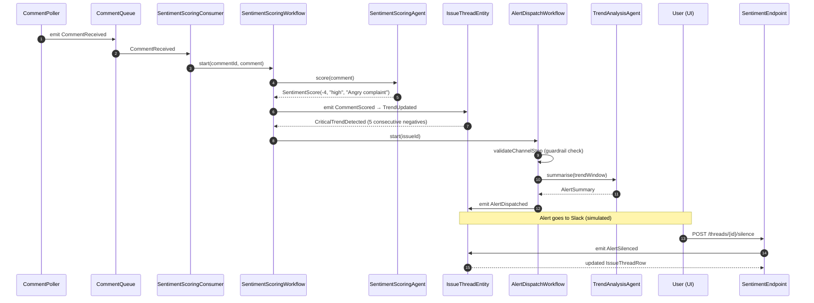
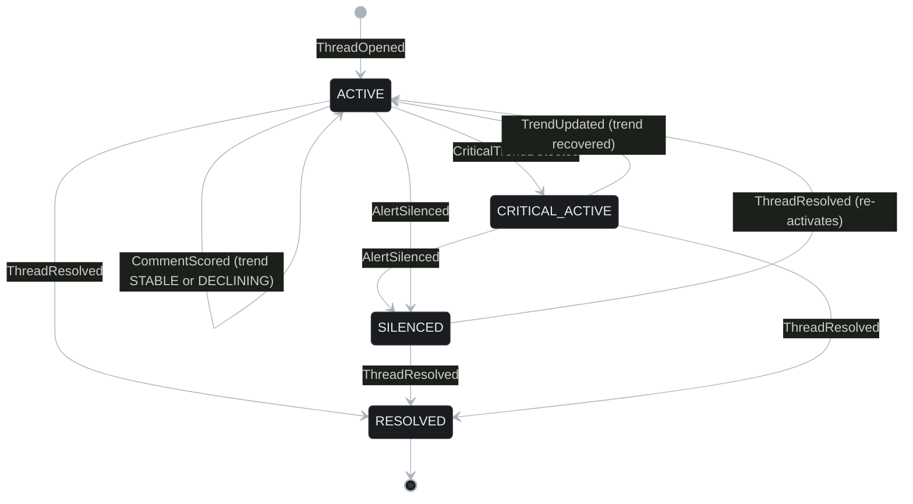
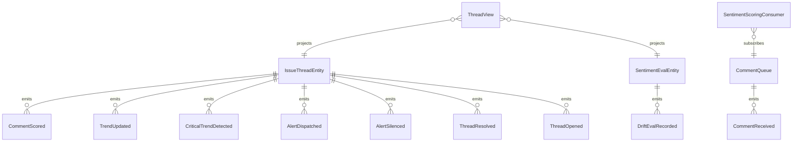

# PLAN — sentiment-monitor

Architectural sketch consumed by `/akka:plan` and rendered on the generated system's Architecture tab.

---

## Component graph

## Interaction sequence — J1 + J2

## State machine — `IssueThreadEntity`

## Entity model

## Component table — Java file targets

| Component | Path (generated) |
|---|---|
| `CommentPoller` | `application/CommentPoller.java` |
| `CommentQueue` | `application/CommentQueue.java` |
| `SentimentScoringConsumer` | `application/SentimentScoringConsumer.java` |
| `SentimentScoringAgent` | `application/SentimentScoringAgent.java` |
| `TrendAnalysisAgent` | `application/TrendAnalysisAgent.java` |
| `SentimentScoringWorkflow` | `application/SentimentScoringWorkflow.java` |
| `AlertDispatchWorkflow` | `application/AlertDispatchWorkflow.java` |
| `IssueThreadEntity` | `application/IssueThreadEntity.java` (state in `domain/IssueThread.java`, events in `domain/IssueThreadEvent.java`) |
| `SentimentEvalEntity` | `application/SentimentEvalEntity.java` |
| `ThreadView` | `application/ThreadView.java` |
| `SentimentEvalRunner` | `application/SentimentEvalRunner.java` |
| `SentimentEndpoint` | `api/SentimentEndpoint.java` |
| `AppEndpoint` | `api/AppEndpoint.java` |
| Bootstrap | `Bootstrap.java` |

## Concurrency notes

- **Per-step timeout**: scorer 15 s (neutral fallback on timeout), trend analyst 30 s (skip dispatch on timeout).
- **Guardrail gate**: `AlertDispatchWorkflow.validateChannelStep` reads the allowlist from application.conf; rejection is a structured error, not an exception — the workflow records the rejection without crashing.
- **Idempotency**: each `SentimentScoringWorkflow` uses `commentId` as the workflow id; each `AlertDispatchWorkflow` uses `issueId + alertEpochSecond` to prevent double dispatch within the same trend window.
- **Eval sampling**: per tick, `SentimentEvalRunner` picks up to 10 scored comments with ground-truth labels, oldest-first, from the JSONL resource file.
