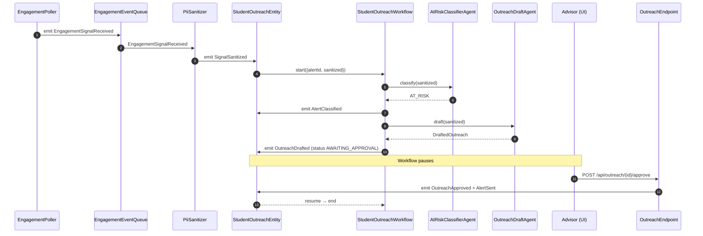
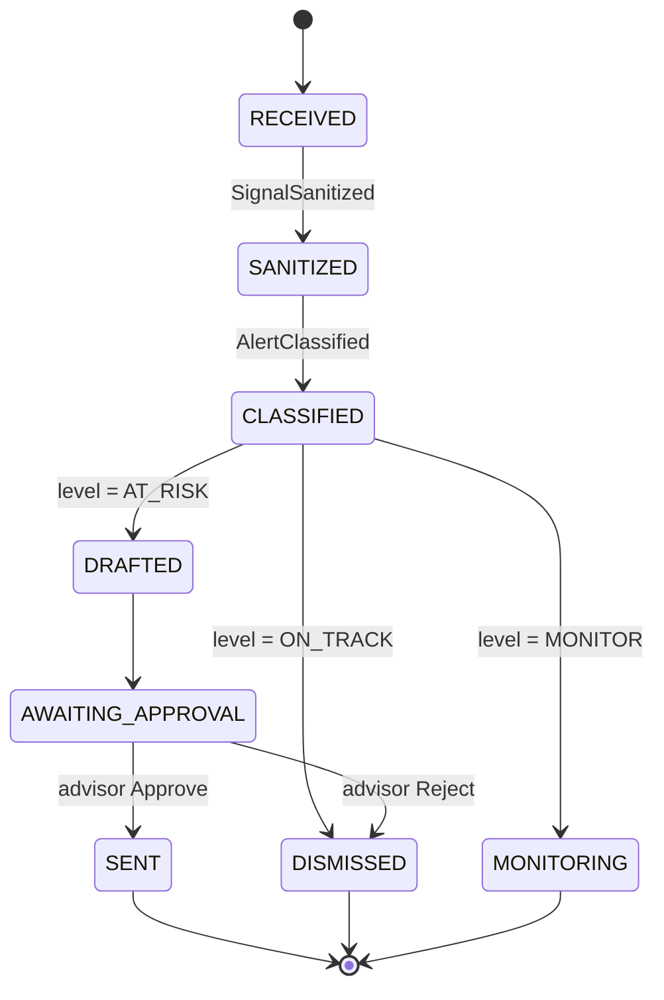
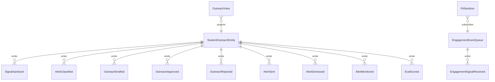

# PLAN — retention-outreach

Architectural sketch consumed by `/akka:plan` and rendered on the generated system's Architecture tab.

---

## Component graph

```mermaid
flowchart TB
  classDef agent fill:#0e1e2a,stroke:#7EC8E3,color:#7EC8E3;
  classDef wf fill:#1c1330,stroke:#A855F7,color:#A855F7;
  classDef ese fill:#1f1900,stroke:#F5C518,color:#F5C518;
  classDef view fill:#0e2010,stroke:#3fb950,color:#3fb950;
  classDef cons fill:#251503,stroke:#F97316,color:#F97316;
  classDef ta fill:#1a1c20,stroke:#aab3bd,color:#aab3bd;
  classDef ep fill:#161616,stroke:#fff,color:#fff;

  Poller[EngagementPoller]:::ta
  Queue[EngagementEventQueue]:::ese
  Sanitizer[PiiSanitizer]:::cons
  Classifier[AtRiskClassifierAgent]:::agent
  Drafter[OutreachDraftAgent]:::agent
  WF[StudentOutreachWorkflow]:::wf
  Entity[StudentOutreachEntity]:::ese
  View[OutreachView]:::view
  EvalRunner[EvalRunner]:::ta
  API[OutreachEndpoint]:::ep
  App[AppEndpoint]:::ep

  Poller -.->|every 15s| Queue
  Queue -.->|subscribes| Sanitizer
  Sanitizer -->|emit SignalSanitized| Entity
  Entity -.->|on sanitized| WF
  WF -->|call| Classifier
  WF -->|call (if AT_RISK)| Drafter
  WF -->|emit events| Entity
  Entity -.->|projects| View
  API -->|approve/reject| Entity
  API -->|query/SSE| View
  EvalRunner -.->|every 30m| Entity
```

## Interaction sequence — J1 + J2



## State machine — `StudentOutreachEntity`



## Entity model



## Component table — Java file targets

| Component | Path (generated) |
|---|---|
| `EngagementPoller` | `application/EngagementPoller.java` |
| `EngagementEventQueue` | `application/EngagementEventQueue.java` |
| `PiiSanitizer` | `application/PiiSanitizer.java` |
| `AtRiskClassifierAgent` | `application/AtRiskClassifierAgent.java` |
| `OutreachDraftAgent` | `application/OutreachDraftAgent.java` |
| `StudentOutreachWorkflow` | `application/StudentOutreachWorkflow.java` |
| `StudentOutreachEntity` | `application/StudentOutreachEntity.java` (state in `domain/StudentAlert.java`, events in `domain/StudentOutreachEvent.java`) |
| `OutreachView` | `application/OutreachView.java` |
| `EvalRunner` | `application/EvalRunner.java` |
| `OutreachEndpoint` | `api/OutreachEndpoint.java` |
| `AppEndpoint` | `api/AppEndpoint.java` |
| Bootstrap | `Bootstrap.java` |

## Concurrency notes

- **Per-step timeout**: classifier 10 s, drafter 30 s. On timeout, escalate to AT_RISK handling.
- **HITL gate**: `StudentOutreachWorkflow` pauses in AWAITING_APPROVAL using the workflow's poll-the-entity idiom; on each poll, if `decision.isPresent()` it advances.
- **Idempotency**: every workflow uses `alertId` as the workflow id so duplicate sanitize events fold into one workflow.
- **Eval sampling**: per tick, EvalRunner picks up to 5 SENT alerts with no `evalScore`, oldest-first.
