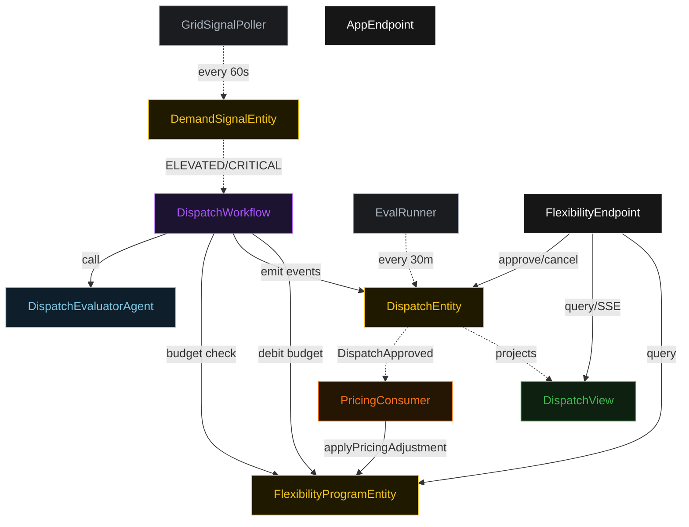
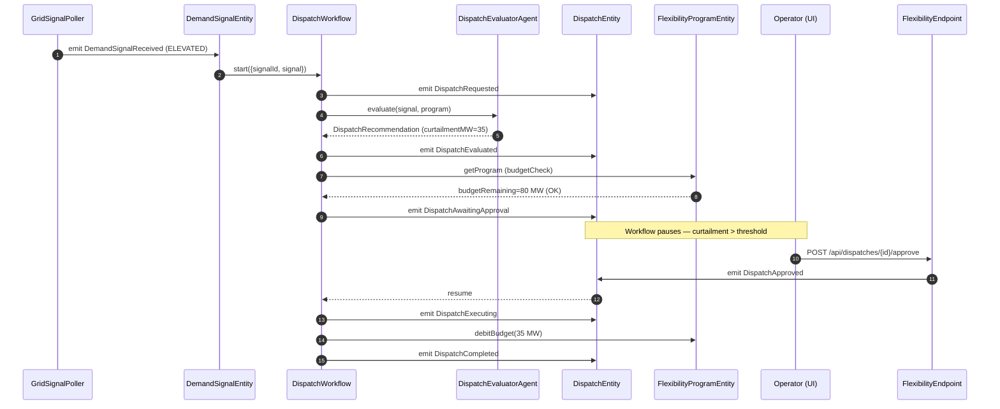
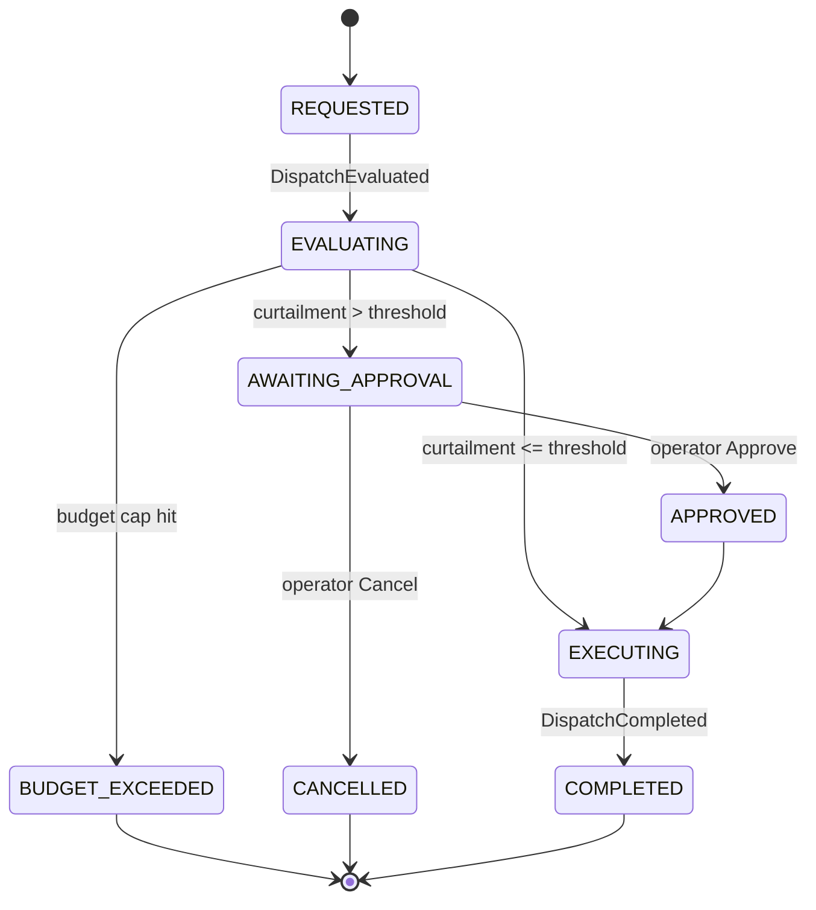
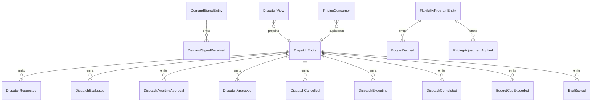

# PLAN — flexibility-orchestrator

Architectural sketch consumed by `/akka:plan` and rendered on the generated system's Architecture tab.

---

## Component graph

## Interaction sequence — J1 + J2

## State machine — `DispatchEntity`

## Entity model

## Component table — Java file targets

| Component | Path (generated) |
|---|---|
| `GridSignalPoller` | `application/GridSignalPoller.java` |
| `DemandSignalEntity` | `application/DemandSignalEntity.java` |
| `DispatchEvaluatorAgent` | `application/DispatchEvaluatorAgent.java` |
| `DispatchWorkflow` | `application/DispatchWorkflow.java` |
| `DispatchEntity` | `application/DispatchEntity.java` (state in `domain/DispatchRecord.java`, events in `domain/DispatchEvent.java`) |
| `FlexibilityProgramEntity` | `application/FlexibilityProgramEntity.java` (state in `domain/FlexibilityProgram.java`) |
| `PricingConsumer` | `application/PricingConsumer.java` |
| `DispatchView` | `application/DispatchView.java` |
| `EvalRunner` | `application/EvalRunner.java` |
| `FlexibilityEndpoint` | `api/FlexibilityEndpoint.java` |
| `AppEndpoint` | `api/AppEndpoint.java` |
| Bootstrap | `Bootstrap.java` |

## Concurrency notes

- **Budget check ordering**: the budget check runs inside `DispatchWorkflow.budgetCheckStep` — a synchronous read of `FlexibilityProgramEntity` state — before any HITL pause. If the budget is exhausted, the workflow ends immediately without prompting the operator.
- **Per-step timeout**: evaluateStep 30 s. On timeout, the workflow emits `BudgetCapExceeded` (conservative default: if we cannot evaluate, do not dispatch).
- **HITL gate**: `DispatchWorkflow` pauses in AWAITING_APPROVAL using the poll-the-entity idiom; every 5 s it checks if `decision.isPresent()`. No auto-timeout — dispatches wait indefinitely for operator action.
- **Idempotency**: every workflow uses `requestId` (derived from `signalId`) as the workflow id so duplicate signal events fold into one workflow instance.
- **Eval sampling**: per tick, EvalRunner picks up to 5 COMPLETED dispatches with no `evalScore`, oldest-first.
