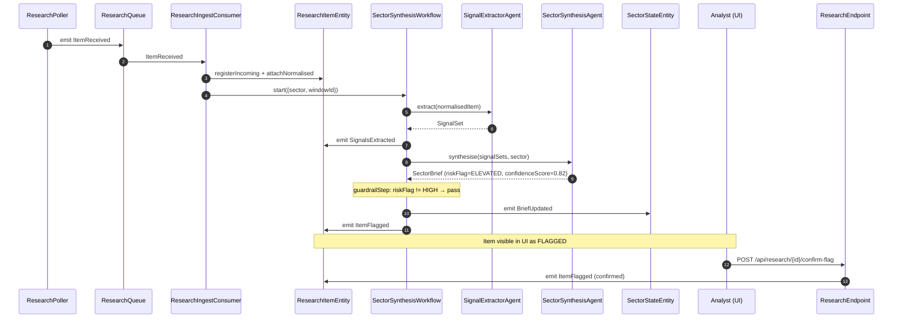
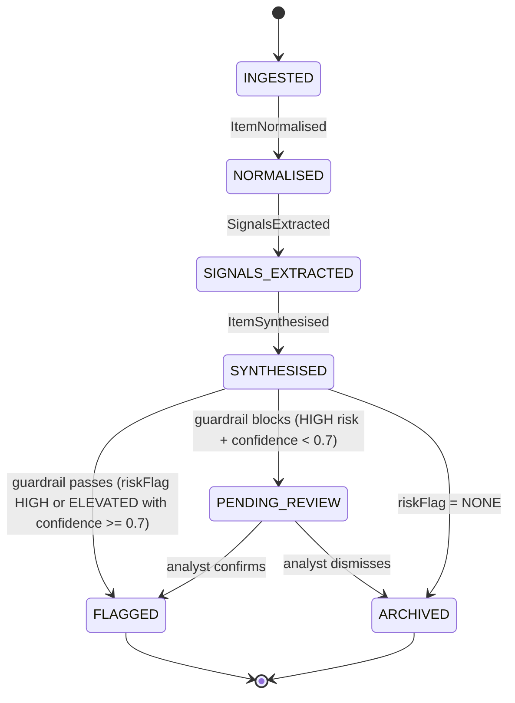
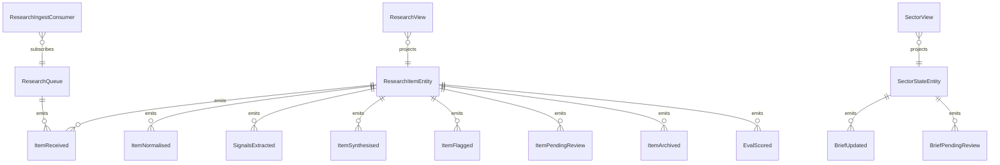

# PLAN — market-researcher

Architectural sketch consumed by `/akka:plan` and rendered on the generated system's Architecture tab.

---

## Component graph

```mermaid
flowchart TB
  classDef agent fill:#0e1e2a,stroke:#7EC8E3,color:#7EC8E3;
  classDef wf fill:#1c1330,stroke:#A855F7,color:#A855F7;
  classDef ese fill:#1f1900,stroke:#F5C518,color:#F5C518;
  classDef view fill:#0e2010,stroke:#3fb950,color:#3fb950;
  classDef cons fill:#251503,stroke:#F97316,color:#F97316;
  classDef ta fill:#1a1c20,stroke:#aab3bd,color:#aab3bd;
  classDef ep fill:#161616,stroke:#fff,color:#fff;

  Poller[ResearchPoller]:::ta
  Queue[ResearchQueue]:::ese
  Ingest[ResearchIngestConsumer]:::cons
  Extractor[SignalExtractorAgent]:::agent
  Synthesiser[SectorSynthesisAgent]:::agent
  WF[SectorSynthesisWorkflow]:::wf
  ItemEntity[ResearchItemEntity]:::ese
  SectorEntity[SectorStateEntity]:::ese
  ResearchView[ResearchView]:::view
  SectorView[SectorView]:::view
  EvalRunner[EvalRunner]:::ta
  API[ResearchEndpoint]:::ep
  App[AppEndpoint]:::ep

  Poller -.->|every 30s| Queue
  Queue -.->|subscribes| Ingest
  Ingest -->|normalise + register| ItemEntity
  Ingest -->|trigger per sector window| WF
  WF -->|call| Extractor
  WF -->|call (if signals present)| Synthesiser
  WF -->|guardrail check| WF
  WF -->|emit events| ItemEntity
  WF -->|commit or pending| SectorEntity
  ItemEntity -.->|projects| ResearchView
  SectorEntity -.->|projects| SectorView
  API -->|confirm/dismiss| ItemEntity
  API -->|query/SSE| ResearchView
  API -->|query/SSE| SectorView
  EvalRunner -.->|every 24h| ItemEntity
```

## Interaction sequence — J1 + J2



## State machine — `ResearchItemEntity`



## Entity model



## Component table — Java file targets

| Component | Path (generated) |
|---|---|
| `ResearchPoller` | `application/ResearchPoller.java` |
| `ResearchQueue` | `application/ResearchQueue.java` |
| `ResearchIngestConsumer` | `application/ResearchIngestConsumer.java` |
| `SignalExtractorAgent` | `application/SignalExtractorAgent.java` |
| `SectorSynthesisAgent` | `application/SectorSynthesisAgent.java` |
| `SectorSynthesisWorkflow` | `application/SectorSynthesisWorkflow.java` |
| `ResearchItemEntity` | `application/ResearchItemEntity.java` (state in `domain/ResearchItemState.java`, events in `domain/ResearchItemEvent.java`) |
| `SectorStateEntity` | `application/SectorStateEntity.java` (state in `domain/SectorState.java`, events in `domain/SectorEvent.java`) |
| `ResearchView` | `application/ResearchView.java` |
| `SectorView` | `application/SectorView.java` |
| `EvalRunner` | `application/EvalRunner.java` |
| `ResearchEndpoint` | `api/ResearchEndpoint.java` |
| `AppEndpoint` | `api/AppEndpoint.java` |
| Bootstrap | `Bootstrap.java` |

## Concurrency notes

- **Per-step timeout**: signal extraction 15 s, sector synthesis 45 s. On timeout, escalate the item to PENDING_REVIEW rather than discarding.
- **Guardrail gate**: `guardrailStep` runs synchronously after `SectorSynthesisAgent` returns — no extra LLM call. Decision is deterministic on `riskFlag` + `confidenceScore`.
- **Idempotency**: workflow id is `(canonicalSector + ":" + windowId)`. Duplicate `ItemReceived` events for the same window fold into one workflow invocation.
- **Eval sampling**: per tick, EvalRunner picks up to 5 FLAGGED items with no `evalScore`, oldest-first.
