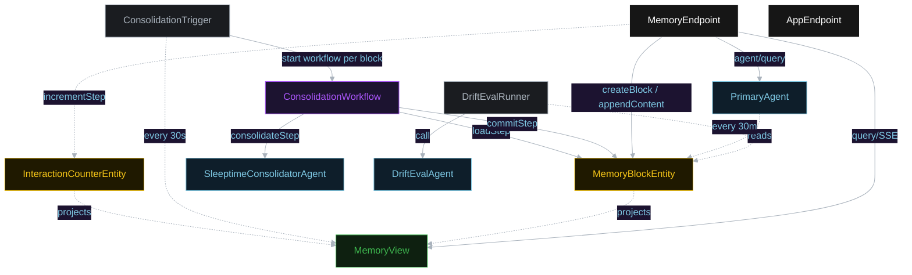
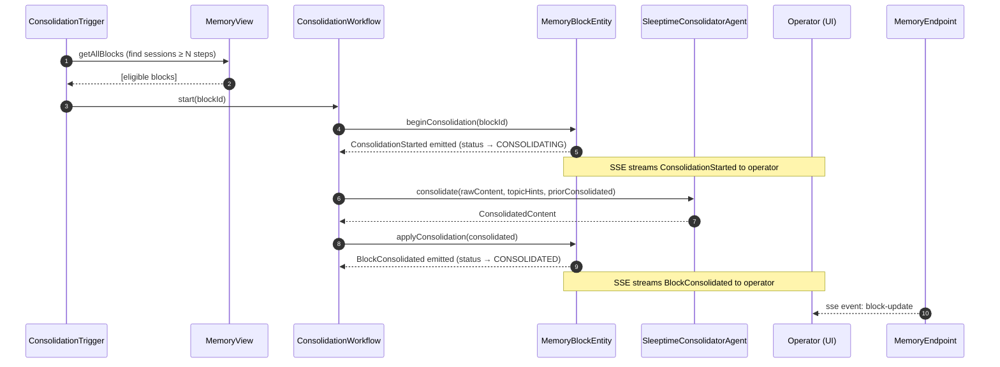
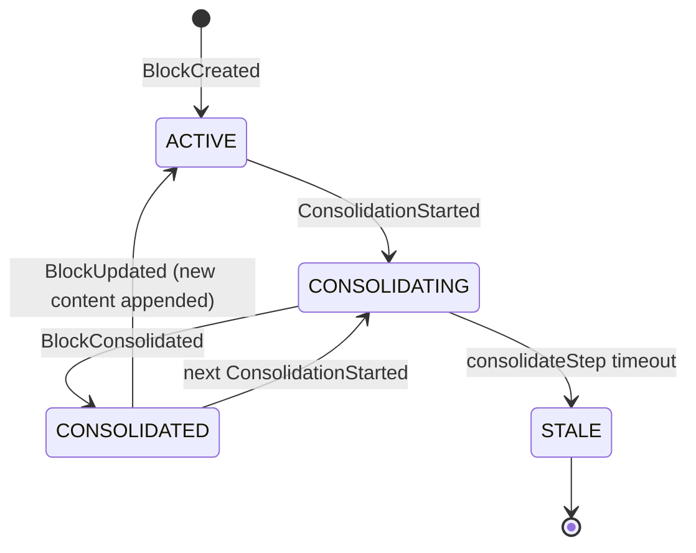
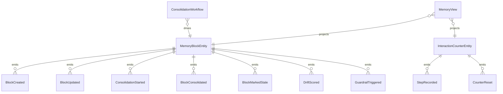

# PLAN — sleeptime-consolidation

Architectural sketch consumed by `/akka:plan` and rendered on the generated system's Architecture tab.

---

## Component graph

## Interaction sequence — J1 (consolidation cycle)

## State machine — `MemoryBlockEntity`

## Entity model

## Component table — Java file targets

| Component | Path (generated) |
|---|---|
| `ConsolidationTrigger` | `application/ConsolidationTrigger.java` |
| `InteractionCounterEntity` | `application/InteractionCounterEntity.java` |
| `MemoryBlockEntity` | `application/MemoryBlockEntity.java` (state in `domain/MemoryBlock.java`, events in `domain/MemoryBlockEvent.java`) |
| `ConsolidationWorkflow` | `application/ConsolidationWorkflow.java` |
| `PrimaryAgent` | `application/PrimaryAgent.java` |
| `SleeptimeConsolidatorAgent` | `application/SleeptimeConsolidatorAgent.java` |
| `DriftEvalAgent` | `application/DriftEvalAgent.java` |
| `MemoryView` | `application/MemoryView.java` |
| `DriftEvalRunner` | `application/DriftEvalRunner.java` |
| `MemoryEndpoint` | `api/MemoryEndpoint.java` |
| `AppEndpoint` | `api/AppEndpoint.java` |
| Bootstrap | `Bootstrap.java` |

## Concurrency notes

- **Consolidation guard**: `ConsolidationWorkflow` id equals `blockId`. A second `start(blockId)` call while a workflow is running returns the running instance — no double-consolidation.
- **Timeout**: `consolidateStep` carries `stepTimeout(Duration.ofSeconds(60))`. On timeout, the workflow emits `BlockMarkedStale` and terminates gracefully.
- **Drift sampling**: per tick, `DriftEvalRunner` picks up to 5 CONSOLIDATED blocks with no `driftScore`, oldest-first, to bound per-tick LLM spend.
- **Guardrail identity**: the before-tool-call hook on `writeMemoryBlock` checks a workflow-scoped lease token. The token is minted by `loadStep` and invalidated by `doneStep`; it is not user-supplied.
- **HOTL stream**: `MemoryEndpoint`'s SSE endpoint subscribes to `MemoryView` updates. Every entity event projection triggers a view row update which fans into the open SSE connections.
