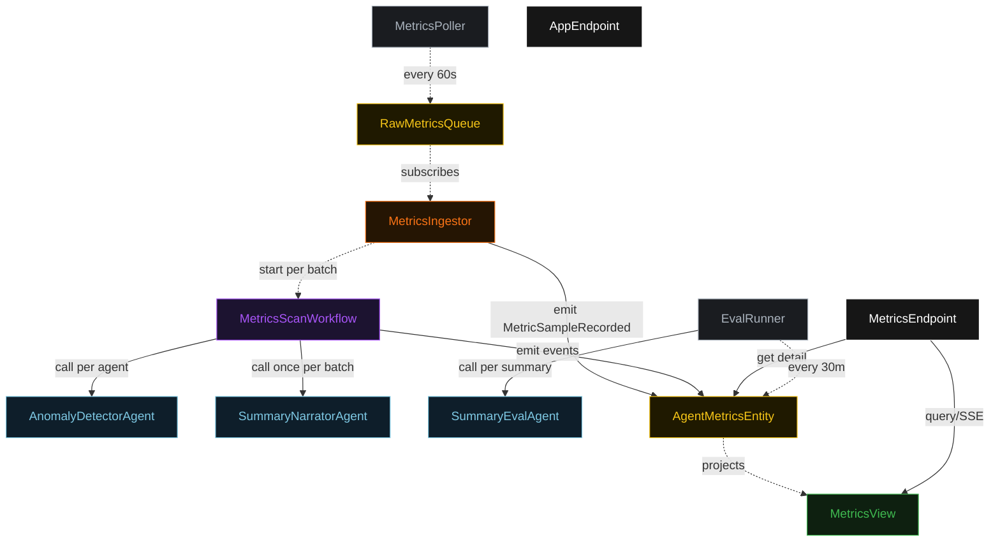
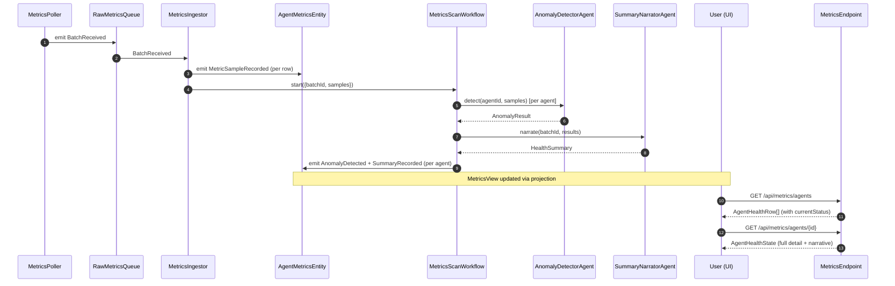
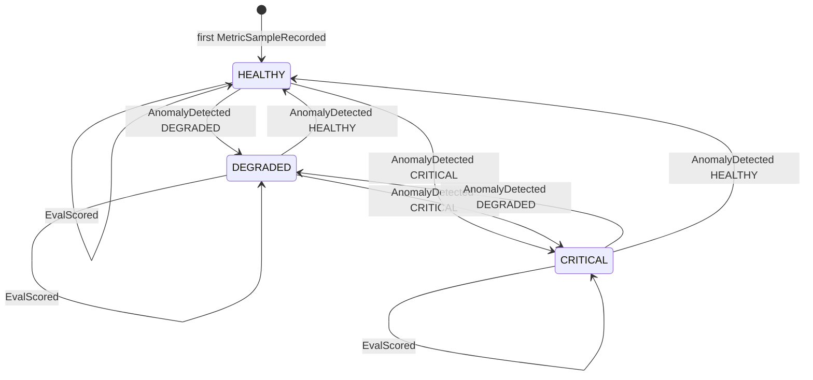
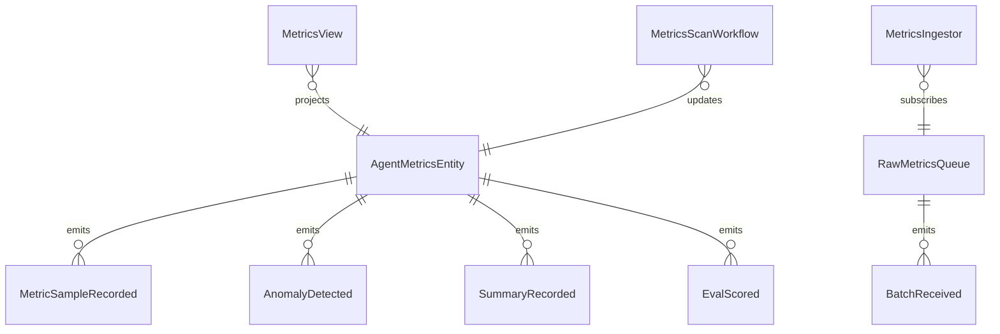

# PLAN — agent-metrics-monitor

Architectural sketch consumed by `/akka:plan` and rendered on the generated system's Architecture tab.

---

## Component graph

## Interaction sequence — J1 + J2

## State machine — `AgentMetricsEntity`

## Entity model

## Component table — Java file targets

| Component | Path (generated) |
|---|---|
| `MetricsPoller` | `application/MetricsPoller.java` |
| `RawMetricsQueue` | `application/RawMetricsQueue.java` |
| `MetricsIngestor` | `application/MetricsIngestor.java` |
| `AnomalyDetectorAgent` | `application/AnomalyDetectorAgent.java` |
| `SummaryNarratorAgent` | `application/SummaryNarratorAgent.java` |
| `SummaryEvalAgent` | `application/SummaryEvalAgent.java` |
| `MetricsScanWorkflow` | `application/MetricsScanWorkflow.java` |
| `AgentMetricsEntity` | `application/AgentMetricsEntity.java` (state in `domain/AgentHealthState.java`, events in `domain/AgentMetricsEvent.java`) |
| `MetricsView` | `application/MetricsView.java` |
| `EvalRunner` | `application/EvalRunner.java` |
| `MetricsEndpoint` | `api/MetricsEndpoint.java` |
| `AppEndpoint` | `api/AppEndpoint.java` |
| Bootstrap | `Bootstrap.java` |

## Concurrency notes

- **Per-step timeout**: `detectStep` 20 s per agent, `narrateStep` 15 s. On timeout, record `AnomalyResult` with status `DEGRADED` and a signal `"detection-timeout"`.
- **Fan-out in detectStep**: the workflow calls `AnomalyDetectorAgent` once per agent in the batch; results are collected into a `List<AnomalyResult>` before `narrateStep` begins.
- **Idempotency**: every workflow uses `batchId` as the workflow id so duplicate `BatchReceived` events fold into one workflow run.
- **Sample cap**: `AgentMetricsEntity` retains only the 10 most recent `AgentMetricSample` records; older ones are dropped from in-memory state (the full audit is in `RawMetricsQueue`).
- **Eval sampling**: per tick, `EvalRunner` picks up to 5 agents with an un-scored `latestSummary`, oldest `lastUpdatedAt` first.
