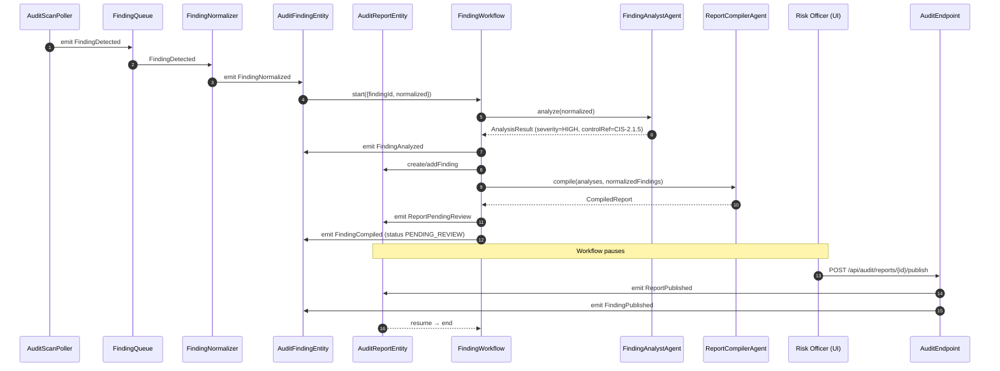
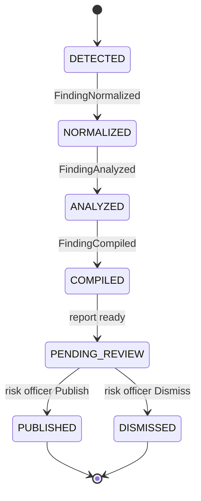
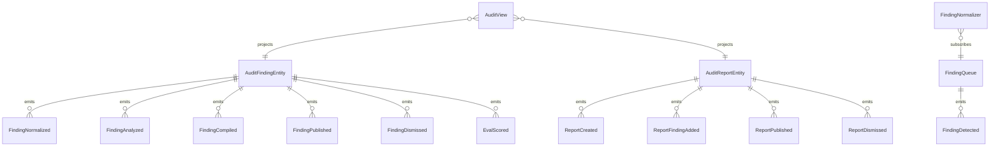

# PLAN — aws-audit-monitor

Architectural sketch consumed by `/akka:plan` and rendered on the generated system's Architecture tab.

---

## Component graph

```mermaid
flowchart TB
  classDef agent fill:#0e1e2a,stroke:#7EC8E3,color:#7EC8E3;
  classDef wf fill:#1c1330,stroke:#A855F7,color:#A855F7;
  classDef ese fill:#1f1900,stroke:#F5C518,color:#F5C518;
  classDef view fill:#0e2010,stroke:#3fb950,color:#3fb950;
  classDef cons fill:#251503,stroke:#F97316,color:#F97316;
  classDef ta fill:#1a1c20,stroke:#aab3bd,color:#aab3bd;
  classDef ep fill:#161616,stroke:#fff,color:#fff;

  Poller[AuditScanPoller]:::ta
  Queue[FindingQueue]:::ese
  Normalizer[FindingNormalizer]:::cons
  Analyst[FindingAnalystAgent]:::agent
  Compiler[ReportCompilerAgent]:::agent
  Judge[AccuracyJudgeAgent]:::agent
  WF[FindingWorkflow]:::wf
  FindingEntity[AuditFindingEntity]:::ese
  ReportEntity[AuditReportEntity]:::ese
  View[AuditView]:::view
  EvalRunner[AccuracyEvalRunner]:::ta
  API[AuditEndpoint]:::ep
  App[AppEndpoint]:::ep

  Poller -.->|every 60s| Queue
  Queue -.->|subscribes| Normalizer
  Normalizer -->|emit FindingNormalized| FindingEntity
  FindingEntity -.->|on normalized| WF
  WF -->|call| Analyst
  WF -->|call (compile)| Compiler
  WF -->|emit events| FindingEntity
  WF -->|emit events| ReportEntity
  FindingEntity -.->|projects| View
  ReportEntity -.->|projects| View
  API -->|publish/dismiss| ReportEntity
  API -->|dismiss finding| FindingEntity
  API -->|query/SSE| View
  EvalRunner -.->|every 4h| FindingEntity
  EvalRunner -->|call| Judge
```

## Interaction sequence — J1 + J2



## State machine — `AuditFindingEntity`



## Entity model



## Component table — Java file targets

| Component | Path (generated) |
|---|---|
| `AuditScanPoller` | `application/AuditScanPoller.java` |
| `FindingQueue` | `application/FindingQueue.java` |
| `FindingNormalizer` | `application/FindingNormalizer.java` |
| `FindingAnalystAgent` | `application/FindingAnalystAgent.java` |
| `ReportCompilerAgent` | `application/ReportCompilerAgent.java` |
| `AccuracyJudgeAgent` | `application/AccuracyJudgeAgent.java` |
| `FindingWorkflow` | `application/FindingWorkflow.java` |
| `AuditFindingEntity` | `application/AuditFindingEntity.java` (state in `domain/AuditFinding.java`, events in `domain/AuditFindingEvent.java`) |
| `AuditReportEntity` | `application/AuditReportEntity.java` (state in `domain/AuditReport.java`, events in `domain/AuditReportEvent.java`) |
| `AuditView` | `application/AuditView.java` |
| `AccuracyEvalRunner` | `application/AccuracyEvalRunner.java` |
| `AuditEndpoint` | `api/AuditEndpoint.java` |
| `AppEndpoint` | `api/AppEndpoint.java` |
| Bootstrap | `Bootstrap.java` |

## Concurrency notes

- **Per-step timeout**: analyst 20 s, compiler 60 s. On timeout, mark finding as DISMISSED with reason `"timeout:analyze"` or `"timeout:compile"`.
- **HITL gate**: `FindingWorkflow` pauses in PENDING_REVIEW using the workflow's poll-the-entity idiom; on each 10s poll, if `decision.isPresent()` on `AuditReportEntity` it advances.
- **Idempotency**: every workflow uses `findingId` as the workflow id so duplicate normalize events fold into one workflow.
- **Report grouping**: `ReportCompilerAgent` accumulates findings per scan window (one report per poller tick batch). If no pending report exists, `FindingWorkflow` creates a new `AuditReportEntity` for the current batch.
- **Eval sampling**: per tick, `AccuracyEvalRunner` picks up to 5 PUBLISHED findings with no `evalScore`, oldest-first.
