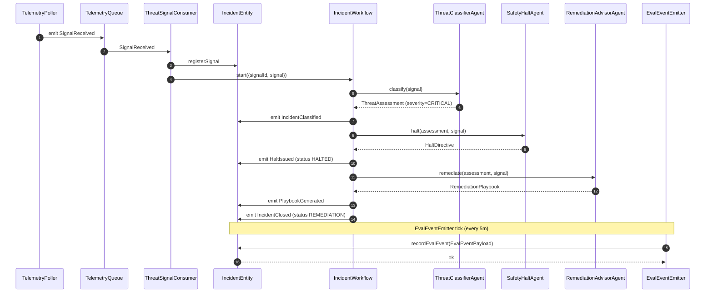
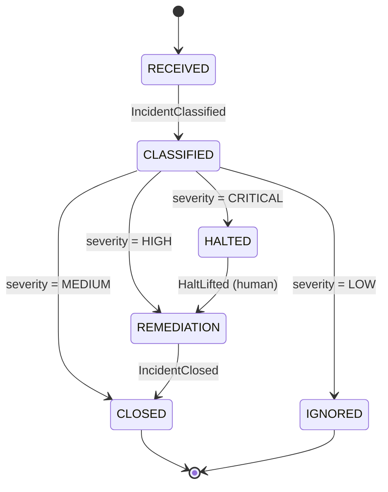
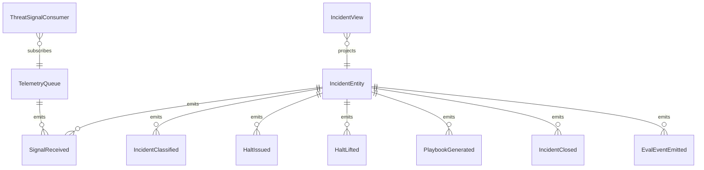

# PLAN — cyber-guardian-agent

Architectural sketch consumed by `/akka:plan` and rendered on the generated system's Architecture tab.

---

## Component graph

```mermaid
flowchart TB
  classDef agent fill:#0e1e2a,stroke:#7EC8E3,color:#7EC8E3;
  classDef wf fill:#1c1330,stroke:#A855F7,color:#A855F7;
  classDef ese fill:#1f1900,stroke:#F5C518,color:#F5C518;
  classDef view fill:#0e2010,stroke:#3fb950,color:#3fb950;
  classDef cons fill:#251503,stroke:#F97316,color:#F97316;
  classDef ta fill:#1a1c20,stroke:#aab3bd,color:#aab3bd;
  classDef ep fill:#161616,stroke:#fff,color:#fff;

  Poller[TelemetryPoller]:::ta
  Queue[TelemetryQueue]:::ese
  Consumer[ThreatSignalConsumer]:::cons
  Classifier[ThreatClassifierAgent]:::agent
  Advisor[RemediationAdvisorAgent]:::agent
  Halter[SafetyHaltAgent]:::agent
  WF[IncidentWorkflow]:::wf
  Entity[IncidentEntity]:::ese
  View[IncidentView]:::view
  Emitter[EvalEventEmitter]:::ta
  API[ThreatEndpoint]:::ep
  App[AppEndpoint]:::ep

  Poller -.->|every 10s| Queue
  Queue -.->|subscribes| Consumer
  Consumer -->|registerSignal| Entity
  Consumer -->|start| WF
  WF -->|call| Classifier
  WF -->|call (if CRITICAL)| Halter
  WF -->|call (if HIGH or CRITICAL)| Advisor
  WF -->|emit events| Entity
  Entity -.->|projects| View
  API -->|lift-halt| Entity
  API -->|query/SSE| View
  Emitter -.->|every 5m| Entity
```

## Interaction sequence — J1 (CRITICAL path)



## State machine — `IncidentEntity`



## Entity model



## Component table — Java file targets

| Component | Path (generated) |
|---|---|
| `TelemetryPoller` | `application/TelemetryPoller.java` |
| `TelemetryQueue` | `application/TelemetryQueue.java` |
| `ThreatSignalConsumer` | `application/ThreatSignalConsumer.java` |
| `ThreatClassifierAgent` | `application/ThreatClassifierAgent.java` |
| `RemediationAdvisorAgent` | `application/RemediationAdvisorAgent.java` |
| `SafetyHaltAgent` | `application/SafetyHaltAgent.java` |
| `IncidentWorkflow` | `application/IncidentWorkflow.java` |
| `IncidentEntity` | `application/IncidentEntity.java` (state in `domain/IncidentState.java`, events in `domain/IncidentEvent.java`) |
| `IncidentView` | `application/IncidentView.java` |
| `EvalEventEmitter` | `application/EvalEventEmitter.java` |
| `ThreatEndpoint` | `api/ThreatEndpoint.java` |
| `AppEndpoint` | `api/AppEndpoint.java` |
| Bootstrap | `Bootstrap.java` |

## Concurrency notes

- **Per-step timeout**: classifier 15 s, halt 20 s, remediation 45 s. On timeout, escalate severity to CRITICAL path.
- **No HITL gate for halt**: the system halts automatically. Human interaction is required only to *lift* the halt via `POST /api/threats/{id}/lift-halt`.
- **Idempotency**: every workflow uses `signalId` as the workflow id so duplicate consumer events fold into one workflow.
- **Eval sampling**: per tick, `EvalEventEmitter` picks up to 10 CLOSED/IGNORED incidents with no `evalEvent`, oldest-first.
