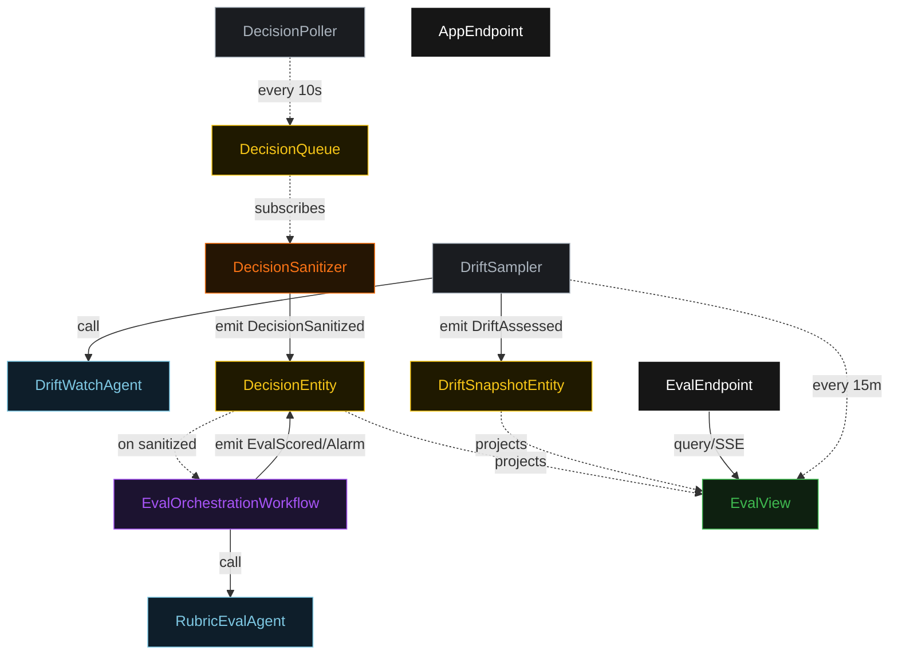
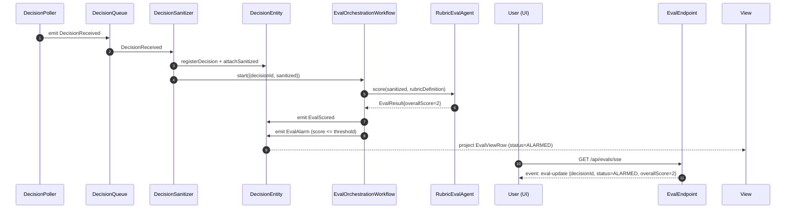
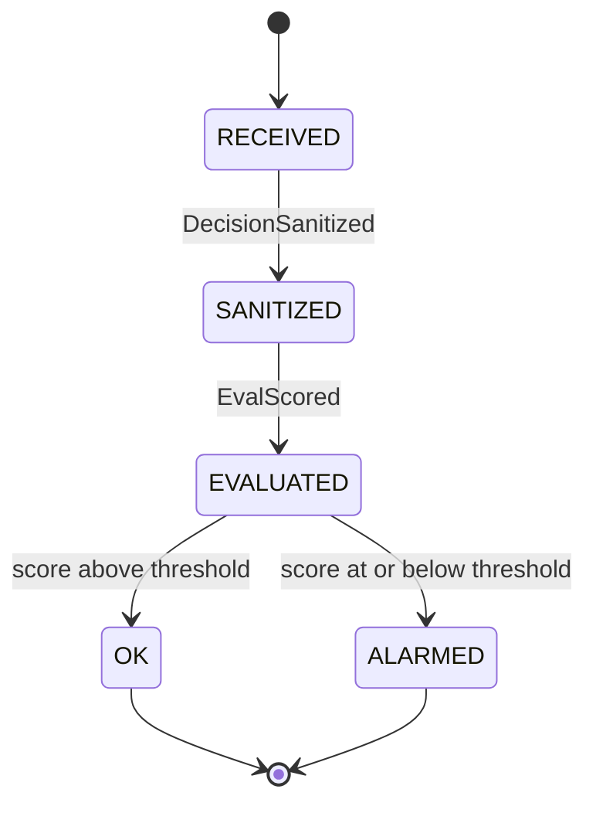
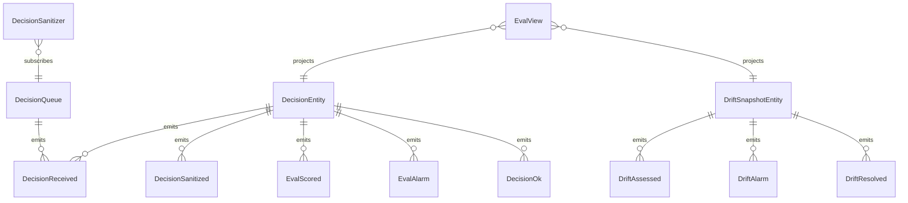

# PLAN — live-eval-harness

Architectural sketch consumed by `/akka:plan` and rendered on the generated system's Architecture tab.

---

## Component graph

## Interaction sequence — J1 + J2

## State machine — `DecisionEntity`

## Entity model

## Component table — Java file targets

| Component | Path (generated) |
|---|---|
| `DecisionPoller` | `application/DecisionPoller.java` |
| `DecisionQueue` | `application/DecisionQueue.java` |
| `DecisionSanitizer` | `application/DecisionSanitizer.java` |
| `RubricEvalAgent` | `application/RubricEvalAgent.java` |
| `DriftWatchAgent` | `application/DriftWatchAgent.java` |
| `EvalOrchestrationWorkflow` | `application/EvalOrchestrationWorkflow.java` |
| `DecisionEntity` | `application/DecisionEntity.java` (state in `domain/DecisionRecord.java`, events in `domain/DecisionEvent.java`) |
| `DriftSnapshotEntity` | `application/DriftSnapshotEntity.java` |
| `DriftSampler` | `application/DriftSampler.java` |
| `EvalView` | `application/EvalView.java` |
| `EvalEndpoint` | `api/EvalEndpoint.java` |
| `AppEndpoint` | `api/AppEndpoint.java` |
| Bootstrap | `Bootstrap.java` |

## Concurrency notes

- **Per-step timeout**: eval step 20 s. On timeout, emit `EvalScored` with `overallScore=1` and `summary="eval-timeout"` so the decision does not stall.
- **Alarm threshold**: configurable; default 3. Decisions with `overallScore <= threshold` emit `EvalAlarm`.
- **Idempotency**: every workflow uses `decisionId` as the workflow id so duplicate sanitize events fold into one workflow instance.
- **Drift sampling**: per tick, `DriftSampler` takes the 50 most recent EVALUATED/OK/ALARMED decisions. On an empty window (service just started), it emits `DriftAssessed` with `status=OK` and narrative "Insufficient data".
- **DriftSnapshotEntity** is a singleton (id="global"). All sessions share the single drift state.
