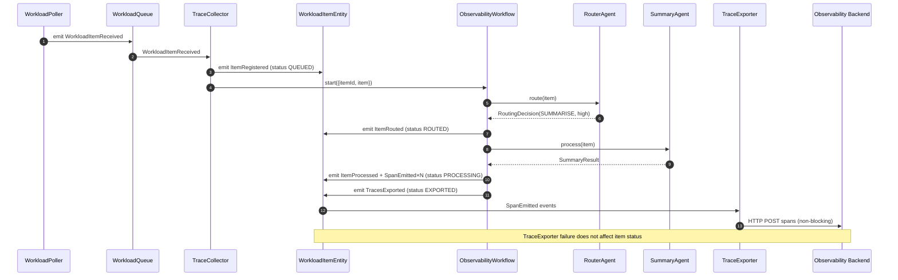
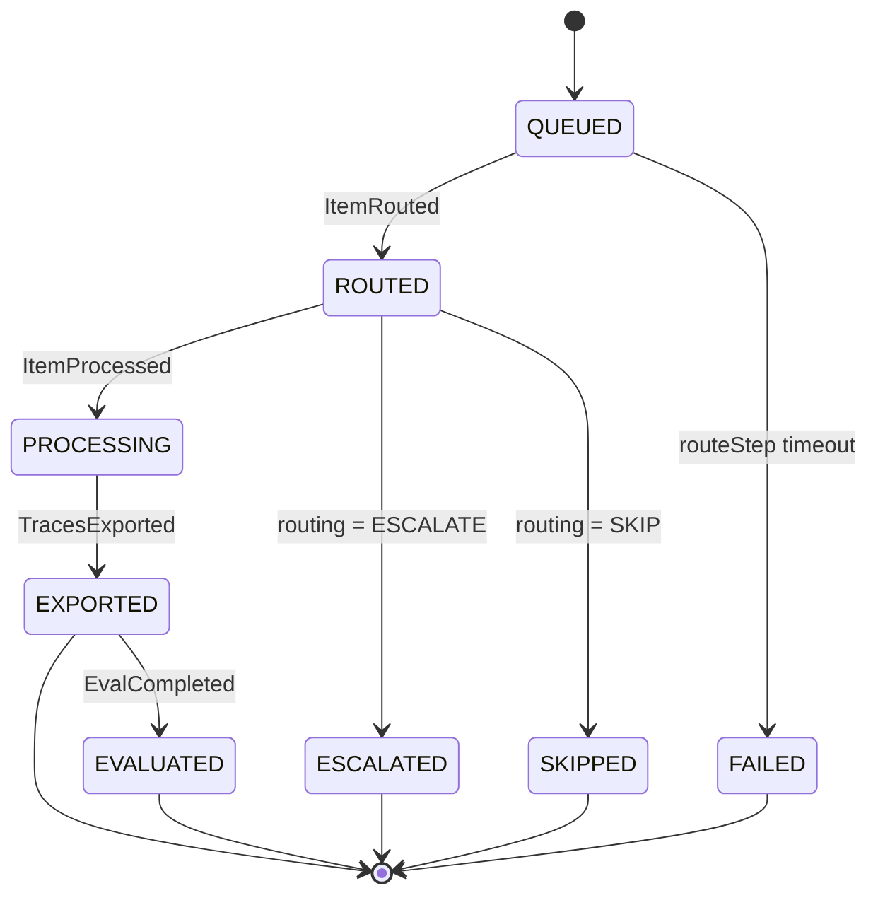
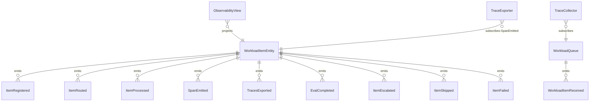

# PLAN — workflow-observability

Architectural sketch consumed by `/akka:plan` and rendered on the generated system's Architecture tab.

---

## Component graph

```mermaid
flowchart TB
  classDef agent fill:#0e1e2a,stroke:#7EC8E3,color:#7EC8E3;
  classDef wf fill:#1c1330,stroke:#A855F7,color:#A855F7;
  classDef ese fill:#1f1900,stroke:#F5C518,color:#F5C518;
  classDef view fill:#0e2010,stroke:#3fb950,color:#3fb950;
  classDef cons fill:#251503,stroke:#F97316,color:#F97316;
  classDef ta fill:#1a1c20,stroke:#aab3bd,color:#aab3bd;
  classDef ep fill:#161616,stroke:#fff,color:#fff;
  classDef ext fill:#1a0e1a,stroke:#e879f9,color:#e879f9;

  Poller[WorkloadPoller]:::ta
  Queue[WorkloadQueue]:::ese
  Collector[TraceCollector]:::cons
  Router[RouterAgent]:::agent
  Summariser[SummaryAgent]:::agent
  WF[ObservabilityWorkflow]:::wf
  Entity[WorkloadItemEntity]:::ese
  Exporter[TraceExporter]:::cons
  View[ObservabilityView]:::view
  EvalSampler[EvalSampler]:::ta
  API[ObservabilityEndpoint]:::ep
  App[AppEndpoint]:::ep
  Backend[(Arize Phoenix / Langfuse / Log)]:::ext

  Poller -.->|every 20s| Queue
  Queue -.->|subscribes| Collector
  Collector -->|emit ItemRegistered| Entity
  Entity -.->|on registered| WF
  WF -->|call| Router
  WF -->|call (if SUMMARISE)| Summariser
  WF -->|emit events| Entity
  Entity -.->|SpanEmitted| Exporter
  Exporter -->|forward traces| Backend
  Entity -.->|projects| View
  API -->|submit custom item| Queue
  API -->|query/SSE| View
  EvalSampler -.->|every 30m| Entity
```

## Interaction sequence — J1 + J2



## State machine — `WorkloadItemEntity`



## Entity model



## Component table — Java file targets

| Component | Path (generated) |
|---|---|
| `WorkloadPoller` | `application/WorkloadPoller.java` |
| `WorkloadQueue` | `application/WorkloadQueue.java` |
| `TraceCollector` | `application/TraceCollector.java` |
| `RouterAgent` | `application/RouterAgent.java` |
| `SummaryAgent` | `application/SummaryAgent.java` |
| `ObservabilityWorkflow` | `application/ObservabilityWorkflow.java` |
| `WorkloadItemEntity` | `application/WorkloadItemEntity.java` (state in `domain/WorkloadItemState.java`, events in `domain/WorkloadItemEvent.java`) |
| `TraceExporter` | `application/TraceExporter.java` |
| `ObservabilityView` | `application/ObservabilityView.java` |
| `EvalSampler` | `application/EvalSampler.java` |
| `ObservabilityEndpoint` | `api/ObservabilityEndpoint.java` |
| `AppEndpoint` | `api/AppEndpoint.java` |
| Bootstrap | `Bootstrap.java` |

## Concurrency notes

- **Per-step timeout**: router 10 s, summariser 30 s. On timeout in routeStep, emit `ItemFailed`.
- **Non-blocking trace export**: `TraceExporter` HTTP calls use a fire-and-forget async client; failure only produces a log line.
- **Idempotency**: every workflow uses `itemId` as the workflow id so duplicate `ItemRegistered` events fold into one workflow.
- **Eval sampling**: per tick, EvalSampler picks up to 5 EXPORTED items with no `evalScore`, oldest-first.
- **TRACE_BACKEND routing**: checked once per `TraceExporter` Consumer instance at start; if the env var is absent, the built-in structured log is used and no HTTP client is initialised.
