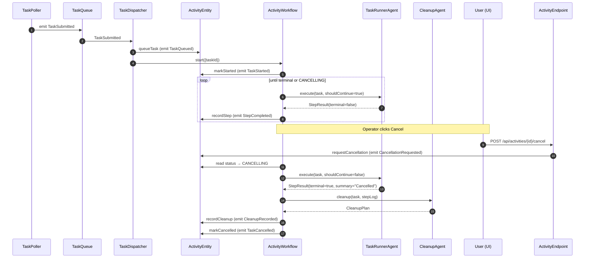
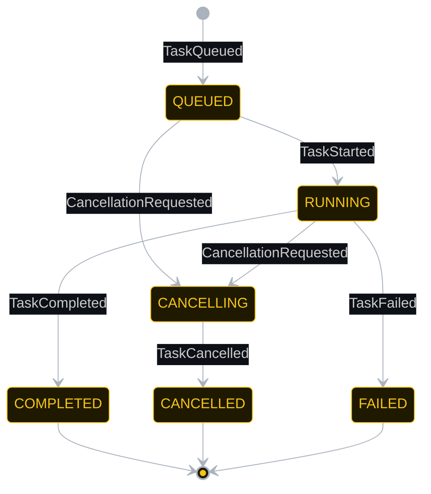
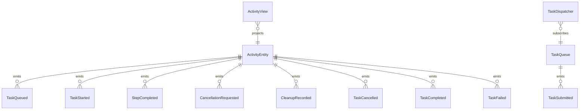

# PLAN — activity-interrupt-cancellation

Architectural sketch consumed by `/akka:plan` and rendered on the generated system's Architecture tab.

---

## Component graph

```mermaid
flowchart TB
  classDef agent fill:#0e1e2a,stroke:#7EC8E3,color:#7EC8E3;
  classDef wf fill:#1c1330,stroke:#A855F7,color:#A855F7;
  classDef ese fill:#1f1900,stroke:#F5C518,color:#F5C518;
  classDef view fill:#0e2010,stroke:#3fb950,color:#3fb950;
  classDef cons fill:#251503,stroke:#F97316,color:#F97316;
  classDef ta fill:#1a1c20,stroke:#aab3bd,color:#aab3bd;
  classDef ep fill:#161616,stroke:#fff,color:#fff;

  Poller[TaskPoller]:::ta
  Queue[TaskQueue]:::ese
  Dispatcher[TaskDispatcher]:::cons
  Runner[TaskRunnerAgent]:::agent
  Cleaner[CleanupAgent]:::agent
  WF[ActivityWorkflow]:::wf
  Entity[ActivityEntity]:::ese
  View[ActivityView]:::view
  Reaper[StaleActivityReaper]:::ta
  API[ActivityEndpoint]:::ep
  App[AppEndpoint]:::ep

  Poller -.->|every 20s| Queue
  Queue -.->|subscribes| Dispatcher
  Dispatcher -->|queueTask + start workflow| Entity
  Dispatcher -->|start| WF
  WF -->|markStarted| Entity
  WF -->|call loop| Runner
  Runner -->>|StepResult| WF
  WF -->|recordStep| Entity
  WF -->|call if CANCELLING| Cleaner
  Cleaner -->>|CleanupPlan| WF
  WF -->|recordCleanup / markCancelled / markCompleted| Entity
  Entity -.->|projects| View
  API -->|cancel| Entity
  API -->|query/SSE| View
  Reaper -.->|every 5m| Entity
```

## Interaction sequence — J1 + J2



## State machine — `ActivityEntity`



```css
/* Mermaid state-label overrides — Lesson 24 */
.statediagram-state rect { fill: #1f2937; stroke: #374151; }
.statediagram-state text { fill: #e5e7eb !important; }
.edgeLabel foreignObject { overflow: visible !important; }
.edgeLabel .label { color: #cccccc !important; background: #0d1117; padding: 2px 4px; }
```

## Entity model



## Component table — Java file targets

| Component | Path (generated) |
|---|---|
| `TaskPoller` | `application/TaskPoller.java` |
| `TaskQueue` | `application/TaskQueue.java` |
| `TaskDispatcher` | `application/TaskDispatcher.java` |
| `TaskRunnerAgent` | `application/TaskRunnerAgent.java` |
| `CleanupAgent` | `application/CleanupAgent.java` |
| `ActivityWorkflow` | `application/ActivityWorkflow.java` |
| `ActivityEntity` | `application/ActivityEntity.java` (state in `domain/ActivityRecord.java`, events in `domain/ActivityEvent.java`) |
| `ActivityView` | `application/ActivityView.java` |
| `StaleActivityReaper` | `application/StaleActivityReaper.java` |
| `ActivityEndpoint` | `api/ActivityEndpoint.java` |
| `AppEndpoint` | `api/AppEndpoint.java` |
| Bootstrap | `Bootstrap.java` |

## Concurrency notes

- **Per-step timeout**: `executeStep` 15 s; `startStep` 10 s. On timeout, the workflow transitions to CANCELLING and runs cleanup.
- **Cancellation signal propagation**: `ActivityWorkflow` reads `ActivityEntity.getActivity()` at the start of each `executeStep` iteration. If `status == CANCELLING`, it passes `shouldContinue=false` to `TaskRunnerAgent`. The agent returns a terminal step and the workflow proceeds to `cleanupStep`.
- **No auto-timeout on cleanup**: `cleanupStep` runs until `CleanupAgent` returns. A 30 s step timeout is set, but cleanup must produce a plan — if it fails, `TaskFailed` is emitted with the cleanup error.
- **Idempotency**: every workflow uses `taskId` as the workflow id; duplicate `TaskSubmitted` events fold into one workflow.
- **Stale detection**: `StaleActivityReaper` uses the view's `startedAt` field. The default timeout is `STALE_TIMEOUT_SECONDS=300` (5 minutes); overridable via environment variable for testing.
