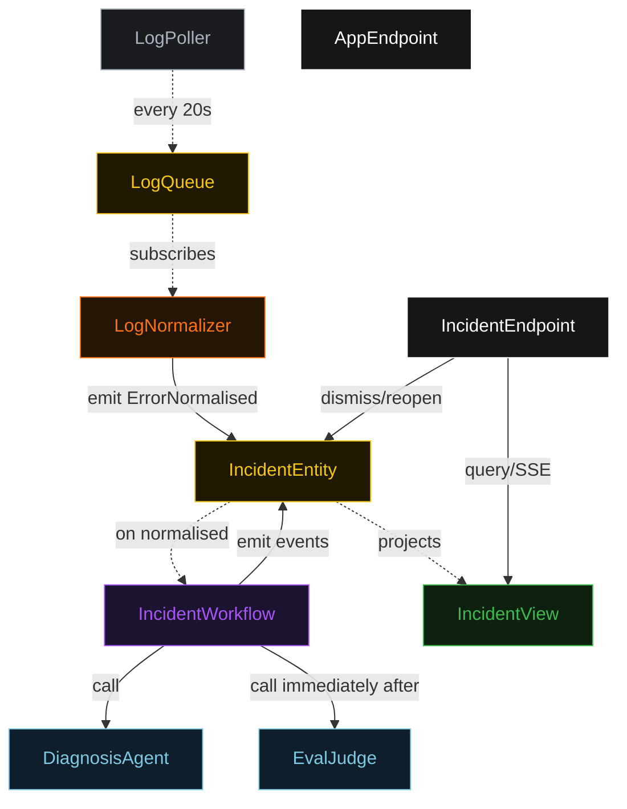
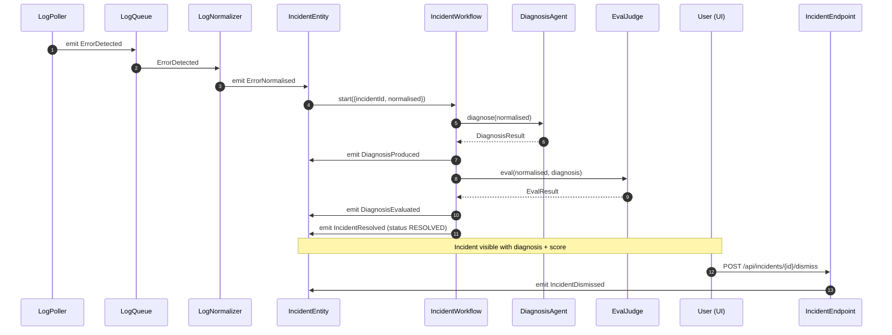
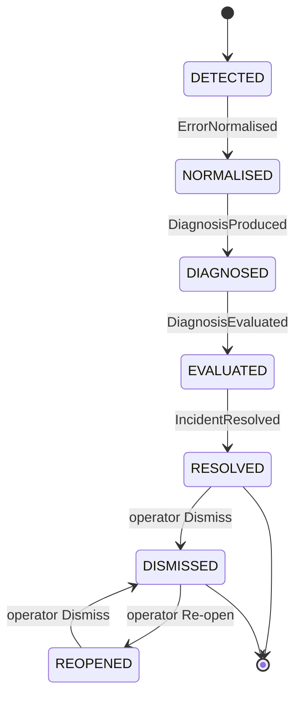
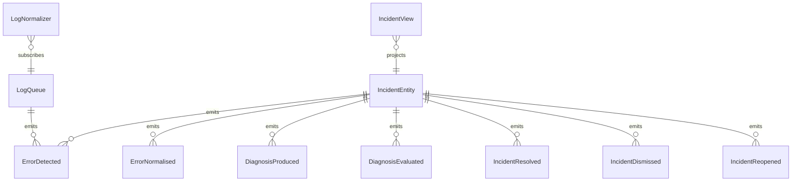

# PLAN — lambda-error-diagnoser

Architectural sketch consumed by `/akka:plan` and rendered on the generated system's Architecture tab.

---

## Component graph

## Interaction sequence — J1

## State machine — `IncidentEntity`

## Entity model

## Component table — Java file targets

| Component | Path (generated) |
|---|---|
| `LogPoller` | `application/LogPoller.java` |
| `LogQueue` | `application/LogQueue.java` |
| `LogNormalizer` | `application/LogNormalizer.java` |
| `DiagnosisAgent` | `application/DiagnosisAgent.java` |
| `EvalJudge` | `application/EvalJudge.java` |
| `IncidentWorkflow` | `application/IncidentWorkflow.java` |
| `IncidentEntity` | `application/IncidentEntity.java` (state in `domain/Incident.java`, events in `domain/IncidentEvent.java`) |
| `IncidentView` | `application/IncidentView.java` |
| `IncidentEndpoint` | `api/IncidentEndpoint.java` |
| `AppEndpoint` | `api/AppEndpoint.java` |
| Bootstrap | `Bootstrap.java` |

## Concurrency notes

- **Per-step timeout**: diagnose step 15 s; eval step 10 s. On diagnose timeout, emit IncidentResolved with a low-confidence stub and score=1 so the incident does not stall indefinitely.
- **On-incident eval**: the eval call happens in the same workflow execution, in the step immediately after diagnosis. There is no separate scheduler or sampling logic — every incident gets scored.
- **Idempotency**: every workflow uses `incidentId` as the workflow id, so duplicate normalise events fold into one workflow.
- **Severity ordering in the UI**: the view sorts CRITICAL and HIGH incidents to the top of the list regardless of arrival time; the underlying getAllIncidents query returns all rows and the client sorts.
