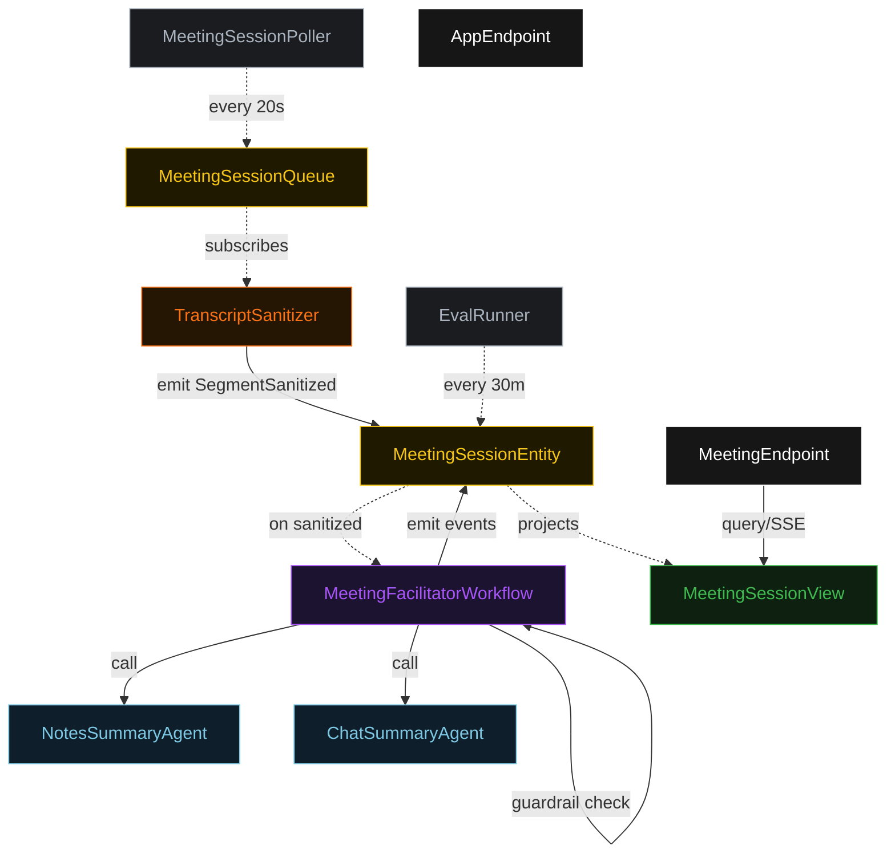
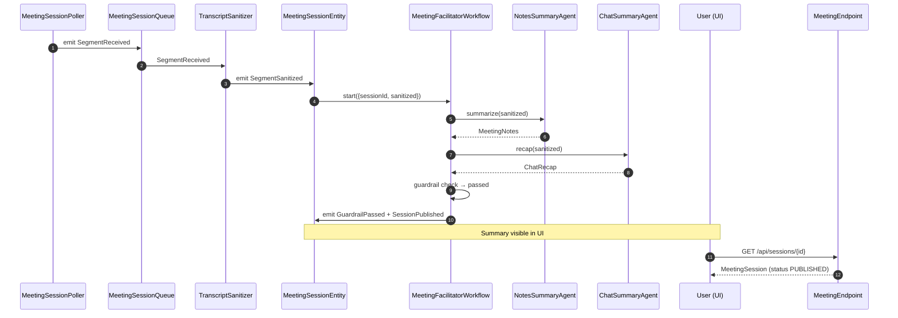
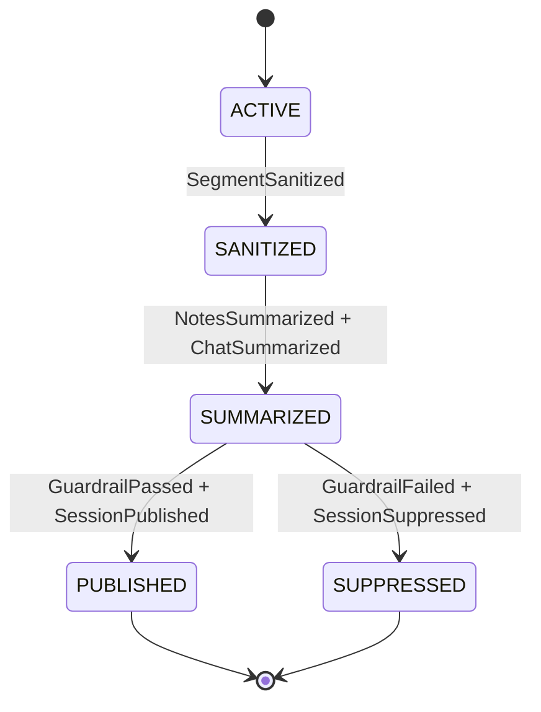
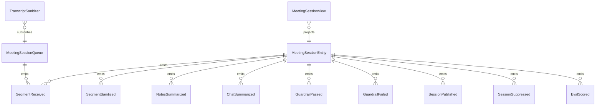

# PLAN — meeting-facilitator

Architectural sketch consumed by `/akka:plan` and rendered on the generated system's Architecture tab.

---

## Component graph

## Interaction sequence — J1 (happy path)

## State machine — `MeetingSessionEntity`

## Entity model

## Component table — Java file targets

| Component | Path (generated) |
|---|---|
| `MeetingSessionPoller` | `application/MeetingSessionPoller.java` |
| `MeetingSessionQueue` | `application/MeetingSessionQueue.java` |
| `TranscriptSanitizer` | `application/TranscriptSanitizer.java` |
| `NotesSummaryAgent` | `application/NotesSummaryAgent.java` |
| `ChatSummaryAgent` | `application/ChatSummaryAgent.java` |
| `MeetingFacilitatorWorkflow` | `application/MeetingFacilitatorWorkflow.java` |
| `MeetingSessionEntity` | `application/MeetingSessionEntity.java` (state in `domain/MeetingSession.java`, events in `domain/MeetingSessionEvent.java`) |
| `MeetingSessionView` | `application/MeetingSessionView.java` |
| `EvalRunner` | `application/EvalRunner.java` |
| `MeetingEndpoint` | `api/MeetingEndpoint.java` |
| `AppEndpoint` | `api/AppEndpoint.java` |
| Bootstrap | `Bootstrap.java` |

## Concurrency notes

- **Per-step timeout**: notes agent 30 s, chat agent 20 s. On timeout, emit GuardrailFailed + SessionSuppressed.
- **Guardrail gate**: `MeetingFacilitatorWorkflow` evaluates both agent outputs synchronously in `guardrailStep`. Both must pass for `SessionPublished` to be emitted.
- **Idempotency**: every workflow uses `sessionId` as the workflow id so duplicate sanitize events fold into one workflow instance.
- **Eval sampling**: per tick, EvalRunner picks up to 5 PUBLISHED sessions with no `evalScore`, oldest-first.
