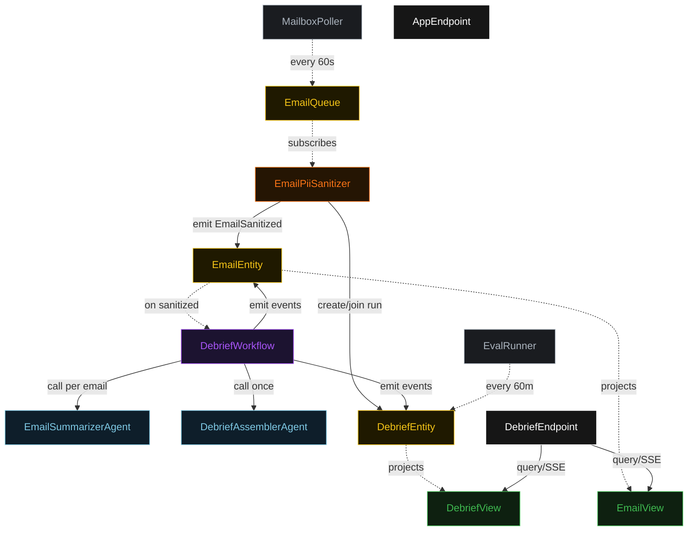
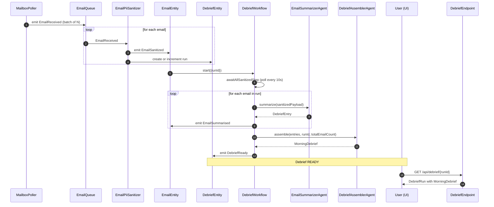
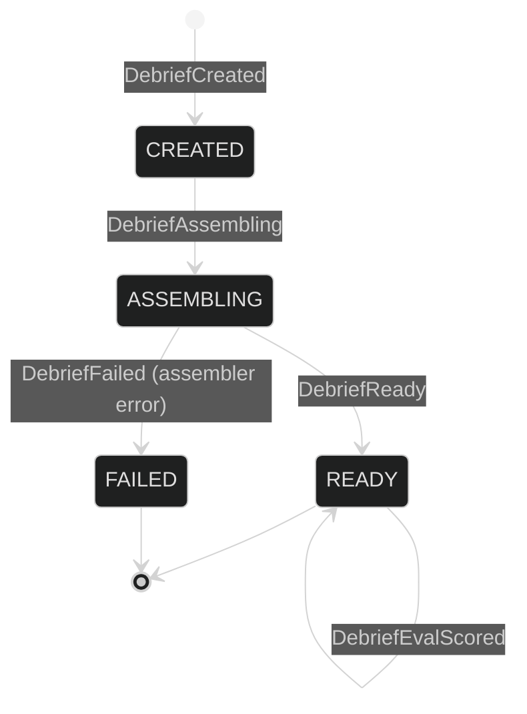
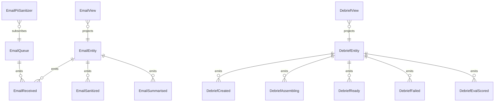

# PLAN — morning-email-debrief

Architectural sketch consumed by `/akka:plan` and rendered on the generated system's Architecture tab.

---

## Component graph

## Interaction sequence — J1 (batch arrives and debrief assembles)

## State machine — `DebriefEntity`

## Entity model

## Component table — Java file targets

| Component | Path (generated) |
|---|---|
| `MailboxPoller` | `application/MailboxPoller.java` |
| `EmailQueue` | `application/EmailQueue.java` |
| `EmailPiiSanitizer` | `application/EmailPiiSanitizer.java` |
| `EmailSummarizerAgent` | `application/EmailSummarizerAgent.java` |
| `DebriefAssemblerAgent` | `application/DebriefAssemblerAgent.java` |
| `DebriefWorkflow` | `application/DebriefWorkflow.java` |
| `EmailEntity` | `application/EmailEntity.java` (state in `domain/EmailRecord.java`, events in `domain/EmailEvent.java`) |
| `DebriefEntity` | `application/DebriefEntity.java` (state in `domain/DebriefRun.java`, events in `domain/DebriefEvent.java`) |
| `EmailView` | `application/EmailView.java` |
| `DebriefView` | `application/DebriefView.java` |
| `EvalRunner` | `application/EvalRunner.java` |
| `DebriefEndpoint` | `api/DebriefEndpoint.java` |
| `AppEndpoint` | `api/AppEndpoint.java` |
| `Bootstrap` | `Bootstrap.java` |

## Concurrency notes

- **Per-step timeout**: summarize step 15 s per email, assemble step 60 s. On assemble timeout, emit DebriefFailed.
- **Await gate**: `DebriefWorkflow` polls `EmailView` every 10 s in `awaitAllSanitizedStep` until all emails for the run are SUMMARISED (or timeout after 10 minutes).
- **Idempotency**: every workflow uses `runId` as the workflow id; the `EmailPiiSanitizer` starts or joins the workflow, never creates a duplicate.
- **Eval sampling**: per tick, `EvalRunner` picks up to 3 READY debriefs with no `evalScore`, oldest-first.
