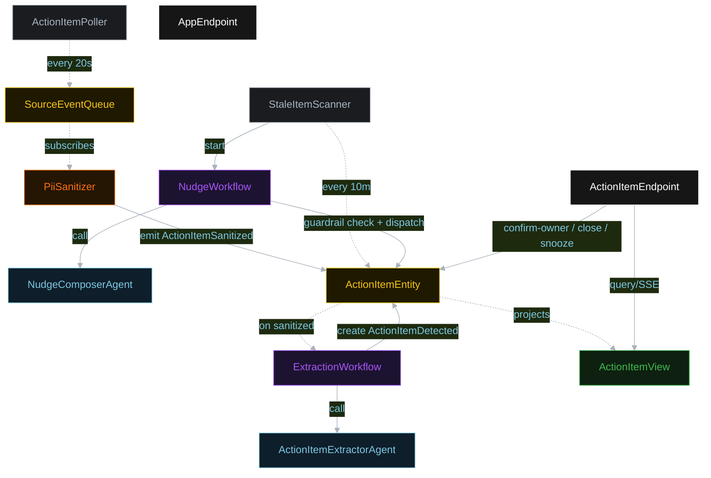
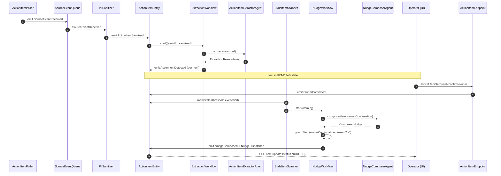
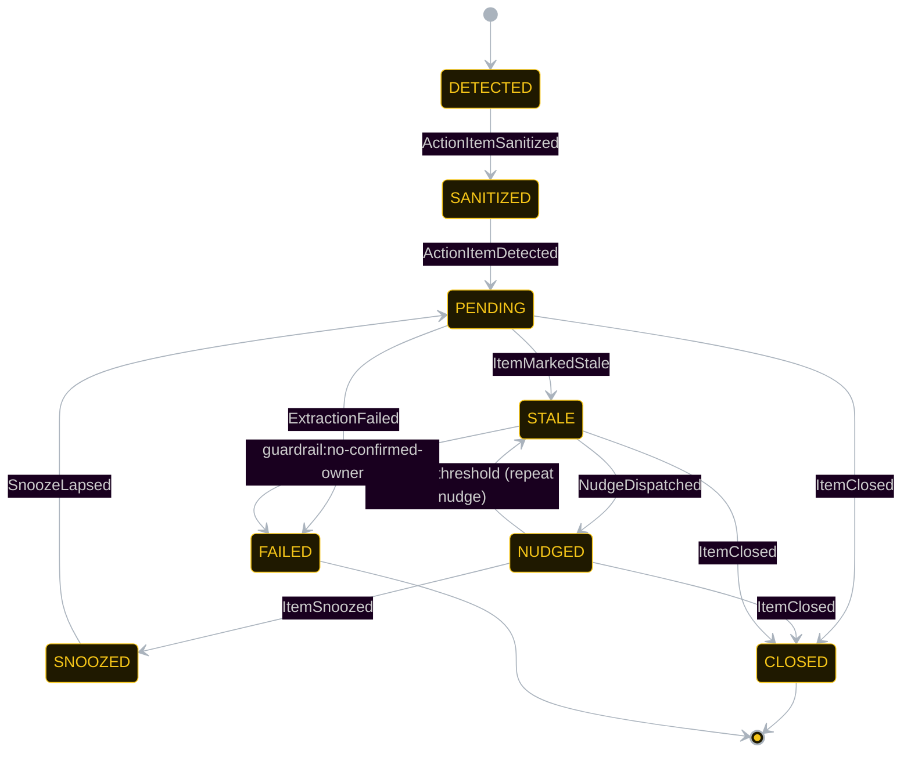
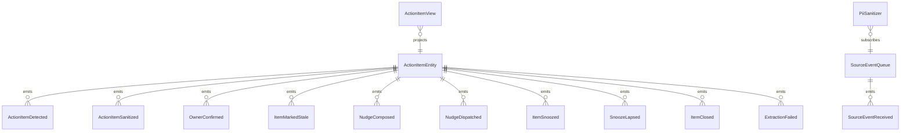

# PLAN — open-loop-chaser

Architectural sketch consumed by `/akka:plan` and rendered on the generated system's Architecture tab.

---

## Component graph

## Interaction sequence — J1 + J2

## State machine — `ActionItemEntity`

## Entity model

## Component table — Java file targets

| Component | Path (generated) |
|---|---|
| `ActionItemPoller` | `application/ActionItemPoller.java` |
| `SourceEventQueue` | `application/SourceEventQueue.java` |
| `PiiSanitizer` | `application/PiiSanitizer.java` |
| `ActionItemExtractorAgent` | `application/ActionItemExtractorAgent.java` |
| `NudgeComposerAgent` | `application/NudgeComposerAgent.java` |
| `ExtractionWorkflow` | `application/ExtractionWorkflow.java` |
| `NudgeWorkflow` | `application/NudgeWorkflow.java` |
| `ActionItemEntity` | `application/ActionItemEntity.java` (state in `domain/ActionItem.java`, events in `domain/ActionItemEvent.java`) |
| `ActionItemView` | `application/ActionItemView.java` |
| `StaleItemScanner` | `application/StaleItemScanner.java` |
| `ActionItemEndpoint` | `api/ActionItemEndpoint.java` |
| `AppEndpoint` | `api/AppEndpoint.java` |
| Bootstrap | `Bootstrap.java` |

## Concurrency notes

- **Per-step timeout**: extractor 15 s, nudge composer 30 s. On timeout, mark item FAILED.
- **Guardrail gate**: `NudgeWorkflow` guardStep reads `ActionItemEntity.getItem` and requires `ownerConfirmation.isPresent()` before proceeding to dispatchStep. If absent, the workflow ends with `ExtractionFailed(reason="guardrail:no-confirmed-owner")`.
- **Idempotency**: every workflow uses the source `eventId` (extraction) or `itemId` (nudge) as its workflow id so duplicate sanitize events and repeated scanner ticks fold safely.
- **Snooze expiry**: `SnoozeLapsed` is emitted by `StaleItemScanner` when it encounters a SNOOZED item whose `snooze.snoozedAt + snooze.snoozeDuration` is in the past. The item returns to PENDING.
- **Staleness threshold**: configurable via `application.conf`; defaults to 30 minutes. `StaleItemScanner` uses the later of `lastNudge.composedAt` and `detectedAt` for the threshold comparison.
