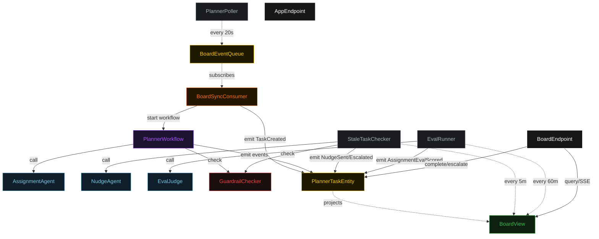
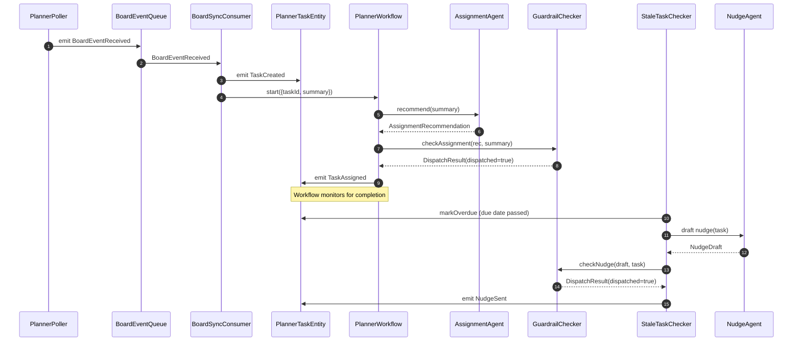
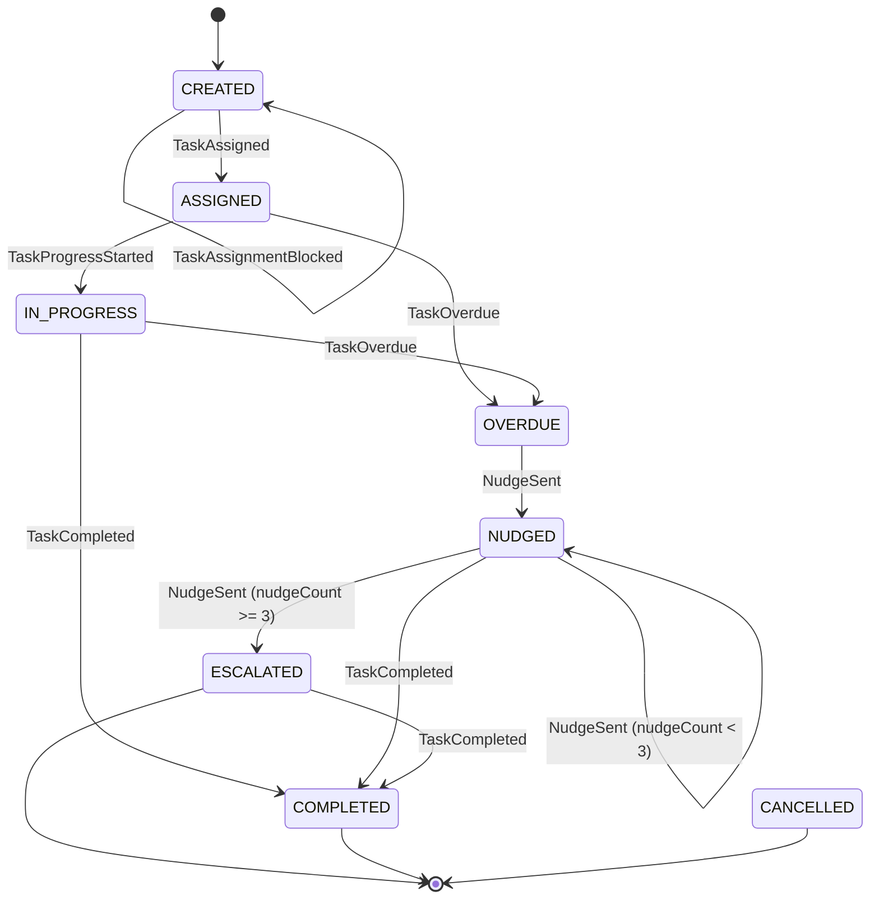
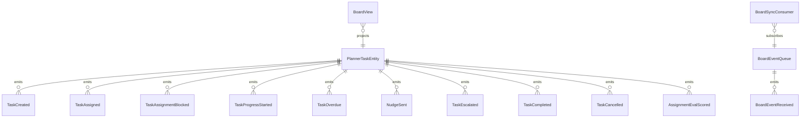

# PLAN — project-tracker

Architectural sketch consumed by `/akka:plan` and rendered on the generated system's Architecture tab.

---

## Component graph

## Interaction sequence — J1 + J2

## State machine — `PlannerTaskEntity`

## Entity model

## Component table — Java file targets

| Component | Path (generated) |
|---|---|
| `PlannerPoller` | `application/PlannerPoller.java` |
| `BoardEventQueue` | `application/BoardEventQueue.java` |
| `BoardSyncConsumer` | `application/BoardSyncConsumer.java` |
| `AssignmentAgent` | `application/AssignmentAgent.java` |
| `NudgeAgent` | `application/NudgeAgent.java` |
| `EvalJudge` | `application/EvalJudge.java` |
| `PlannerWorkflow` | `application/PlannerWorkflow.java` |
| `GuardrailChecker` | `application/GuardrailChecker.java` |
| `PlannerTaskEntity` | `application/PlannerTaskEntity.java` (state in `domain/PlannerTask.java`, events in `domain/PlannerTaskEvent.java`) |
| `BoardView` | `application/BoardView.java` |
| `StaleTaskChecker` | `application/StaleTaskChecker.java` |
| `EvalRunner` | `application/EvalRunner.java` |
| `BoardEndpoint` | `api/BoardEndpoint.java` |
| `AppEndpoint` | `api/AppEndpoint.java` |
| Bootstrap | `Bootstrap.java` |

## Concurrency notes

- **Per-step timeout**: recommend 15 s, guardrail check 5 s, assign 10 s. On timeout the workflow emits `TaskAssignmentBlocked` and ends.
- **Stale task scan**: `StaleTaskChecker` processes at most 3 nudge candidates per tick to avoid bursty LLM calls.
- **Idempotency**: every workflow uses `taskId` as the workflow id so duplicate `TaskCreated` events fold into one workflow.
- **Eval sampling**: per tick, EvalRunner picks up to 5 COMPLETED tasks with no `evalScore`, oldest-first.
- **Guardrail placement**: `GuardrailChecker` is a synchronous plain Java class called on the workflow thread and the StaleTaskChecker thread — no Akka component boundary.
