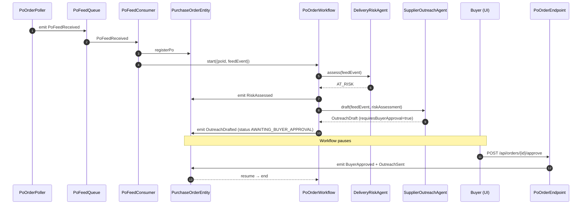
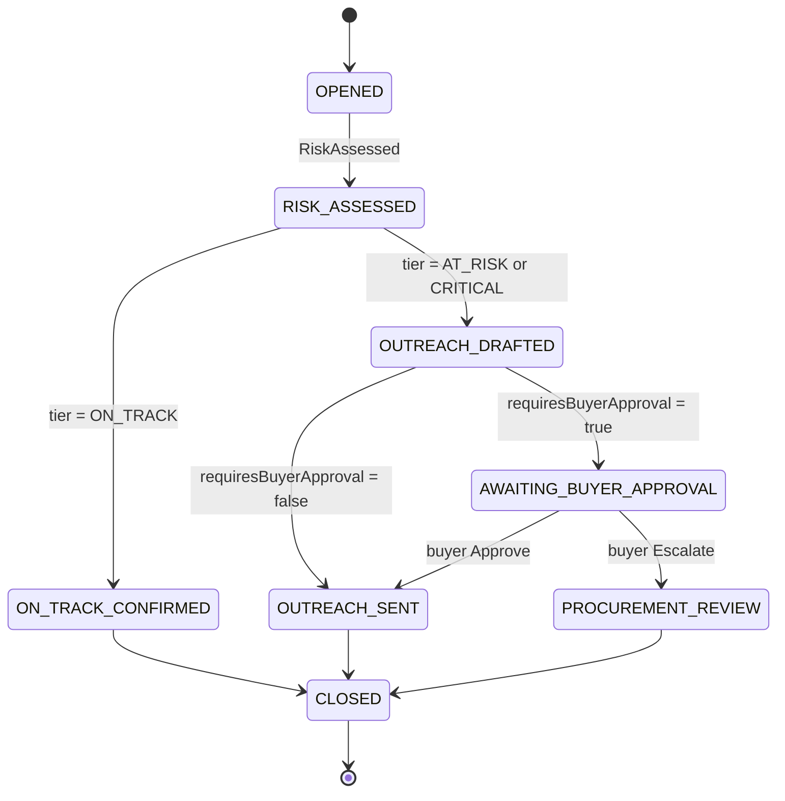
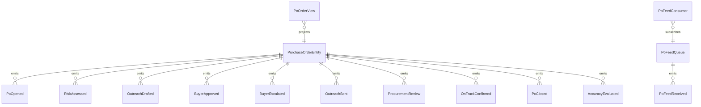

# PLAN — supplier-comms-monitor

Architectural sketch consumed by `/akka:plan` and rendered on the generated system's Architecture tab.

---

## Component graph

```mermaid
flowchart TB
  classDef agent fill:#0e1e2a,stroke:#7EC8E3,color:#7EC8E3;
  classDef wf fill:#1c1330,stroke:#A855F7,color:#A855F7;
  classDef ese fill:#1f1900,stroke:#F5C518,color:#F5C518;
  classDef view fill:#0e2010,stroke:#3fb950,color:#3fb950;
  classDef cons fill:#251503,stroke:#F97316,color:#F97316;
  classDef ta fill:#1a1c20,stroke:#aab3bd,color:#aab3bd;
  classDef ep fill:#161616,stroke:#fff,color:#fff;

  Poller[PoOrderPoller]:::ta
  Queue[PoFeedQueue]:::ese
  Consumer[PoFeedConsumer]:::cons
  RiskAgent[DeliveryRiskAgent]:::agent
  OutreachAgent[SupplierOutreachAgent]:::agent
  WF[PoOrderWorkflow]:::wf
  Entity[PurchaseOrderEntity]:::ese
  View[PoOrderView]:::view
  EvalRunner[AccuracyEvalRunner]:::ta
  API[PoOrderEndpoint]:::ep
  App[AppEndpoint]:::ep

  Poller -.->|every 20s| Queue
  Queue -.->|subscribes| Consumer
  Consumer -->|register + start| Entity
  Consumer -->|start workflow| WF
  WF -->|call| RiskAgent
  WF -->|call (if AT_RISK or CRITICAL)| OutreachAgent
  WF -->|emit events| Entity
  Entity -.->|projects| View
  API -->|approve/escalate| Entity
  API -->|query/SSE| View
  EvalRunner -.->|every 60m| Entity
```

## Interaction sequence — J1 + J2



## State machine — `PurchaseOrderEntity`



## Entity model



## Component table — Java file targets

| Component | Path (generated) |
|---|---|
| `PoOrderPoller` | `application/PoOrderPoller.java` |
| `PoFeedQueue` | `application/PoFeedQueue.java` |
| `PoFeedConsumer` | `application/PoFeedConsumer.java` |
| `DeliveryRiskAgent` | `application/DeliveryRiskAgent.java` |
| `SupplierOutreachAgent` | `application/SupplierOutreachAgent.java` |
| `PoOrderWorkflow` | `application/PoOrderWorkflow.java` |
| `PurchaseOrderEntity` | `application/PurchaseOrderEntity.java` (state in `domain/PurchaseOrder.java`, events in `domain/PoEvent.java`) |
| `PoOrderView` | `application/PoOrderView.java` |
| `AccuracyEvalRunner` | `application/AccuracyEvalRunner.java` |
| `PoOrderEndpoint` | `api/PoOrderEndpoint.java` |
| `AppEndpoint` | `api/AppEndpoint.java` |
| Bootstrap | `Bootstrap.java` |

## Concurrency notes

- **Per-step timeout**: risk assessment 15 s, outreach drafting 30 s. On timeout, escalate to PROCUREMENT_REVIEW.
- **HITL gate**: `PoOrderWorkflow` pauses in AWAITING_BUYER_APPROVAL using the workflow's poll-the-entity idiom; on each poll, if `decision.isPresent()` it advances.
- **Idempotency**: every workflow uses `poId` as the workflow id so duplicate feed events fold into one workflow.
- **Eval sampling**: per tick, AccuracyEvalRunner picks up to 5 CLOSED POs with no `accuracyScore`, oldest-first.
- **Guardrail position**: the `sendSupplierEmail` tool's before-call hook fires inside `PoOrderWorkflow`'s finalise step; it reads `PurchaseOrderEntity` state to confirm send eligibility before the simulated email stub is called.
