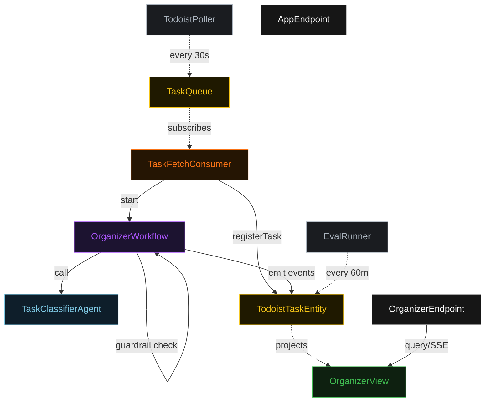
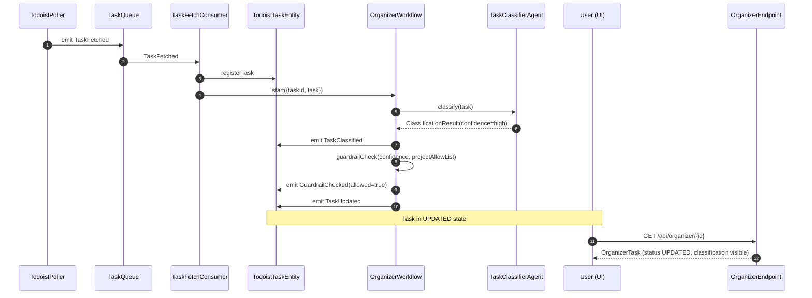
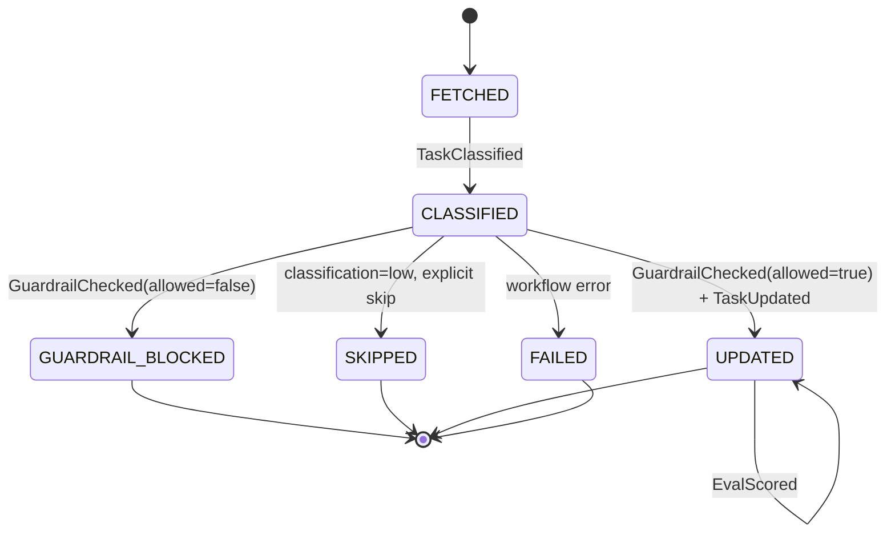
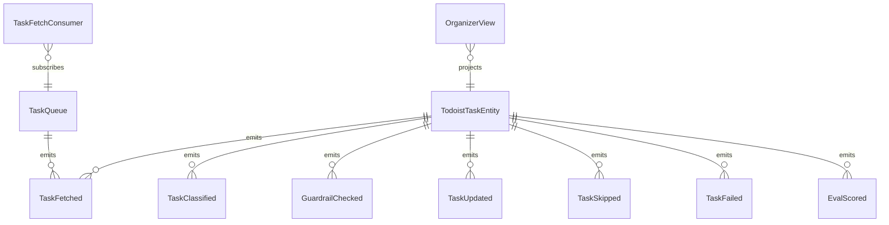

# PLAN — todoist-organizer

Architectural sketch consumed by `/akka:plan` and rendered on the generated system's Architecture tab.

---

## Component graph

## Interaction sequence — J1 + J2

## State machine — `TodoistTaskEntity`

## Entity model

## Component table — Java file targets

| Component | Path (generated) |
|---|---|
| `TodoistPoller` | `application/TodoistPoller.java` |
| `TaskQueue` | `application/TaskQueue.java` |
| `TaskFetchConsumer` | `application/TaskFetchConsumer.java` |
| `TaskClassifierAgent` | `application/TaskClassifierAgent.java` |
| `OrganizerWorkflow` | `application/OrganizerWorkflow.java` |
| `TodoistTaskEntity` | `application/TodoistTaskEntity.java` (state in `domain/OrganizerTask.java`, events in `domain/OrganizerTaskEvent.java`) |
| `OrganizerView` | `application/OrganizerView.java` |
| `EvalRunner` | `application/EvalRunner.java` |
| `OrganizerEndpoint` | `api/OrganizerEndpoint.java` |
| `AppEndpoint` | `api/AppEndpoint.java` |
| Bootstrap | `Bootstrap.java` |

## Concurrency notes

- **Per-step timeout**: classifier 15 s. On timeout, the workflow emits `TaskFailed` and terminates.
- **Guardrail gate**: `OrganizerWorkflow`'s `guardrailStep` is a synchronous in-workflow decision — no LLM call. It reads `ClassificationResult.confidence` and checks `targetProjectId` against a configured allow-list.
- **Idempotency**: every workflow uses `taskId` as the workflow id so duplicate fetch events fold into one workflow instance.
- **Eval sampling**: per tick, EvalRunner picks up to 5 UPDATED tasks with no `evalScore`, oldest-first.
