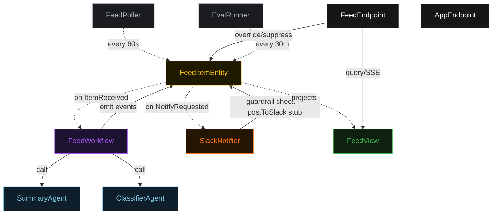
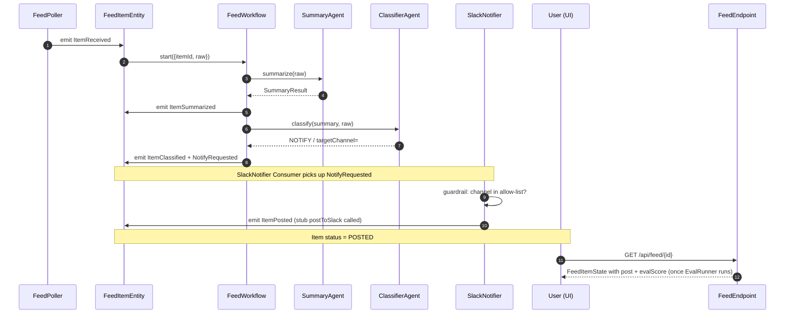
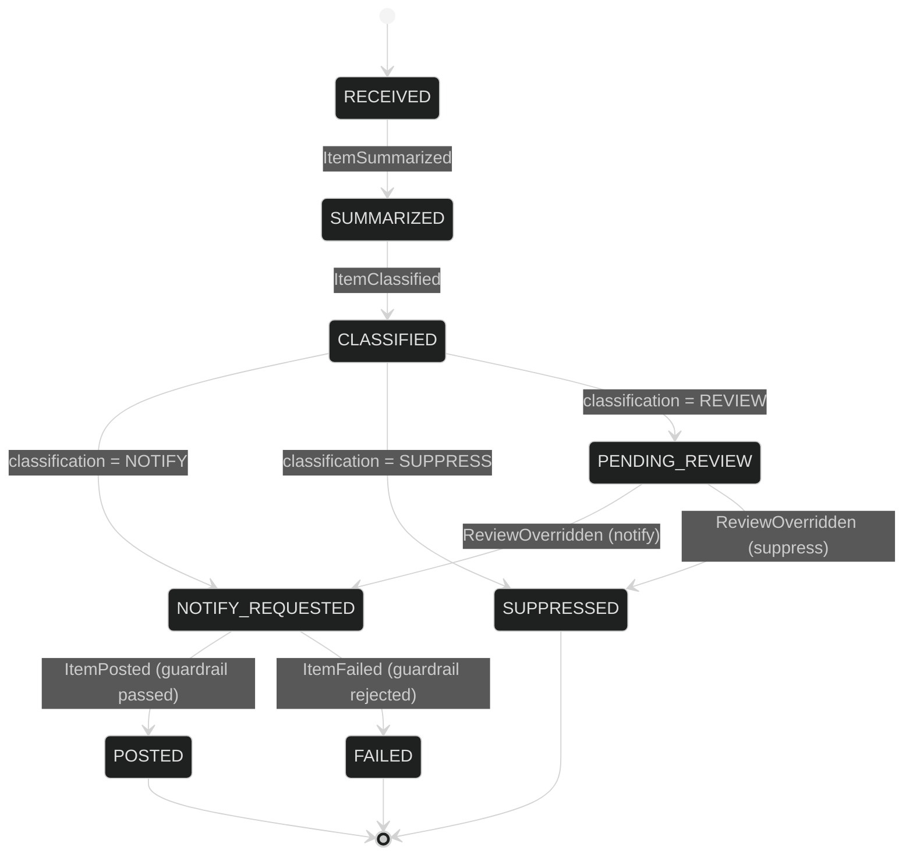
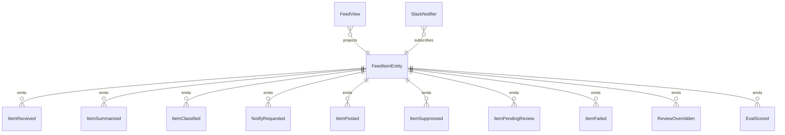

# PLAN — feed-monitor

Architectural sketch consumed by `/akka:plan` and rendered on the generated system's Architecture tab.

---

## Component graph

## Interaction sequence — J1

## State machine — `FeedItemEntity`

## Entity model

## Component table — Java file targets

| Component | Path (generated) |
|---|---|
| `FeedPoller` | `application/FeedPoller.java` |
| `FeedItemEntity` | `application/FeedItemEntity.java` (state in `domain/FeedItemState.java`, events in `domain/FeedItemEvent.java`) |
| `SummaryAgent` | `application/SummaryAgent.java` |
| `ClassifierAgent` | `application/ClassifierAgent.java` |
| `FeedWorkflow` | `application/FeedWorkflow.java` |
| `SlackNotifier` | `application/SlackNotifier.java` |
| `FeedView` | `application/FeedView.java` |
| `EvalRunner` | `application/EvalRunner.java` |
| `FeedEndpoint` | `api/FeedEndpoint.java` |
| `AppEndpoint` | `api/AppEndpoint.java` |
| Bootstrap | `Bootstrap.java` |

## Concurrency notes

- **Per-step timeout**: summarize 20 s, classify 10 s. On timeout, emit `ItemFailed(reason="step-timeout")`.
- **Guardrail check**: `SlackNotifier` synchronously validates channel before the stub call; on rejection, transitions to FAILED immediately.
- **Idempotency**: every workflow uses `itemId` as the workflow id so duplicate `ItemReceived` events fold into one workflow.
- **Review override**: `FeedEndpoint.override` and `FeedEndpoint.suppress` can advance PENDING_REVIEW items; they are the only callers of `recordReviewOverride`.
- **Eval sampling**: per tick, EvalRunner picks up to 5 POSTED items with no `evalScore`, oldest-first.
