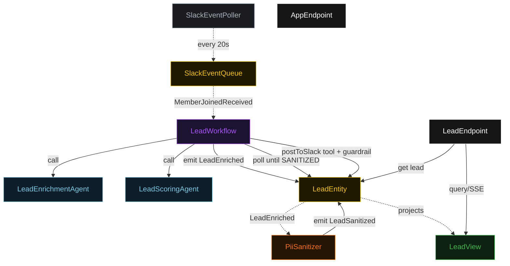
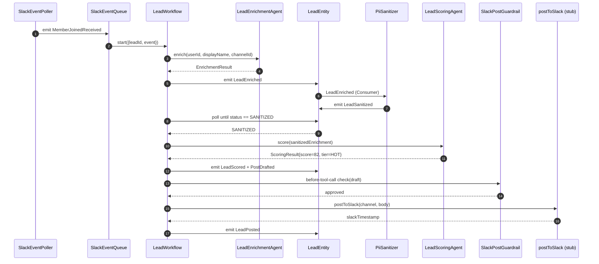
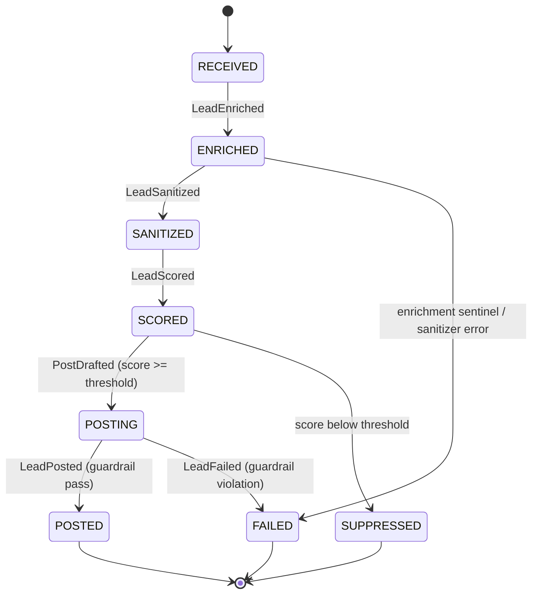
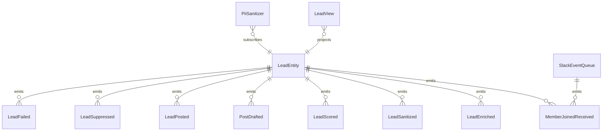

# PLAN — slack-lead-qualifier

Architectural sketch consumed by `/akka:plan` and rendered on the generated system's Architecture tab.

---

## Component graph

## Interaction sequence — J1 (happy path: HOT lead posted)

## State machine — `LeadEntity`

## Entity model

## Component table — Java file targets

| Component | Path (generated) |
|---|---|
| `SlackEventPoller` | `application/SlackEventPoller.java` |
| `SlackEventQueue` | `application/SlackEventQueue.java` |
| `LeadEnrichmentAgent` | `application/LeadEnrichmentAgent.java` |
| `LeadScoringAgent` | `application/LeadScoringAgent.java` |
| `PiiSanitizer` | `application/PiiSanitizer.java` |
| `LeadWorkflow` | `application/LeadWorkflow.java` |
| `LeadEntity` | `application/LeadEntity.java` (state in `domain/Lead.java`, events in `domain/LeadEvent.java`) |
| `LeadView` | `application/LeadView.java` |
| `LeadEndpoint` | `api/LeadEndpoint.java` |
| `AppEndpoint` | `api/AppEndpoint.java` |
| Bootstrap | `Bootstrap.java` |

## Concurrency notes

- **Per-step timeout**: enrichment 30 s, scoring 20 s. On enrichment timeout, set EnrichmentResult to sentinel and continue; PiiSanitizer detects the sentinel and emits LeadFailed.
- **Sanitizer poll**: `waitSanitizedStep` polls `LeadEntity.getLead` every 3 s. No auto-timeout — if the Consumer is delayed, the workflow waits. Deployers wanting an SLA can add a TimedAction that marks stale leads FAILED after N minutes.
- **Guardrail placement**: the `SlackPostGuardrail` runs before every `postToSlack` tool invocation. It reads the draft body from the call argument — it does NOT re-read entity state.
- **Idempotency**: each workflow uses `leadId` (derived from `eventId`) as the workflow id so duplicate event deliveries fold into one workflow.
- **Threshold configuration**: `akka.javasdk.lead-qualifier.posting-threshold` (default 60) is read at `conditionalPostStep` time; changing the config and restarting takes effect immediately without code changes.
