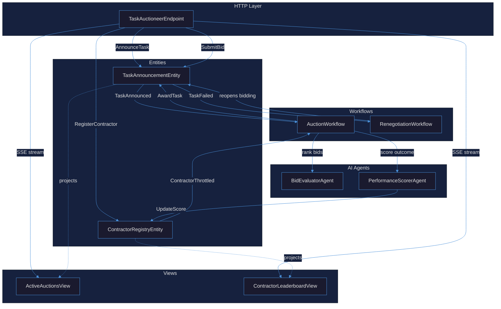
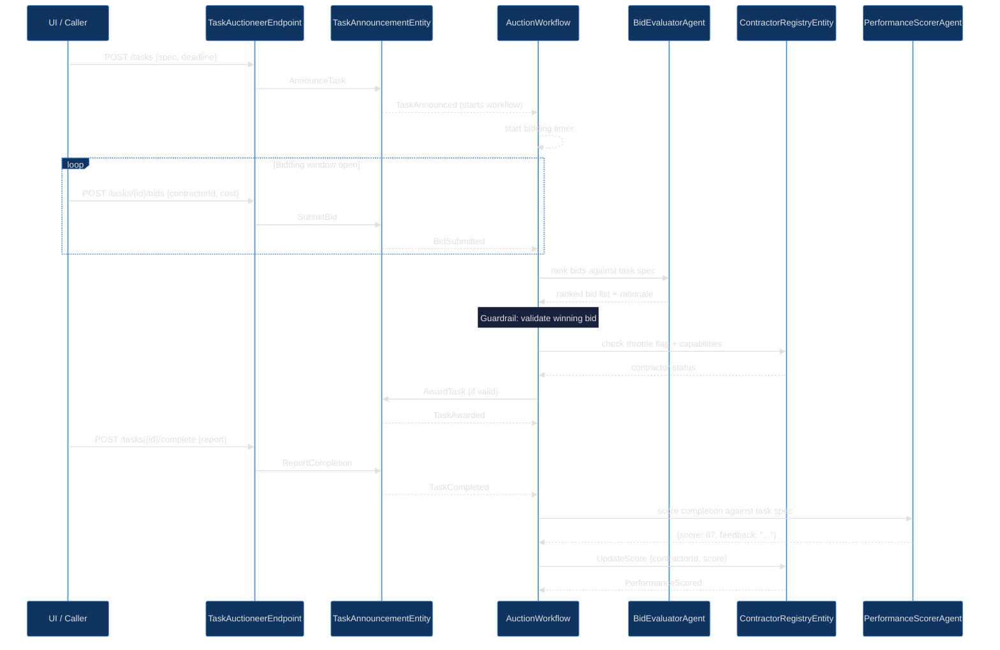
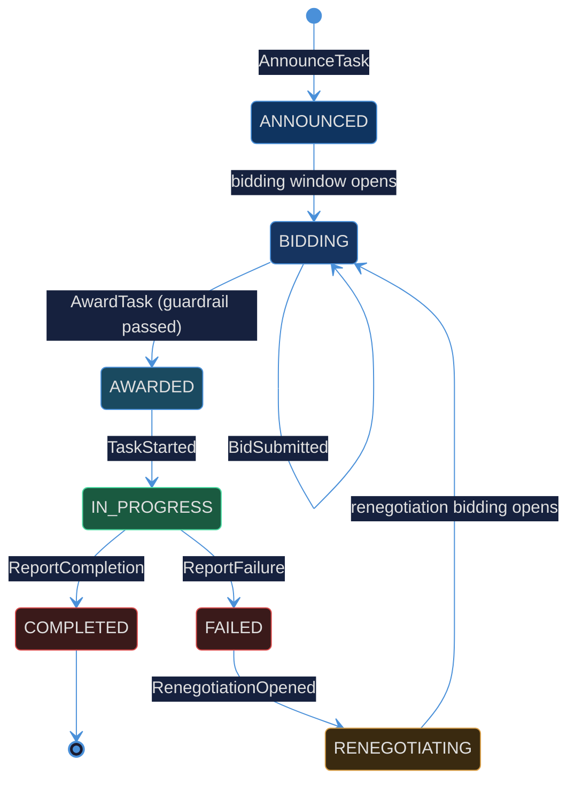
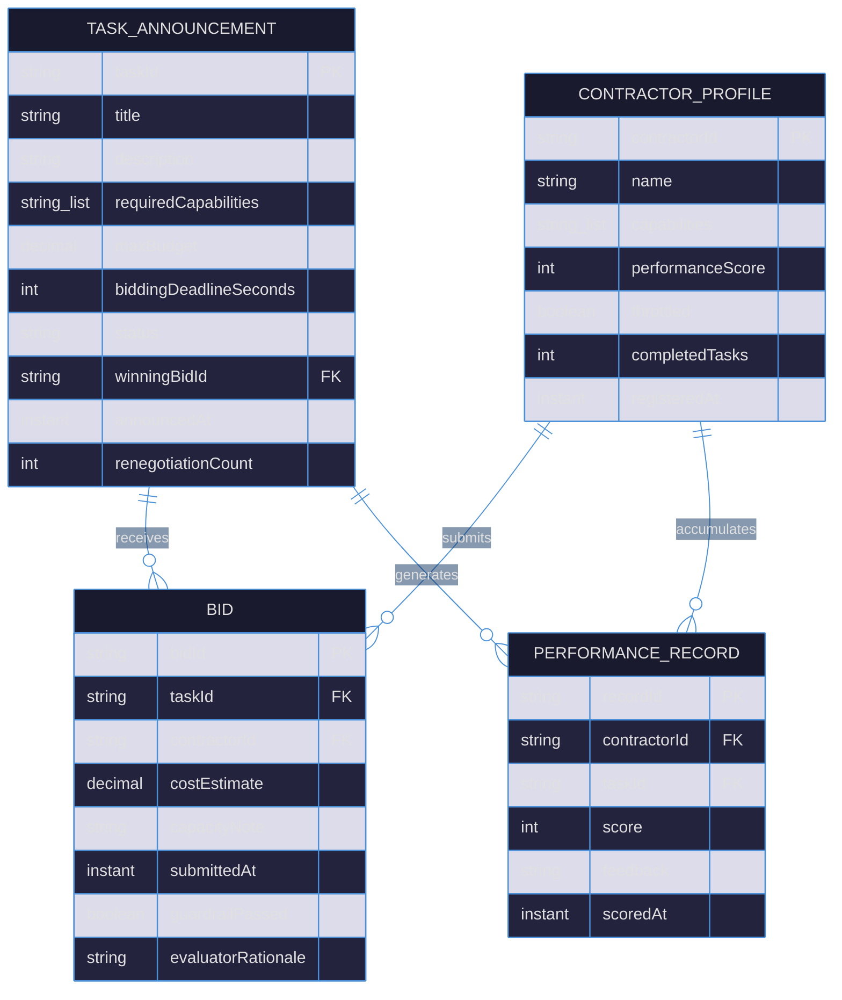

# PLAN — Contract-Net Task Auctioneer

## 1. Component Graph

## 2. Sequence — Happy Path (Announce → Award → Complete → Score)

## 3. State Machine — TaskAnnouncementEntity

## 4. Entity-Relationship Diagram

