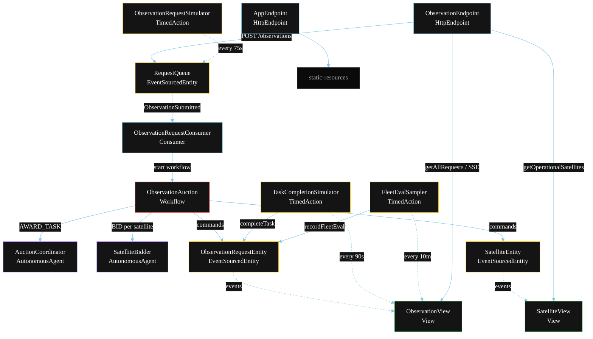
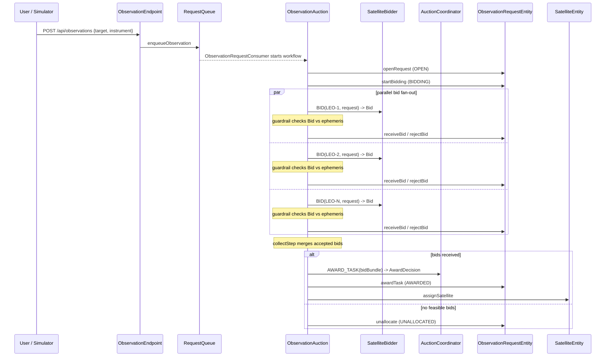
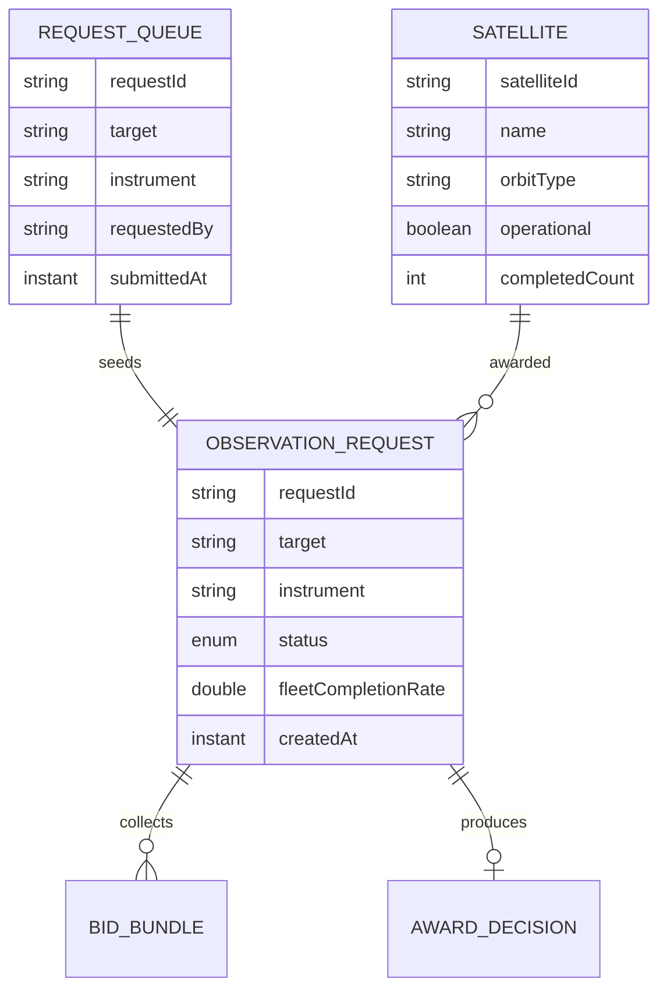

# PLAN — Contract-Net Satellite Tasker

Architectural sketch for `/akka:specify`. Mirrors `SPEC.md` Section 4 component names exactly. Mermaid sources here are rendered on the Architecture tab of the embedded UI; carry the Lesson 24 CSS overrides into the generated `index.html`.

## Component graph

Solid arrows: synchronous commands. Dashed arrows: event subscriptions and scheduled ticks.

## Interaction sequence

## State machine

```mermaid
stateDiagram-v2
  [*] --> OPEN
  OPEN --> BIDDING: startBidding
  BIDDING --> AWARDED: AwardDecision issued
  BIDDING --> UNALLOCATED: deadline; no feasible bids
  AWARDED --> COMPLETED: TaskCompleted
  AWARDED --> AWARDED: FleetEvalScored
  COMPLETED --> [*]
  UNALLOCATED --> [*]
```

## Entity model

## Component table

| Component | Akka primitive | File path |
|---|---|---|
| `AuctionCoordinator` | AutonomousAgent | `application/AuctionCoordinator.java` |
| `SatelliteBidder` | AutonomousAgent | `application/SatelliteBidder.java` |
| `SatelliteTasks` | Task constants | `application/SatelliteTasks.java` |
| `ObservationAuction` | Workflow | `application/ObservationAuction.java` |
| `ObservationRequestEntity` | EventSourcedEntity | `domain/ObservationRequestEntity.java` |
| `SatelliteEntity` | EventSourcedEntity | `domain/SatelliteEntity.java` |
| `RequestQueue` | EventSourcedEntity | `domain/RequestQueue.java` |
| `ObservationView` | View | `application/ObservationView.java` |
| `SatelliteView` | View | `application/SatelliteView.java` |
| `ObservationRequestConsumer` | Consumer | `application/ObservationRequestConsumer.java` |
| `ObservationRequestSimulator` | TimedAction | `application/ObservationRequestSimulator.java` |
| `TaskCompletionSimulator` | TimedAction | `application/TaskCompletionSimulator.java` |
| `FleetEvalSampler` | TimedAction | `application/FleetEvalSampler.java` |
| `ObservationEndpoint` | HttpEndpoint | `api/ObservationEndpoint.java` |
| `AppEndpoint` | HttpEndpoint | `api/AppEndpoint.java` |

## Concurrency notes

- **Step timeouts (Lesson 4):** each `bidStep` gets 30s; `awardStep` gets 45s. The 5s default fails every LLM call. `WorkflowSettings` is nested inside `Workflow` — no import.
- **Parallel bid fan-out:** all satellite bid steps run concurrently via `CompletionStage` zip over the fleet list, not sequential step calls.
- **Idempotency:** the workflow id is the `requestId`. Re-delivery of the same `ObservationSubmitted` event resolves to the same workflow instance — no duplicate auction.
- **Guardrail placement:** the bid-feasibility guardrail runs inside the workflow immediately after each `SatelliteBidder` returns, before the bid is added to the pool. Infeasible bids never reach the AuctionCoordinator.
- **Empty-pool path:** if `collectStep` finds zero accepted bids it transitions to `unallocatedStep` without calling the AuctionCoordinator.
- **Fleet eval:** `FleetEvalSampler` reads `ObservationView.getAllRequests` (no enum WHERE clause) and filters client-side for AWARDED and COMPLETED counts.
