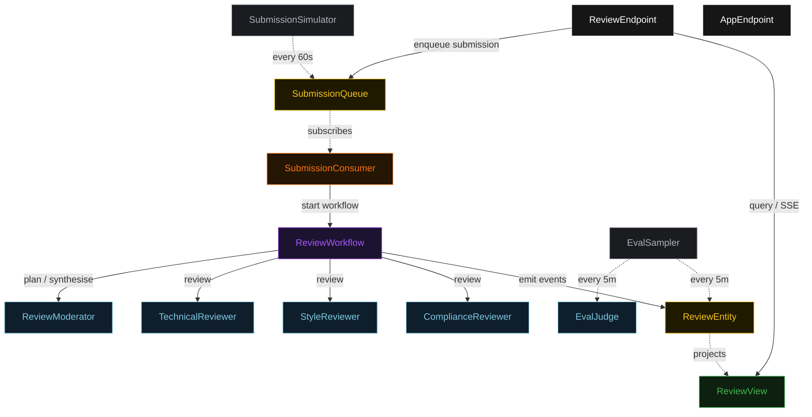
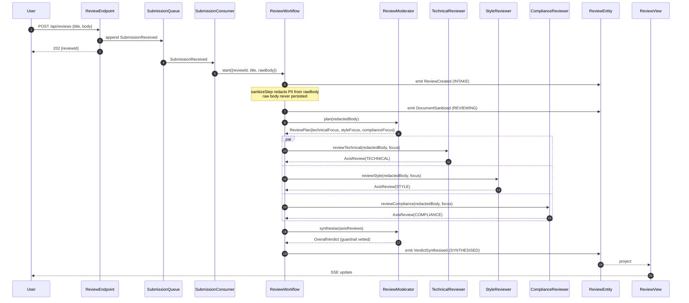
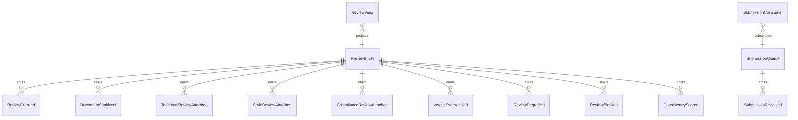

# PLAN — peerreview

Architectural sketch consumed by `/akka:plan` (or skipped if `/akka:specify` covers it). Diagrams are rendered on the generated system's Architecture tab. All four mermaid diagrams use the Akka theme palette; the state diagram carries the Lesson 24 CSS overrides so state names render white and edge labels are not clipped.

---

## Component graph

Solid arrows are synchronous commands; dashed arrows are event subscriptions and scheduled ticks. The PII sanitizer is a deterministic helper invoked inside `ReviewWorkflow.sanitizeStep` — it has no component box because it makes no Akka call of its own.

## Interaction sequence — J1 (happy path)

## State machine — `ReviewEntity`

```mermaid
stateDiagram-v2
  [*] --> INTAKE
  INTAKE --> REVIEWING: DocumentSanitized (PII redacted)
  REVIEWING --> SYNTHESISED: all axes reviewed; guardrail OK
  REVIEWING --> DEGRADED: a reviewer timed out
  REVIEWING --> BLOCKED: guardrail rejected the verdict
  SYNTHESISED --> SYNTHESISED: ConsistencyScored (no status change)
  SYNTHESISED --> [*]
  DEGRADED --> [*]
  BLOCKED --> [*]
```

## Entity model

## Component table — Java file targets

| Component | Path (generated) |
|---|---|
| `ReviewModerator` | `application/ReviewModerator.java` |
| `TechnicalReviewer` | `application/TechnicalReviewer.java` |
| `StyleReviewer` | `application/StyleReviewer.java` |
| `ComplianceReviewer` | `application/ComplianceReviewer.java` |
| `EvalJudge` | `application/EvalJudge.java` |
| `ReviewTasks` | `application/ReviewTasks.java` |
| `PiiSanitizer` | `application/PiiSanitizer.java` |
| `ReviewWorkflow` | `application/ReviewWorkflow.java` |
| `ReviewEntity` | `application/ReviewEntity.java` (state in `domain/Review.java`, events in `domain/ReviewEvent.java`) |
| `SubmissionQueue` | `application/SubmissionQueue.java` |
| `ReviewView` | `application/ReviewView.java` |
| `SubmissionConsumer` | `application/SubmissionConsumer.java` |
| `SubmissionSimulator` | `application/SubmissionSimulator.java` |
| `EvalSampler` | `application/EvalSampler.java` |
| `ReviewEndpoint` | `api/ReviewEndpoint.java` |
| `AppEndpoint` | `api/AppEndpoint.java` |
| `Bootstrap` | `Bootstrap.java` |

Akka component count: **2 http-endpoint · 2 timed-action · 1 view · 1 workflow · 1 service-setup · 5 autonomous-agent · 1 consumer · 2 event-sourced-entity**.

## Concurrency notes

- **Workflow step timeouts:** wrap the three reviewer calls and the synthesise call in `WorkflowSettings.builder().stepTimeout(MyStep, Duration.ofSeconds(60))`. The default 5-second step timeout (Lesson 4) is far too short for LLM calls — without the override every reviewer step retries forever. `WorkflowSettings` is the nested `Workflow.WorkflowSettings` (Lesson 5) — no import.
- **Parallel fork:** `technicalStep`, `styleStep`, and `complianceStep` use Akka's parallel-step idiom (CompletionStage zip). All three calls must be initiated before any is awaited; sequential calls would defeat the debate-multi-perspective pattern.
- **Degraded path:** on any reviewer timeout, transition to a synthesis from partial input rather than failing the whole workflow. `failureReason` names the missing reviewer; status is `DEGRADED`.
- **Sanitizer ordering:** `sanitizeStep` runs before `planStep`. The raw body lives only in the workflow's transient start command and is never written to `ReviewEntity` — only `redactedBody` is persisted. This realises control S1.
- **Idempotency:** `ReviewEndpoint.submit` uses `(title, submittedBy)` over a 10-second window as the idempotency key to avoid double-creation on client retry.
- **View indexing:** `ReviewView` exposes one query, `getAllReviews`, with no `WHERE status` clause — Akka cannot auto-index the `ReviewStatus` enum column (Lesson 2). Callers filter by status client-side.
- **Eval sampling:** `EvalSampler` selects the oldest `SYNTHESISED` review with no `consistencyScore`, one per tick. `ConsistencyScored` does not change status; it only populates the score and rationale.
- **emptyState:** `ReviewEntity.emptyState()` returns `Review.initial("", "")` with placeholder identity values and never references `commandContext()` (Lesson 3).
