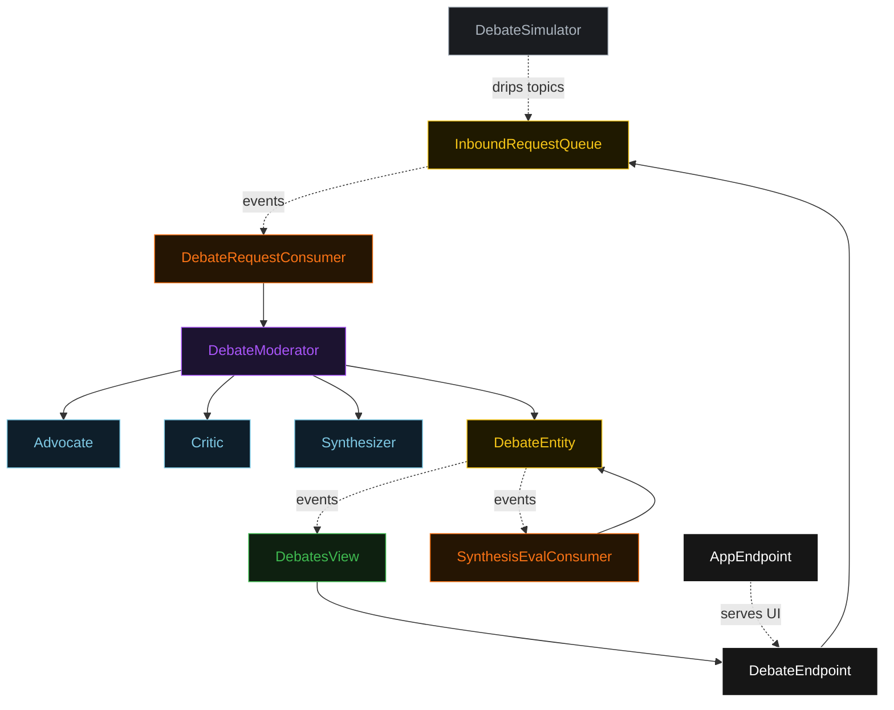
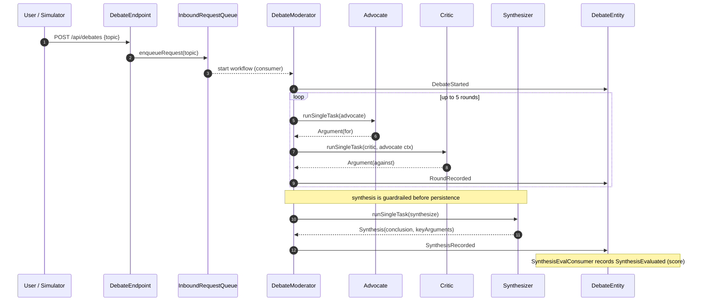
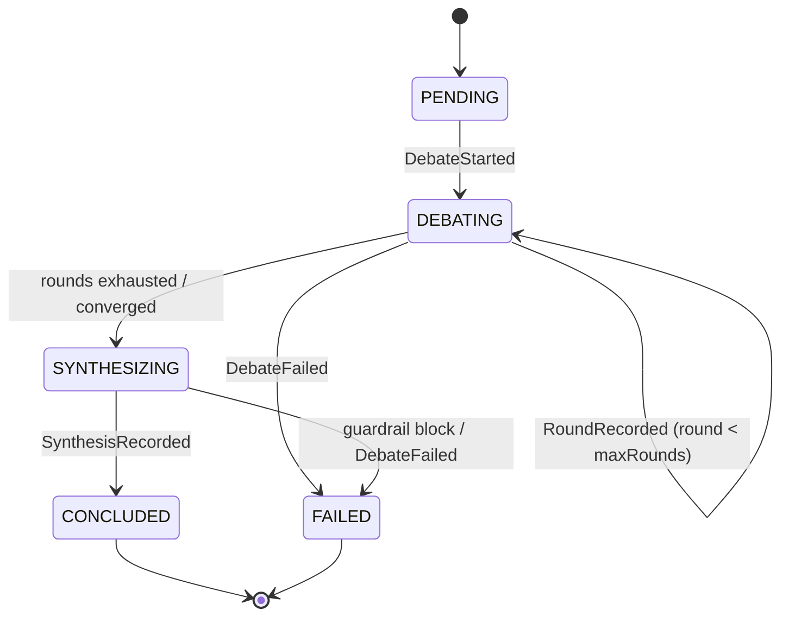
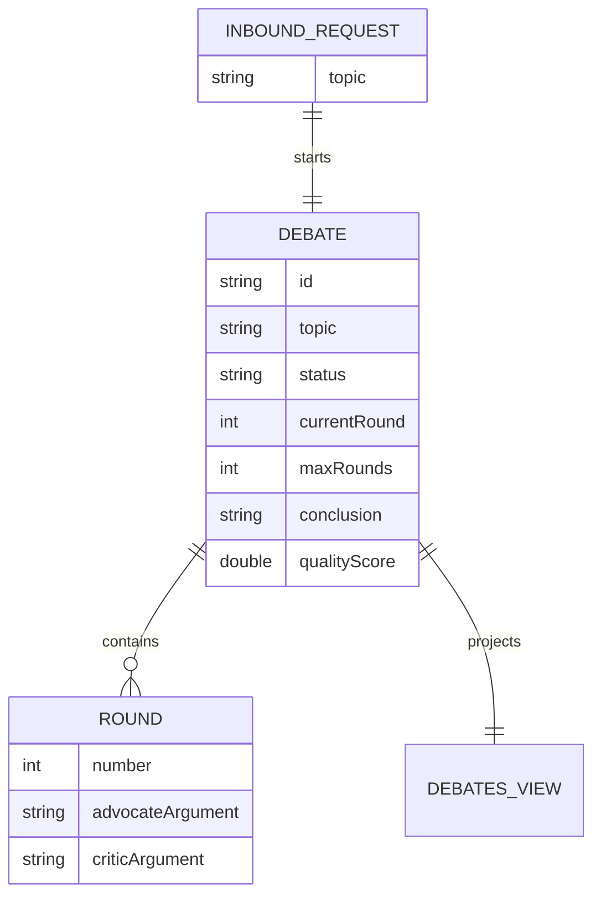

# PLAN — debate

Architectural sketch. All four mermaid diagrams + the component table are required. Diagrams render on the Architecture tab; the generated `index.html` must carry the Lesson 24 state-label CSS overrides.

---

## Component graph

## Interaction sequence

## State machine

## Entity model

## Component table

| Component | Path (generated) |
|---|---|
| `Advocate` | `application/Advocate.java` |
| `Critic` | `application/Critic.java` |
| `Synthesizer` | `application/Synthesizer.java` |
| `DebateTasks` | `application/DebateTasks.java` |
| `DebateModerator` | `application/DebateModerator.java` |
| `DebateEntity` | `application/DebateEntity.java` |
| `InboundRequestQueue` | `application/InboundRequestQueue.java` |
| `DebatesView` | `application/DebatesView.java` |
| `DebateRequestConsumer` | `application/DebateRequestConsumer.java` |
| `SynthesisEvalConsumer` | `application/SynthesisEvalConsumer.java` |
| `DebateSimulator` | `application/DebateSimulator.java` |
| `DebateEndpoint` | `api/DebateEndpoint.java` |
| `AppEndpoint` | `api/AppEndpoint.java` |
| domain records | `domain/Debate.java`, `domain/Round.java`, `domain/Argument.java`, `domain/Synthesis.java` |

## Concurrency notes

- **Step timeouts:** `roundStep` and `synthesisStep` call agents — override `stepTimeout(60s)` on both (Lesson 4). Default 5s would time out on every LLM call.
- **Round bound:** `maxRounds` = 5 caps the loop; `roundStep` self-transitions until `currentRound == maxRounds` or the sides converge, then moves to `synthesisStep`.
- **Idempotency:** the workflow keys on the debate UUID minted by `DebateRequestConsumer`; re-delivery of the same inbound event resolves to the same workflow id.
- **Failure / compensation:** `defaultStepRecovery(maxRetries(2).failoverTo(error))`; the `error` step records `DebateFailed` so a stalled or guardrail-blocked debate reaches a terminal `FAILED` state rather than hanging.
- **Eval is non-blocking:** `SynthesisEvalConsumer` runs after `SynthesisRecorded` and writes `SynthesisEvaluated` asynchronously; the debate is already `CONCLUDED` and visible before the score lands.
