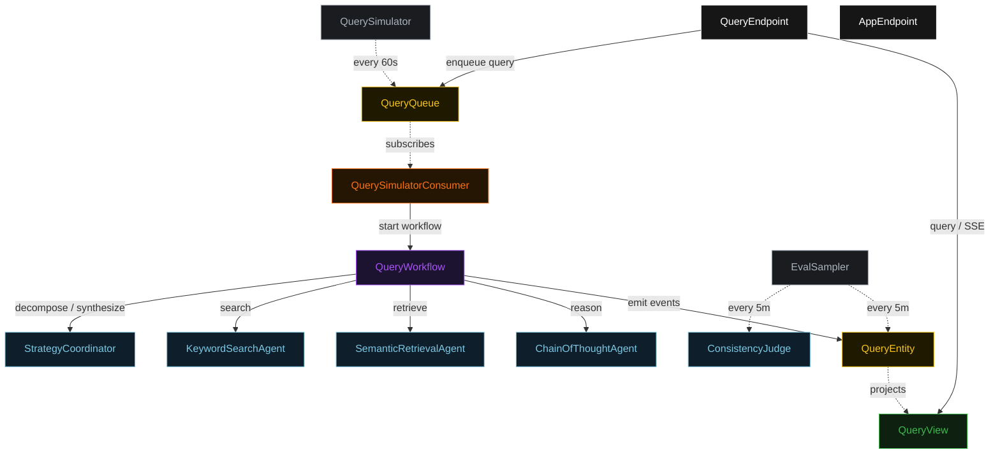
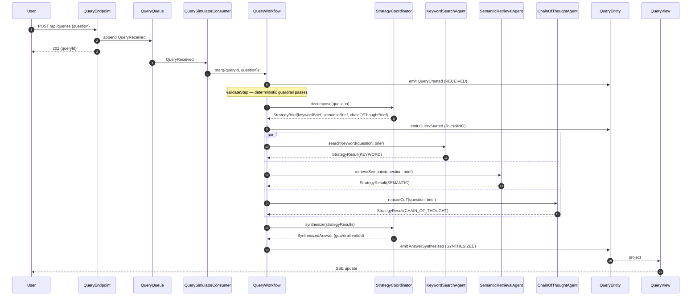
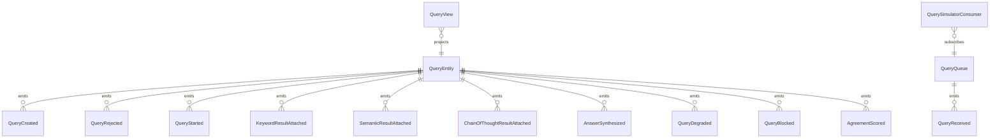

# PLAN — multi-strategy-workflow

Architectural sketch consumed by `/akka:plan` (or skipped if `/akka:specify` covers it). Diagrams are rendered on the generated system's Architecture tab. All four mermaid diagrams use the Akka theme palette; the state diagram carries the Lesson 24 CSS overrides so state names render white and edge labels are not clipped.

---

## Component graph

Solid arrows are synchronous commands; dashed arrows are event subscriptions and scheduled ticks. The query validator is a deterministic helper invoked inside `QueryWorkflow.validateStep` — it has no component box because it makes no Akka call of its own.

## Interaction sequence — J1 (happy path)

## State machine — `QueryEntity`

```mermaid
stateDiagram-v2
  [*] --> RECEIVED
  RECEIVED --> REJECTED: QueryRejected (input guardrail failed)
  RECEIVED --> RUNNING: QueryStarted (decomposed; strategies dispatched)
  RUNNING --> SYNTHESIZED: all strategies returned; guardrail OK
  RUNNING --> DEGRADED: a strategy agent timed out
  RUNNING --> BLOCKED: output guardrail rejected the answer
  SYNTHESIZED --> SYNTHESIZED: AgreementScored (no status change)
  SYNTHESIZED --> [*]
  DEGRADED --> [*]
  BLOCKED --> [*]
  REJECTED --> [*]
```

## Entity model

## Component table — Java file targets

| Component | Path (generated) |
|---|---|
| `StrategyCoordinator` | `application/StrategyCoordinator.java` |
| `KeywordSearchAgent` | `application/KeywordSearchAgent.java` |
| `SemanticRetrievalAgent` | `application/SemanticRetrievalAgent.java` |
| `ChainOfThoughtAgent` | `application/ChainOfThoughtAgent.java` |
| `ConsistencyJudge` | `application/ConsistencyJudge.java` |
| `QueryTasks` | `application/QueryTasks.java` |
| `QueryValidator` | `application/QueryValidator.java` |
| `QueryWorkflow` | `application/QueryWorkflow.java` |
| `QueryEntity` | `application/QueryEntity.java` (state in `domain/Query.java`, events in `domain/QueryEvent.java`) |
| `QueryQueue` | `application/QueryQueue.java` |
| `QueryView` | `application/QueryView.java` |
| `QuerySimulatorConsumer` | `application/QuerySimulatorConsumer.java` |
| `QuerySimulator` | `application/QuerySimulator.java` |
| `EvalSampler` | `application/EvalSampler.java` |
| `QueryEndpoint` | `api/QueryEndpoint.java` |
| `AppEndpoint` | `api/AppEndpoint.java` |
| `Bootstrap` | `Bootstrap.java` |

Akka component count: **2 http-endpoint · 2 timed-action · 1 view · 1 workflow · 1 service-setup · 5 autonomous-agent · 1 consumer · 2 event-sourced-entity**.

## Concurrency notes

- **Workflow step timeouts:** wrap the three strategy calls and the synthesize call in `WorkflowSettings.builder().stepTimeout(MyStep, Duration.ofSeconds(60))`. The default 5-second step timeout (Lesson 4) is far too short for LLM calls — without the override every strategy step retries forever.
- **Parallel fork:** `keywordStep`, `semanticStep`, and `chainOfThoughtStep` use Akka's parallel-step idiom (CompletionStage zip). All three calls must be initiated before any is awaited; sequential calls would defeat the debate-multi-perspective pattern.
- **Degraded path:** on any strategy agent timeout, transition to synthesis from partial input rather than failing the whole workflow. `failureReason` names the missing strategy; status is `DEGRADED`.
- **Validation ordering:** `validateStep` runs before `decomposeStep`. The input guardrail checks the raw question string and rejects it before any agent call is made. This realises control G1.
- **Idempotency:** `QueryEndpoint.submit` uses `(question, submittedBy)` over a 10-second window as the idempotency key to avoid double-creation on client retry.
- **View indexing:** `QueryView` exposes one query, `getAllQueries`, with no `WHERE status` clause — Akka cannot auto-index the `QueryStatus` enum column (Lesson 2). Callers filter by status client-side.
- **Eval sampling:** `EvalSampler` selects the oldest `SYNTHESIZED` query with no `agreementScore`, one per tick. `AgreementScored` does not change status; it only populates the score and rationale.
- **emptyState:** `QueryEntity.emptyState()` returns `Query.initial("", "")` with placeholder identity values and never references `commandContext()` (Lesson 3).
