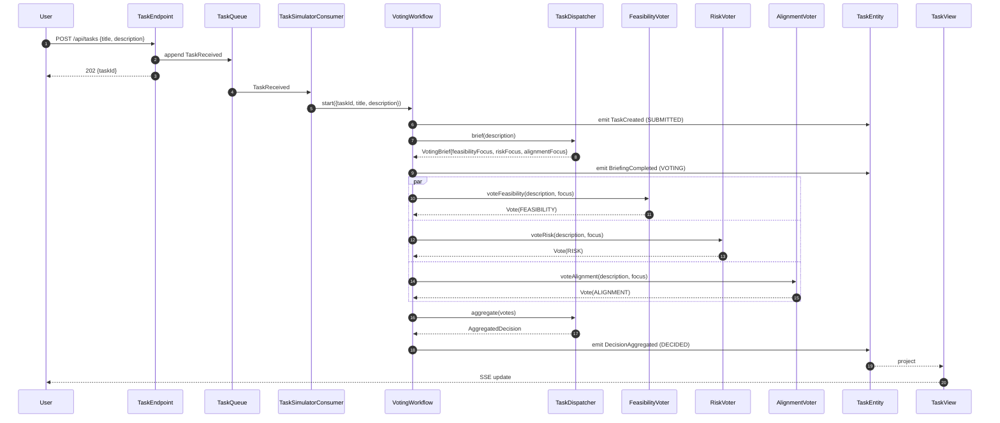
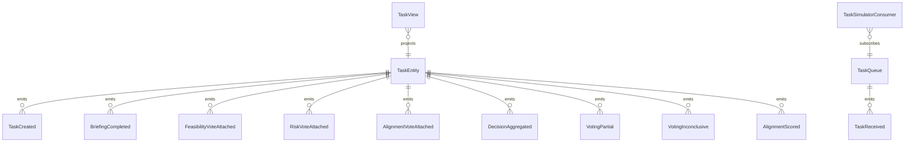

# PLAN — parallel-voting-workflow

Architectural sketch consumed by `/akka:plan` (or skipped if `/akka:specify` covers it). Diagrams are rendered on the generated system's Architecture tab. All four mermaid diagrams use the Akka theme palette; the state diagram carries the Lesson 24 CSS overrides so state names render white and edge labels are not clipped.

---

## Component graph

```mermaid
flowchart TB
  classDef agent fill:#0e1e2a,stroke:#7EC8E3,color:#7EC8E3;
  classDef wf fill:#1c1330,stroke:#A855F7,color:#A855F7;
  classDef ese fill:#1f1900,stroke:#F5C518,color:#F5C518;
  classDef view fill:#0e2010,stroke:#3fb950,color:#3fb950;
  classDef cons fill:#251503,stroke:#F97316,color:#F97316;
  classDef ta fill:#1a1c20,stroke:#aab3bd,color:#aab3bd;
  classDef ep fill:#161616,stroke:#fff,color:#fff;

  Dispatcher[TaskDispatcher]:::agent
  Feasibility[FeasibilityVoter]:::agent
  Risk[RiskVoter]:::agent
  Alignment[AlignmentVoter]:::agent
  Judge[AggregationJudge]:::agent

  WF[VotingWorkflow]:::wf
  Task[TaskEntity]:::ese
  Queue[TaskQueue]:::ese
  View[TaskView]:::view
  Consumer[TaskSimulatorConsumer]:::cons
  Sim[TaskSimulator]:::ta
  Eval[EvalSampler]:::ta
  API[TaskEndpoint]:::ep
  App[AppEndpoint]:::ep

  API -->|enqueue task| Queue
  Sim -.->|every 60s| Queue
  Queue -.->|subscribes| Consumer
  Consumer -->|start workflow| WF
  WF -->|brief / aggregate| Dispatcher
  WF -->|vote| Feasibility
  WF -->|vote| Risk
  WF -->|vote| Alignment
  WF -->|emit events| Task
  Task -.->|projects| View
  API -->|query / SSE| View
  Eval -.->|every 5m| Judge
  Eval -.->|every 5m| Task
```

Solid arrows are synchronous commands; dashed arrows are event subscriptions and scheduled ticks.

## Interaction sequence — J1 (happy path)

## State machine — `TaskEntity`

```mermaid
stateDiagram-v2
  [*] --> SUBMITTED
  SUBMITTED --> VOTING: BriefingCompleted
  VOTING --> DECIDED: all votes returned; quorum met
  VOTING --> INCONCLUSIVE: all votes returned; quorum not met
  VOTING --> PARTIAL: a voter timed out; aggregated from partial votes
  DECIDED --> DECIDED: AlignmentScored (no status change)
  DECIDED --> [*]
  INCONCLUSIVE --> [*]
  PARTIAL --> [*]
```

## Entity model

## Component table — Java file targets

| Component | Path (generated) |
|---|---|
| `TaskDispatcher` | `application/TaskDispatcher.java` |
| `FeasibilityVoter` | `application/FeasibilityVoter.java` |
| `RiskVoter` | `application/RiskVoter.java` |
| `AlignmentVoter` | `application/AlignmentVoter.java` |
| `AggregationJudge` | `application/AggregationJudge.java` |
| `VotingTasks` | `application/VotingTasks.java` |
| `VotingWorkflow` | `application/VotingWorkflow.java` |
| `TaskEntity` | `application/TaskEntity.java` (state in `domain/Task.java`, events in `domain/TaskEvent.java`) |
| `TaskQueue` | `application/TaskQueue.java` |
| `TaskView` | `application/TaskView.java` |
| `TaskSimulatorConsumer` | `application/TaskSimulatorConsumer.java` |
| `TaskSimulator` | `application/TaskSimulator.java` |
| `EvalSampler` | `application/EvalSampler.java` |
| `TaskEndpoint` | `api/TaskEndpoint.java` |
| `AppEndpoint` | `api/AppEndpoint.java` |
| `Bootstrap` | `Bootstrap.java` |

Akka component count: **2 http-endpoint · 2 timed-action · 1 view · 1 workflow · 1 service-setup · 5 autonomous-agent · 1 consumer · 2 event-sourced-entity**.

## Concurrency notes

- **Workflow step timeouts:** wrap the three voter calls and the aggregate call in `WorkflowSettings.builder().stepTimeout(MyStep, Duration.ofSeconds(60))`. The default 5-second step timeout (Lesson 4) is far too short for LLM calls — without the override every voter step retries forever.
- **Parallel fork:** `feasibilityStep`, `riskStep`, and `alignmentStep` use Akka's parallel-step idiom (CompletionStage zip). All three calls must be initiated before any is awaited; sequential calls would defeat the debate-multi-perspective pattern.
- **Partial path:** on any voter timeout, transition to aggregation from partial input rather than failing the whole workflow. `failureReason` names the missing voter; status is `PARTIAL`.
- **Quorum check:** after aggregation, `quorumStep` counts how many votes share the plurality ballot. If fewer than two match, status is `INCONCLUSIVE`; otherwise `DECIDED`.
- **Idempotency:** `TaskEndpoint.submit` uses `(title, submittedBy)` over a 10-second window as the idempotency key to avoid double-creation on client retry.
- **View indexing:** `TaskView` exposes one query, `getAllTasks`, with no `WHERE status` clause — Akka cannot auto-index the `TaskStatus` enum column (Lesson 2). Callers filter by status client-side.
- **Eval sampling:** `EvalSampler` selects the oldest `DECIDED` or `PARTIAL` task with no `alignmentScore`, one per tick. `AlignmentScored` does not change status; it only populates the score and rationale.
- **emptyState:** `TaskEntity.emptyState()` returns `Task.initial("", "")` with placeholder identity values and never references `commandContext()` (Lesson 3).
