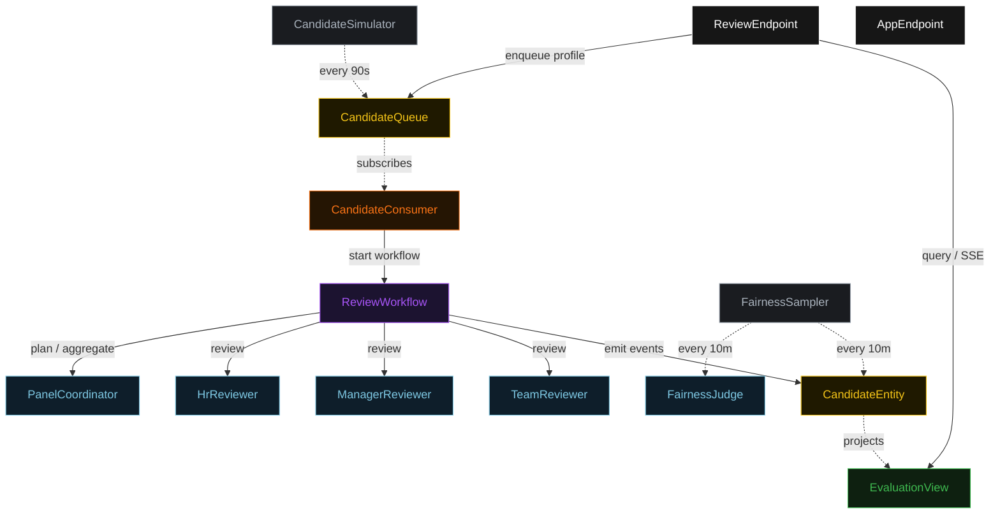
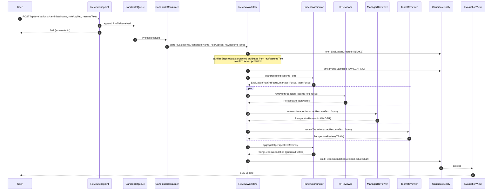
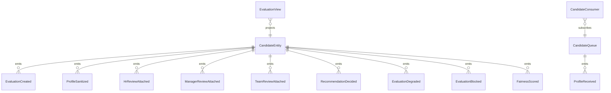

# PLAN — parallel-hiring-reviewers

Architectural sketch consumed by `/akka:plan` (or skipped if `/akka:specify` covers it). Diagrams are rendered on the generated system's Architecture tab. All four mermaid diagrams use the Akka theme palette; the state diagram carries the Lesson 24 CSS overrides so state names render white and edge labels are not clipped.

---

## Component graph

Solid arrows are synchronous commands; dashed arrows are event subscriptions and scheduled ticks. The special-category sanitizer is a deterministic helper invoked inside `ReviewWorkflow.sanitizeStep` — it has no component box because it makes no Akka call of its own.

## Interaction sequence — J1 (happy path)

## State machine — `CandidateEntity`

```mermaid
stateDiagram-v2
  [*] --> INTAKE
  INTAKE --> EVALUATING: ProfileSanitized (protected attrs redacted)
  EVALUATING --> DECIDED: all perspectives reviewed; guardrail OK
  EVALUATING --> DEGRADED: a reviewer timed out
  EVALUATING --> BLOCKED: guardrail rejected the recommendation
  DECIDED --> DECIDED: FairnessScored (no status change)
  DECIDED --> [*]
  DEGRADED --> [*]
  BLOCKED --> [*]
```

## Entity model

## Component table — Java file targets

| Component | Path (generated) |
|---|---|
| `PanelCoordinator` | `application/PanelCoordinator.java` |
| `HrReviewer` | `application/HrReviewer.java` |
| `ManagerReviewer` | `application/ManagerReviewer.java` |
| `TeamReviewer` | `application/TeamReviewer.java` |
| `FairnessJudge` | `application/FairnessJudge.java` |
| `ReviewTasks` | `application/ReviewTasks.java` |
| `SpecialCategorySanitizer` | `application/SpecialCategorySanitizer.java` |
| `ReviewWorkflow` | `application/ReviewWorkflow.java` |
| `CandidateEntity` | `application/CandidateEntity.java` (state in `domain/CandidateEvaluation.java`, events in `domain/EvaluationEvent.java`) |
| `CandidateQueue` | `application/CandidateQueue.java` |
| `EvaluationView` | `application/EvaluationView.java` |
| `CandidateConsumer` | `application/CandidateConsumer.java` |
| `CandidateSimulator` | `application/CandidateSimulator.java` |
| `FairnessSampler` | `application/FairnessSampler.java` |
| `ReviewEndpoint` | `api/ReviewEndpoint.java` |
| `AppEndpoint` | `api/AppEndpoint.java` |
| `Bootstrap` | `Bootstrap.java` |

Akka component count: **2 http-endpoint · 2 timed-action · 1 view · 1 workflow · 1 service-setup · 5 autonomous-agent · 1 consumer · 2 event-sourced-entity**.

## Concurrency notes

- **Workflow step timeouts:** wrap the three reviewer calls and the aggregate call in `WorkflowSettings.builder().stepTimeout(MyStep, Duration.ofSeconds(60))`. The default 5-second step timeout (Lesson 4) is far too short for LLM calls — without the override every reviewer step retries forever.
- **Parallel fork:** `hrStep`, `managerStep`, and `teamStep` use Akka's parallel-step idiom (CompletionStage zip). All three calls must be initiated before any is awaited; sequential calls would defeat the debate-multi-perspective pattern.
- **Degraded path:** a reviewer timeout transitions to aggregation from partial input rather than failing the whole workflow; `failureReason` names the missing reviewer; status is `DEGRADED`.
- **Sanitizer ordering:** `sanitizeStep` runs before `planStep`. The raw résumé text lives only in the workflow's transient start command and is never written to `CandidateEntity` — only `redactedResumeText` is persisted. This realises control S1.
- **Idempotency:** `ReviewEndpoint.submit` uses `(candidateName, roleApplied)` over a 10-second window as the idempotency key to avoid double-creation on client retry.
- **View indexing:** `EvaluationView` exposes one query, `getAllEvaluations`, with no `WHERE status` clause — Akka cannot auto-index the `EvaluationStatus` enum column (Lesson 2). Callers filter by status client-side.
- **Fairness sampling:** `FairnessSampler` selects the oldest `DECIDED` evaluation with no `fairnessScore`, one per tick. `FairnessScored` does not change status; it only populates the score and rationale.
- **emptyState:** `CandidateEntity.emptyState()` returns `CandidateEvaluation.initial("", "", "")` with placeholder identity values and never references `commandContext()` (Lesson 3).
