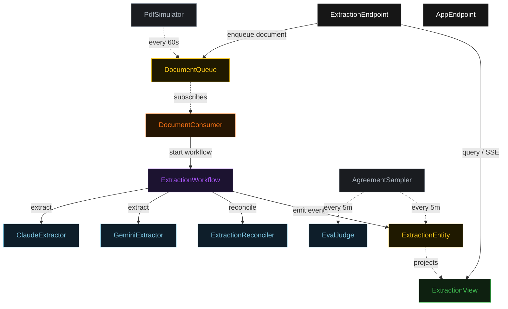
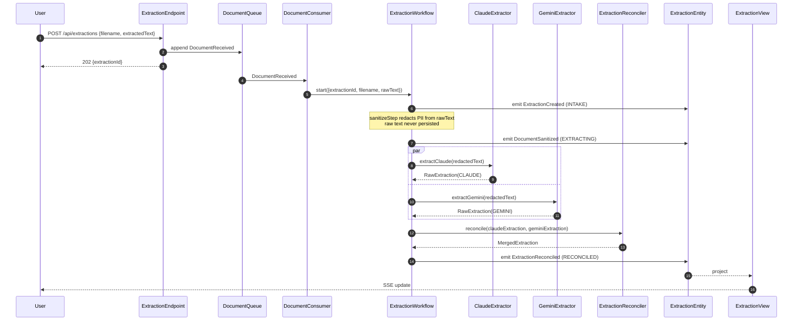
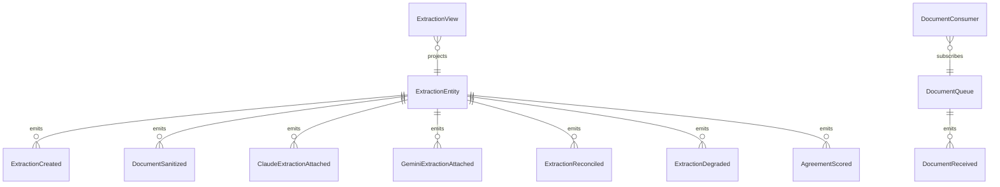

# PLAN — dual-llm-pdf-extract

Architectural sketch consumed by `/akka:plan` (or skipped if `/akka:specify` covers it). Diagrams are rendered on the generated system's Architecture tab. All four mermaid diagrams use the Akka theme palette; the state diagram carries the Lesson 24 CSS overrides so state names render white and edge labels are not clipped.

---

## Component graph

Solid arrows are synchronous commands; dashed arrows are event subscriptions and scheduled ticks. The PII sanitizer is a deterministic helper invoked inside `ExtractionWorkflow.sanitizeStep` — it has no component box because it makes no Akka call of its own.

## Interaction sequence — J1 (happy path)

## State machine — `ExtractionEntity`

```mermaid
stateDiagram-v2
  [*] --> INTAKE
  INTAKE --> EXTRACTING: DocumentSanitized (PII redacted)
  EXTRACTING --> RECONCILED: both extractors returned; reconciler merged
  EXTRACTING --> DEGRADED: an extractor timed out
  RECONCILED --> RECONCILED: AgreementScored (no status change)
  RECONCILED --> [*]
  DEGRADED --> [*]
```

## Entity model

## Component table — Java file targets

| Component | Path (generated) |
|---|---|
| `ClaudeExtractor` | `application/ClaudeExtractor.java` |
| `GeminiExtractor` | `application/GeminiExtractor.java` |
| `ExtractionReconciler` | `application/ExtractionReconciler.java` |
| `EvalJudge` | `application/EvalJudge.java` |
| `ExtractionTasks` | `application/ExtractionTasks.java` |
| `PiiSanitizer` | `application/PiiSanitizer.java` |
| `ExtractionWorkflow` | `application/ExtractionWorkflow.java` |
| `ExtractionEntity` | `application/ExtractionEntity.java` (state in `domain/Extraction.java`, events in `domain/ExtractionEvent.java`) |
| `DocumentQueue` | `application/DocumentQueue.java` |
| `ExtractionView` | `application/ExtractionView.java` |
| `DocumentConsumer` | `application/DocumentConsumer.java` |
| `PdfSimulator` | `application/PdfSimulator.java` |
| `AgreementSampler` | `application/AgreementSampler.java` |
| `ExtractionEndpoint` | `api/ExtractionEndpoint.java` |
| `AppEndpoint` | `api/AppEndpoint.java` |
| `Bootstrap` | `Bootstrap.java` |

Akka component count: **2 http-endpoint · 2 timed-action · 1 view · 1 workflow · 1 service-setup · 4 autonomous-agent · 1 consumer · 2 event-sourced-entity**.

## Concurrency notes

- **Workflow step timeouts:** wrap the two extractor calls and the reconcile call in `WorkflowSettings.builder().stepTimeout(MyStep, Duration.ofSeconds(60))`. The default 5-second step timeout is far too short for LLM calls (Lesson 4).
- **Parallel fork:** `claudeStep` and `geminiStep` use Akka's parallel-step idiom (CompletionStage zip). Both extraction calls must be initiated before either is awaited; sequential calls would defeat the debate-multi-perspective pattern and eliminate the cross-model comparison signal.
- **Degraded path:** on any extractor timeout, transition to reconciliation from partial input rather than failing the whole workflow. `failureReason` names the missing extractor; status is `DEGRADED`. The reconciler still produces a `MergedExtraction` but with `disagreementCount = 0` and a note that only one model returned.
- **Sanitizer ordering:** `sanitizeStep` runs before either extractor is called. The raw text lives only in the workflow's transient start command and is never written to `ExtractionEntity` — only `redactedText` is persisted. This realises control S1.
- **Idempotency:** `ExtractionEndpoint.submit` uses `(filename, submittedBy)` over a 10-second window as the idempotency key to avoid double-creation on client retry.
- **View indexing:** `ExtractionView` exposes one query, `getAllExtractions`, with no `WHERE status` clause — Akka cannot auto-index the `ExtractionStatus` enum column. Callers filter by status client-side.
- **Eval sampling:** `AgreementSampler` selects the oldest `RECONCILED` extraction with no `agreementScore`, one per tick. `AgreementScored` does not change status; it only populates the score and rationale.
- **emptyState:** `ExtractionEntity.emptyState()` returns `Extraction.initial("", "")` with placeholder identity values and never references `commandContext()` (Lesson 3).
