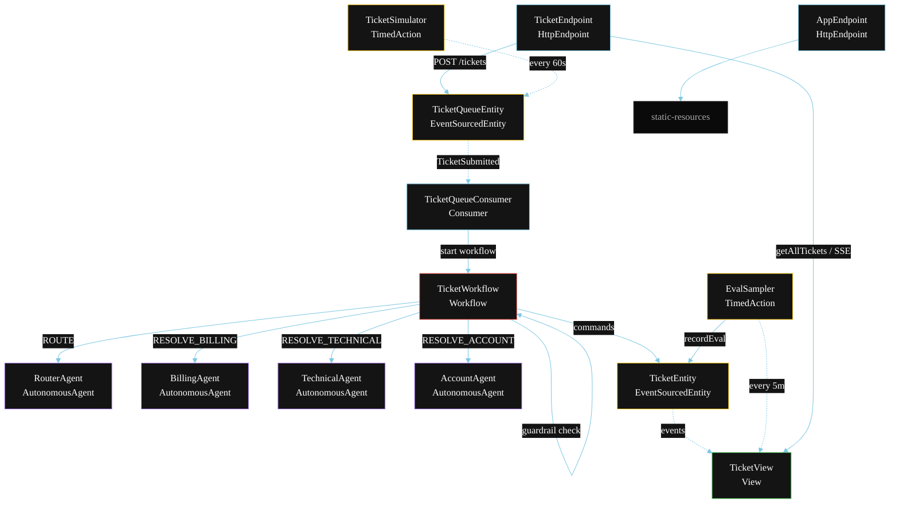
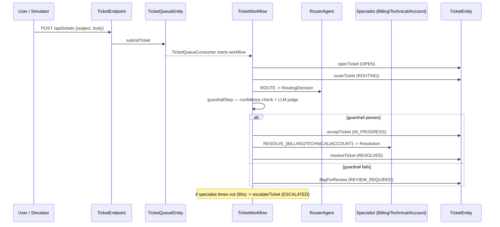
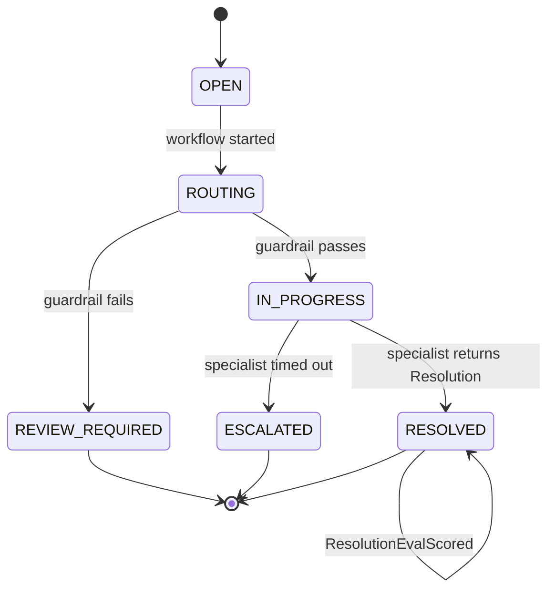
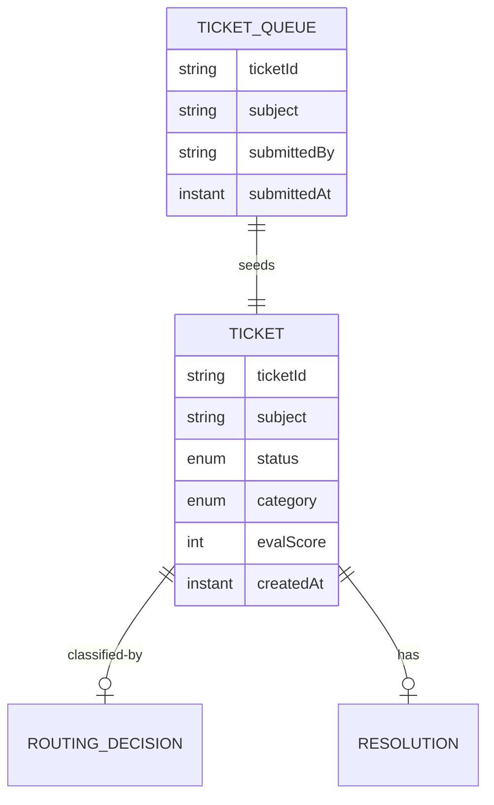

# PLAN — Multi-Agent Customer Router

Architectural sketch for `/akka:specify`. Mirrors `SPEC.md` Section 4 component names exactly. Mermaid sources here are rendered on the Architecture tab of the embedded UI; carry the Lesson 24 CSS overrides into the generated `index.html`.

## Component graph

Solid arrows: synchronous commands. Dashed arrows: event subscriptions. Dotted arrows: scheduled ticks.

## Interaction sequence

## State machine

## Entity model

## Component table

| Component | Akka primitive | File path |
|---|---|---|
| `RouterAgent` | AutonomousAgent | `application/RouterAgent.java` |
| `BillingAgent` | AutonomousAgent | `application/BillingAgent.java` |
| `TechnicalAgent` | AutonomousAgent | `application/TechnicalAgent.java` |
| `AccountAgent` | AutonomousAgent | `application/AccountAgent.java` |
| `TicketTasks` | Task constants | `application/TicketTasks.java` |
| `TicketWorkflow` | Workflow | `application/TicketWorkflow.java` |
| `TicketEntity` | EventSourcedEntity | `domain/TicketEntity.java` |
| `TicketQueueEntity` | EventSourcedEntity | `domain/TicketQueueEntity.java` |
| `TicketView` | View | `application/TicketView.java` |
| `TicketQueueConsumer` | Consumer | `application/TicketQueueConsumer.java` |
| `TicketSimulator` | TimedAction | `application/TicketSimulator.java` |
| `EvalSampler` | TimedAction | `application/EvalSampler.java` |
| `TicketEndpoint` | HttpEndpoint | `api/TicketEndpoint.java` |
| `AppEndpoint` | HttpEndpoint | `api/AppEndpoint.java` |

## Concurrency notes

- **Step timeouts (Lesson 4):** `routeStep` gets 30s; `delegateStep` gets 90s. The 5s default fails every LLM call. `WorkflowSettings` is nested inside `Workflow` — no import.
- **Sequential delegation:** unlike a fan-out pattern, only one specialist runs per ticket. The branch is selected deterministically from `RoutingDecision.category`.
- **Guardrail gate:** `guardrailStep` runs between routing and delegation. A REVIEW_REQUIRED outcome ends the workflow without calling any specialist — no partial specialist execution.
- **Idempotency:** the workflow id is the `ticketId`. Re-delivery of the same `TicketSubmitted` event resolves to the same workflow instance — no duplicate ticket.
- **Escalation path (compensation):** if the specialist times out, `defaultStepRecovery` routes to `escalateStep`, which calls `TicketEntity.escalateTicket` and ends with `TicketEscalated`. No infinite retry.
- **Eval sampling:** `EvalSampler` reads `TicketView.getAllTickets` (no enum WHERE clause — Lesson 2) and filters client-side for the oldest `RESOLVED` ticket lacking an `evalScore`.
