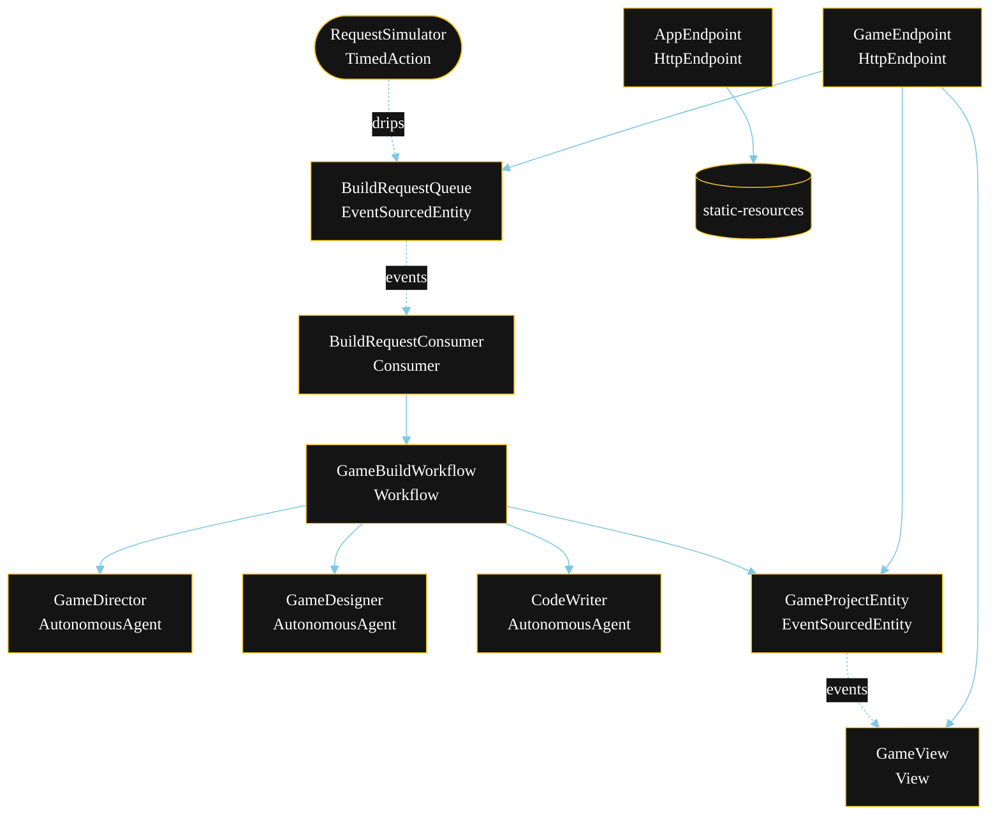
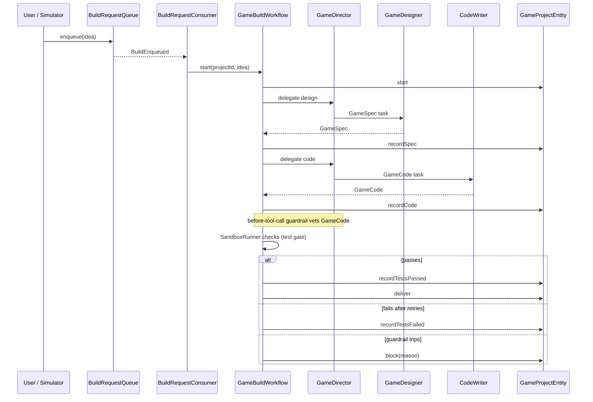
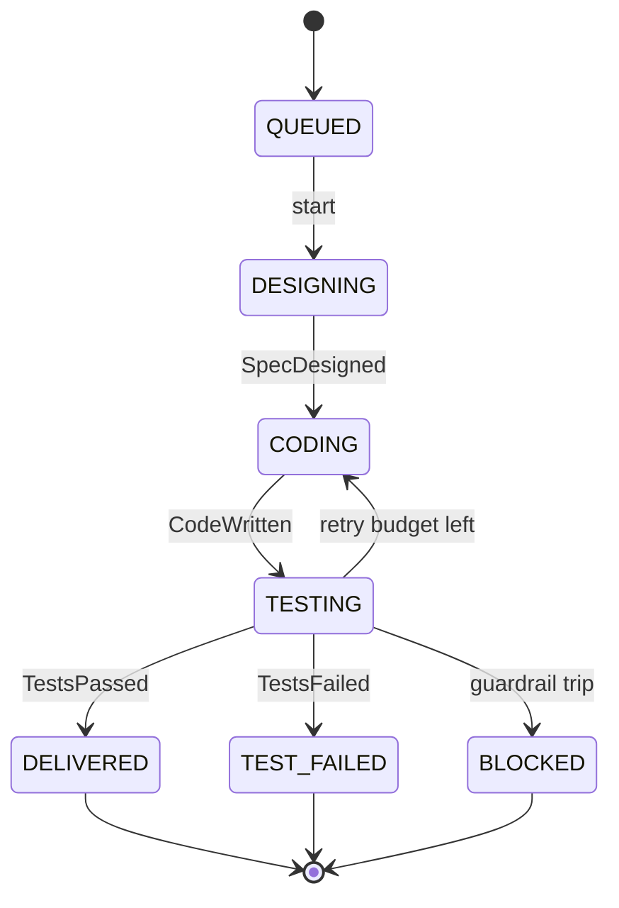
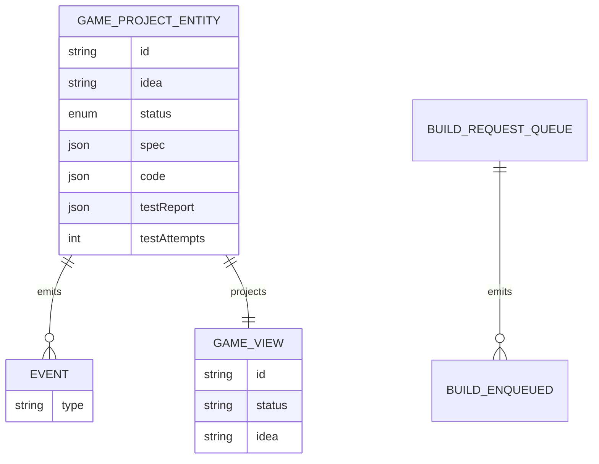

# PLAN — game-builder-team

Architecture sketch for the Game Builder Team system. The generated system renders these diagrams on the Architecture tab. Apply the Lesson 24 mermaid CSS overrides so state labels and edge labels render legibly.

---

## 1. Component graph

Solid arrows are synchronous commands; dashed arrows are event subscriptions; dotted arrows are scheduled ticks.

## 2. Interaction sequence

## 3. State machine

## 4. Entity model

## 5. Component table

| Component | Akka primitive | File path |
|---|---|---|
| `GameDirector` | AutonomousAgent | `application/GameDirector.java` |
| `GameDesigner` | AutonomousAgent | `application/GameDesigner.java` |
| `CodeWriter` | AutonomousAgent | `application/CodeWriter.java` |
| `GameBuildTasks` | task constants | `application/GameBuildTasks.java` |
| `GameBuildWorkflow` | Workflow | `application/GameBuildWorkflow.java` |
| `SandboxRunner` | helper | `application/SandboxRunner.java` |
| `GameProjectEntity` | EventSourcedEntity | `application/GameProjectEntity.java` |
| `BuildRequestQueue` | EventSourcedEntity | `application/BuildRequestQueue.java` |
| `GameView` | View | `application/GameView.java` |
| `BuildRequestConsumer` | Consumer | `application/BuildRequestConsumer.java` |
| `RequestSimulator` | TimedAction | `application/RequestSimulator.java` |
| `GameEndpoint` | HttpEndpoint | `api/GameEndpoint.java` |
| `AppEndpoint` | HttpEndpoint | `api/AppEndpoint.java` |
| `GameProject`, `GameSpec`, `GameCode`, `TestReport` | records | `domain/` |

## 6. Concurrency notes

- **Step timeouts.** `designStep`, `codeStep`, and `assembleStep` each call an agent; override `settings()` with `stepTimeout(60s)` per Lesson 4. `WorkflowSettings` is nested in `Workflow` — no import.
- **Retry budget.** `testStep` retries `codeStep` up to twice when the test gate fails before settling in `TEST_FAILED`. The attempt count lives in `GameProject.testAttempts` so retries survive restarts.
- **Idempotency.** Each build is keyed by a fresh UUID assigned by `BuildRequestConsumer`; replaying a `BuildEnqueued` event with the same offset does not start a second workflow.
- **Compensation.** A guardrail trip in `testStep` is terminal — `block(reason)` writes `BuildBlocked` and the workflow ends; no run tool executes, so there is nothing to roll back.
- **View indexing.** `GameView` exposes one query (`getAllProjects`) with no enum `WHERE`; status filtering happens client-side in `GameEndpoint` (Lesson 2).
