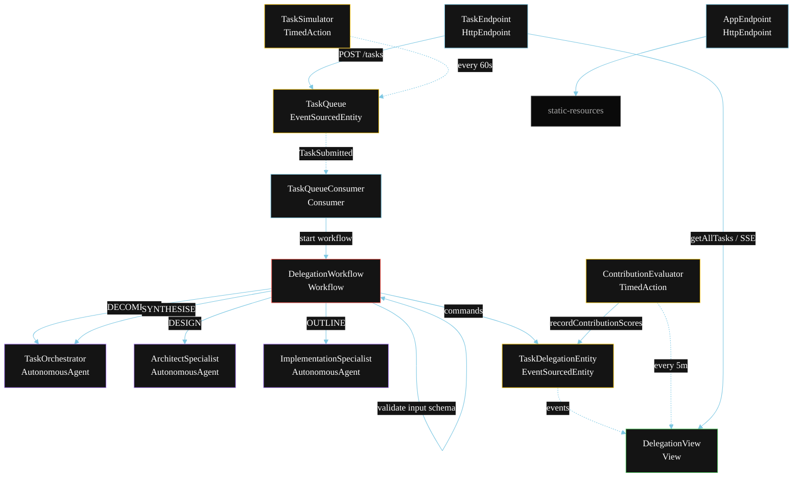
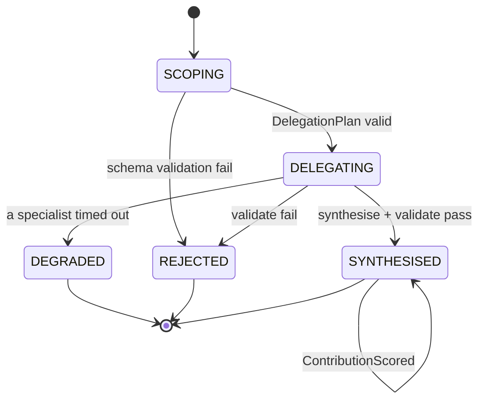
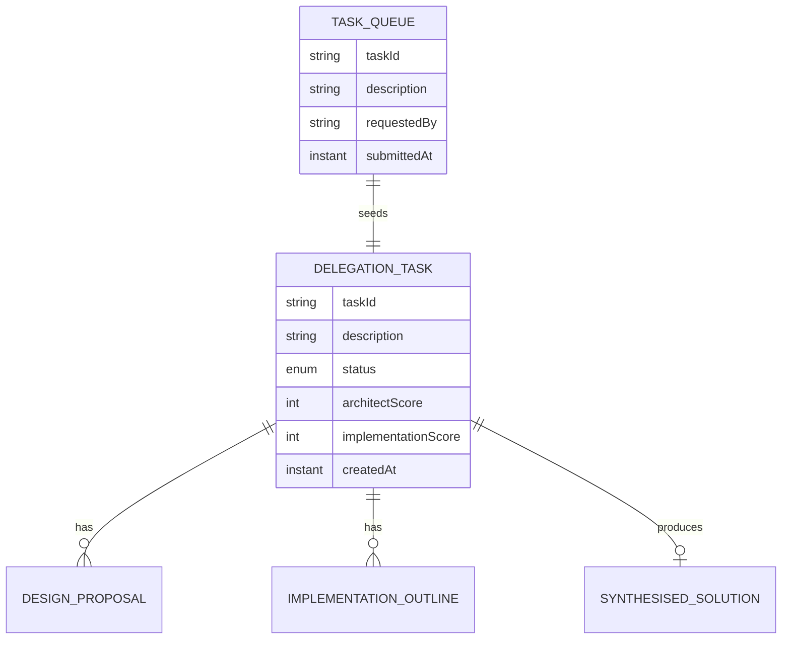

# PLAN — Hierarchical Sub-Agent Delegation

Architectural sketch for `/akka:specify`. Mirrors `SPEC.md` Section 4 component names exactly. Mermaid sources here are rendered on the Architecture tab of the embedded UI; carry the Lesson 24 CSS overrides into the generated `index.html`.

## Component graph



Solid arrows: synchronous commands. Dashed arrows: event subscriptions. Dotted arrows: scheduled ticks.

## Interaction sequence

```mermaid
sequenceDiagram
  participant U as User / Simulator
  participant TE as TaskEndpoint
  participant TQ as TaskQueue
  participant WF as DelegationWorkflow
  participant TO as TaskOrchestrator
  participant AS as ArchitectSpecialist
  participant IS as ImplementationSpecialist
  participant DE as TaskDelegationEntity

  U->>TE: POST /api/tasks {description}
  TE->>TQ: enqueueTask
  TQ-->>WF: TaskQueueConsumer starts workflow
  WF->>DE: createTask (SCOPING)
  WF->>TO: DECOMPOSE -> DelegationPlan
  WF->>WF: guardrailStep validates DelegationPlan schema
  alt schema invalid
    WF->>DE: reject (REJECTED)
  else schema valid
    WF->>DE: status DELEGATING
    par parallel fan-out
      WF->>AS: DESIGN -> DesignProposal
    and
      WF->>IS: OUTLINE -> ImplementationOutline
    end
    Note over WF: join; if either step times out (60s) -> degradeStep
    WF->>WF: evaluateStep scores contributions (1-5)
    WF->>TO: SYNTHESISE(design, implementation) -> SynthesisedSolution
    WF->>WF: validateStep vets the solution
    alt validate passes
      WF->>DE: synthesise (SYNTHESISED)
    else validate fails
      WF->>DE: reject (REJECTED)
    end
  end
```

## State machine



## Entity model



## Component table

| Component | Akka primitive | File path |
|---|---|---|
| `TaskOrchestrator` | AutonomousAgent | `application/TaskOrchestrator.java` |
| `ArchitectSpecialist` | AutonomousAgent | `application/ArchitectSpecialist.java` |
| `ImplementationSpecialist` | AutonomousAgent | `application/ImplementationSpecialist.java` |
| `DelegationTasks` | Task constants | `application/DelegationTasks.java` |
| `DelegationWorkflow` | Workflow | `application/DelegationWorkflow.java` |
| `TaskDelegationEntity` | EventSourcedEntity | `domain/TaskDelegationEntity.java` |
| `TaskQueue` | EventSourcedEntity | `domain/TaskQueue.java` |
| `DelegationView` | View | `application/DelegationView.java` |
| `TaskQueueConsumer` | Consumer | `application/TaskQueueConsumer.java` |
| `TaskSimulator` | TimedAction | `application/TaskSimulator.java` |
| `ContributionEvaluator` | TimedAction | `application/ContributionEvaluator.java` |
| `TaskEndpoint` | HttpEndpoint | `api/TaskEndpoint.java` |
| `AppEndpoint` | HttpEndpoint | `api/AppEndpoint.java` |

## Concurrency notes

- **Step timeouts (Lesson 4):** `designStep` and `outlineStep` get 60s; `synthesiseStep` gets 90s. The 5s default fails every LLM call. `WorkflowSettings` is nested inside `Workflow` — no import.
- **Parallel fan-out:** `designStep` and `outlineStep` run concurrently via `CompletionStage` zip, not two sequential step calls.
- **Input guardrail placement:** the `guardrailStep` runs after `decomposeStep` and before the parallel fan-out, so a malformed `DelegationPlan` stops the workflow before any specialist is invoked.
- **Idempotency:** the workflow id is the `taskId`. Re-delivery of the same `TaskSubmitted` event resolves to the same workflow instance — no duplicate task.
- **Degrade path (compensation):** if either specialist times out, `defaultStepRecovery` routes to `degradeStep`, which synthesises from whichever partial output exists and ends with `TaskDegraded`. No infinite retry.
- **Contribution scoring:** `ContributionEvaluator` reads `DelegationView.getAllTasks` (no enum WHERE clause — Lesson 2) and filters client-side for `SYNTHESISED` tasks without `architectScore`.
