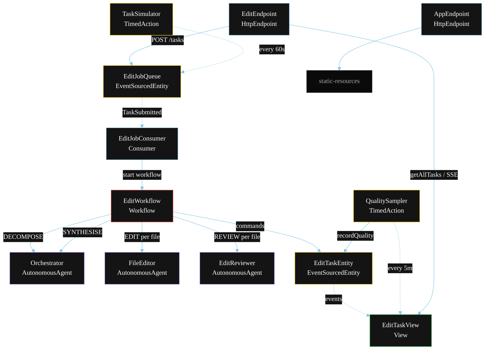
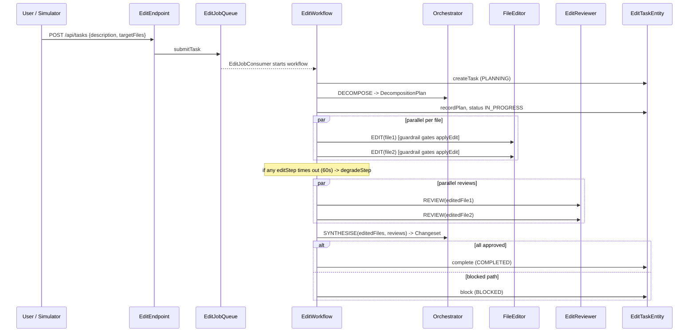
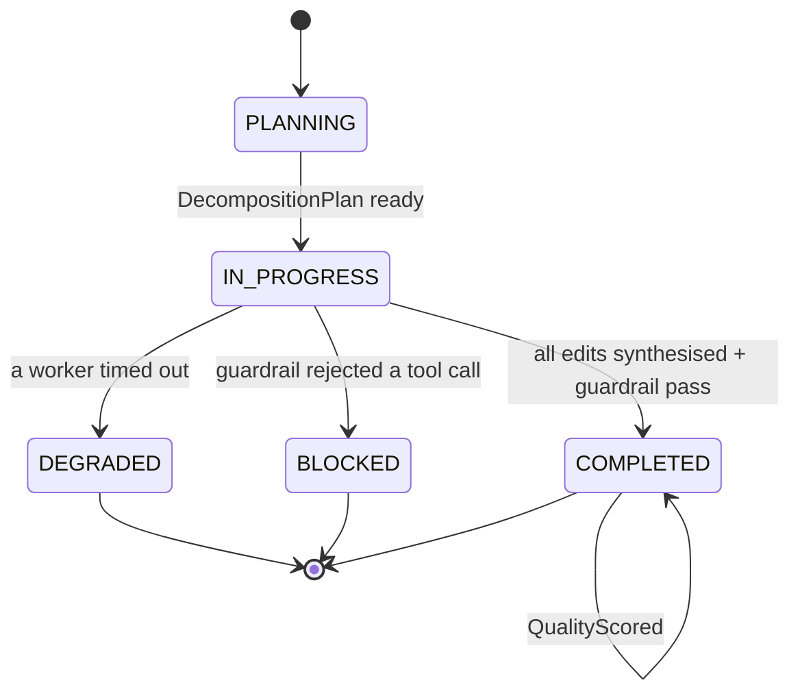
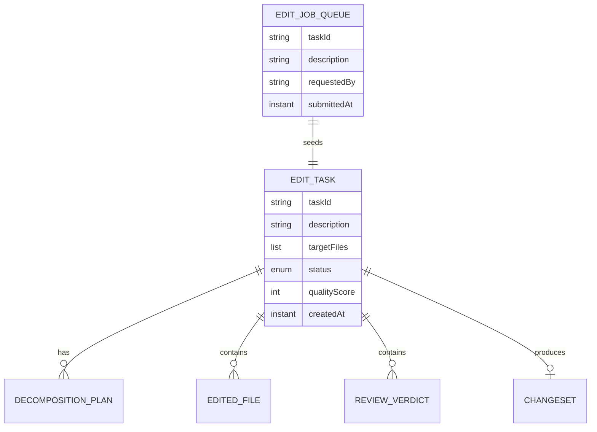

# PLAN — Orchestrator-Workers Workflow

Architectural sketch for `/akka:specify`. Mirrors `SPEC.md` Section 4 component names exactly. Mermaid sources here are rendered on the Architecture tab of the embedded UI; carry the Lesson 24 CSS overrides into the generated `index.html`.

## Component graph

Solid arrows: synchronous commands. Dashed arrows: event subscriptions.

## Interaction sequence

## State machine

## Entity model

## Component table

| Component | Akka primitive | File path |
|---|---|---|
| `Orchestrator` | AutonomousAgent | `application/Orchestrator.java` |
| `FileEditor` | AutonomousAgent | `application/FileEditor.java` |
| `EditReviewer` | AutonomousAgent | `application/EditReviewer.java` |
| `EditTasks` | Task constants | `application/EditTasks.java` |
| `EditWorkflow` | Workflow | `application/EditWorkflow.java` |
| `EditTaskEntity` | EventSourcedEntity | `domain/EditTaskEntity.java` |
| `EditJobQueue` | EventSourcedEntity | `domain/EditJobQueue.java` |
| `EditTaskView` | View | `application/EditTaskView.java` |
| `EditJobConsumer` | Consumer | `application/EditJobConsumer.java` |
| `TaskSimulator` | TimedAction | `application/TaskSimulator.java` |
| `QualitySampler` | TimedAction | `application/QualitySampler.java` |
| `EditEndpoint` | HttpEndpoint | `api/EditEndpoint.java` |
| `AppEndpoint` | HttpEndpoint | `api/AppEndpoint.java` |

## Concurrency notes

- **Step timeouts (Lesson 4):** each `editStep` gets 60 s; each `reviewStep` gets 30 s; `synthesiseStep` gets 90 s. The 5 s default fails every LLM call. `WorkflowSettings` is nested inside `Workflow` — no import.
- **Parallel fan-out:** `editStep(i)` instances run concurrently across all target files via `CompletionStage` allOf, not sequential calls. `reviewStep(i)` follows the same pattern.
- **Before-tool-call guardrail:** every `applyEdit` invocation inside `FileEditor` is intercepted; the guardrail checks `filePath` against the task's declared `targetFiles` list before the call is forwarded to the tool.
- **Idempotency:** the workflow id is the `taskId`. Re-delivery of the same `TaskSubmitted` event resolves to the same workflow instance — no duplicate task.
- **Degrade path:** if any `editStep` times out, `defaultStepRecovery` routes to `degradeStep`, which synthesises from completed files and ends with `TaskDegraded`. No infinite retry.
- **Quality sampling:** `QualitySampler` reads `EditTaskView.getAllTasks` and filters client-side for the oldest `COMPLETED` task lacking a `qualityScore`.
