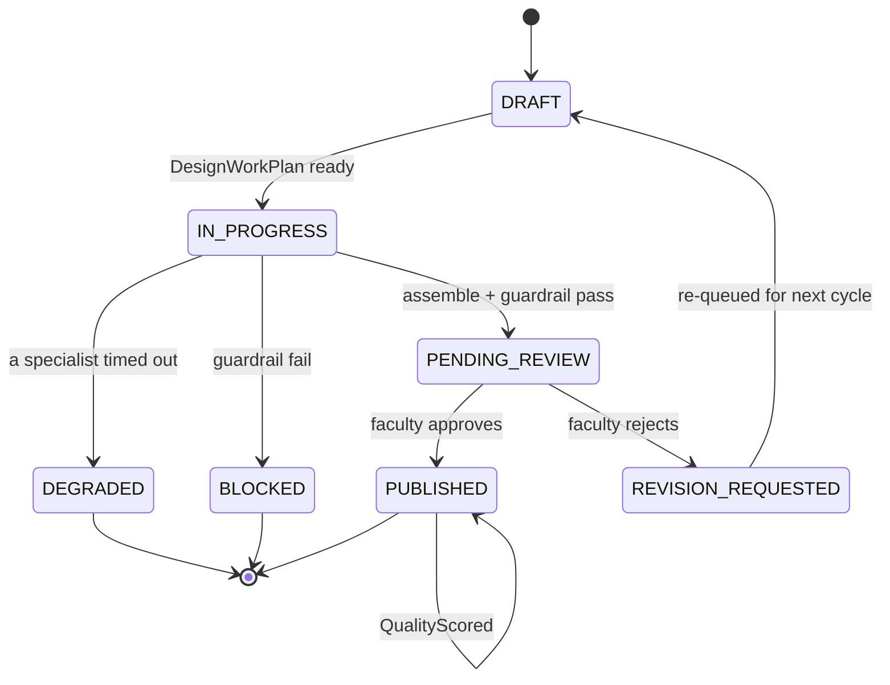
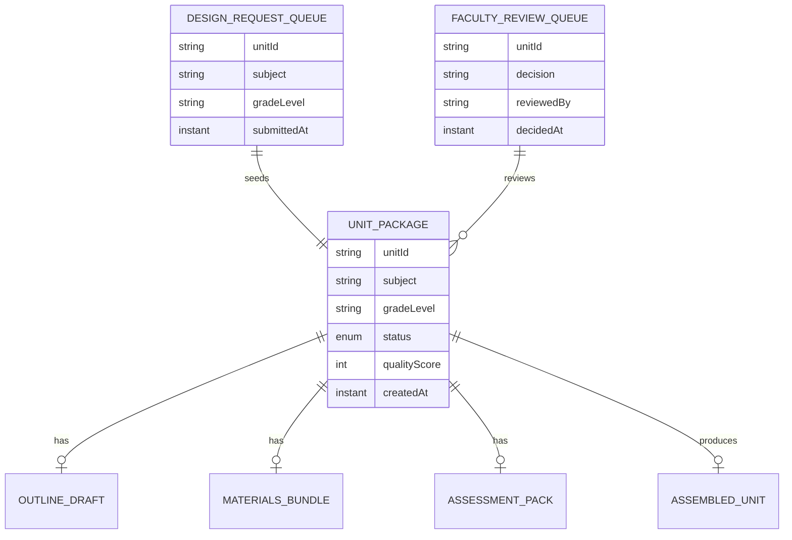

# PLAN — Instructional Design Assistant

Architectural sketch for `/akka:specify`. Mirrors `SPEC.md` Section 4 component names exactly. Mermaid sources here are rendered on the Architecture tab of the embedded UI; carry the Lesson 24 CSS overrides into the generated `index.html`.

## Component graph

```mermaid
%%{init: {'theme':'base','themeVariables':{'primaryColor':'#141414','primaryBorderColor':'#F5C518','primaryTextColor':'#ffffff','lineColor':'#7EC8E3','nodeTextColor':'#ffffff','fontFamily':'Instrument Sans'}}}%%
flowchart TB
  UE[UnitDesignEndpoint<br/>HttpEndpoint]:::ep
  AE[AppEndpoint<br/>HttpEndpoint]:::ep
  DQ[DesignRequestQueue<br/>EventSourcedEntity]:::ese
  FQ[FacultyReviewQueue<br/>EventSourcedEntity]:::ese
  DC[DesignRequestConsumer<br/>Consumer]:::con
  WF[UnitDesignWorkflow<br/>Workflow]:::wf
  SU[UnitDesignSupervisor<br/>AutonomousAgent]:::ag
  OS[OutlineSpecialist<br/>AutonomousAgent]:::ag
  MS[MaterialsSpecialist<br/>AutonomousAgent]:::ag
  AS[AssessmentSpecialist<br/>AutonomousAgent]:::ag
  UP[UnitPackageEntity<br/>EventSourcedEntity]:::ese
  UV[UnitPackageView<br/>View]:::vw
  SIM[RequestSimulator<br/>TimedAction]:::ta
  EV[EvalSampler<br/>TimedAction]:::ta

  UE -->|POST /units| DQ
  UE -->|POST /units/{id}/review| FQ
  SIM -.->|every 60s| DQ
  DQ -.->|DesignRequestSubmitted| DC
  FQ -.->|ReviewDecisionRecorded| DC
  DC -->|start workflow| WF
  WF -->|DECOMPOSE| SU
  WF -->|DRAFT_OUTLINE| OS
  WF -->|CREATE_MATERIALS| MS
  WF -->|BUILD_ASSESSMENT| AS
  WF -->|ASSEMBLE| SU
  WF -->|commands| UP
  WF -->|recordDecision| FQ
  UP -.->|events| UV
  EV -.->|every 5m| UV
  EV -->|recordQuality| UP
  UE -->|getAllUnits / SSE| UV
  AE --> STATIC[static-resources]:::static

  classDef ep fill:#141414,stroke:#7EC8E3,color:#fff;
  classDef ese fill:#141414,stroke:#F5C518,color:#fff;
  classDef vw fill:#141414,stroke:#3fb950,color:#fff;
  classDef wf fill:#141414,stroke:#ff5f57,color:#fff;
  classDef ag fill:#141414,stroke:#B388FF,color:#fff;
  classDef con fill:#141414,stroke:#7EC8E3,color:#fff;
  classDef ta fill:#141414,stroke:#F5C518,color:#fff;
  classDef static fill:#0A0A0A,stroke:#333,color:#aaa;
```

Solid arrows: synchronous commands. Dashed arrows: event subscriptions.

## Interaction sequence

```mermaid
sequenceDiagram
  participant U as User / Simulator
  participant UE as UnitDesignEndpoint
  participant DQ as DesignRequestQueue
  participant WF as UnitDesignWorkflow
  participant SU as UnitDesignSupervisor
  participant OS as OutlineSpecialist
  participant MS as MaterialsSpecialist
  participant AS as AssessmentSpecialist
  participant UP as UnitPackageEntity
  participant FQ as FacultyReviewQueue

  U->>UE: POST /api/units {subject, gradeLevel, objectives}
  UE->>DQ: enqueueRequest
  DQ-->>WF: DesignRequestConsumer starts workflow
  WF->>UP: createUnit (DRAFT)
  WF->>SU: DECOMPOSE -> DesignWorkPlan
  WF->>UP: status IN_PROGRESS
  par parallel fan-out
    WF->>OS: DRAFT_OUTLINE -> OutlineDraft
  and
    WF->>MS: CREATE_MATERIALS -> MaterialsBundle
  and
    WF->>AS: BUILD_ASSESSMENT -> AssessmentPack
  end
  Note over WF: join; if any step times out (60s) -> degradeStep
  WF->>SU: ASSEMBLE(outline, materials, assessment) -> AssembledUnit
  WF->>WF: guardrailStep vets content
  alt guardrail passes
    WF->>UP: pendingReview (PENDING_REVIEW)
    WF->>WF: pendingReviewStep — durable pause
    U->>UE: POST /api/units/{id}/review {decision: approve}
    UE->>FQ: recordDecision
    FQ-->>WF: ReviewDecisionRecorded
    WF->>UP: publish (PUBLISHED)
  else guardrail fails
    WF->>UP: block (BLOCKED)
  end
```

## State machine



## Entity model



## Component table

| Component | Akka primitive | File path |
|---|---|---|
| `UnitDesignSupervisor` | AutonomousAgent | `application/UnitDesignSupervisor.java` |
| `OutlineSpecialist` | AutonomousAgent | `application/OutlineSpecialist.java` |
| `MaterialsSpecialist` | AutonomousAgent | `application/MaterialsSpecialist.java` |
| `AssessmentSpecialist` | AutonomousAgent | `application/AssessmentSpecialist.java` |
| `UnitDesignTasks` | Task constants | `application/UnitDesignTasks.java` |
| `UnitDesignWorkflow` | Workflow | `application/UnitDesignWorkflow.java` |
| `UnitPackageEntity` | EventSourcedEntity | `domain/UnitPackageEntity.java` |
| `DesignRequestQueue` | EventSourcedEntity | `domain/DesignRequestQueue.java` |
| `FacultyReviewQueue` | EventSourcedEntity | `domain/FacultyReviewQueue.java` |
| `UnitPackageView` | View | `application/UnitPackageView.java` |
| `DesignRequestConsumer` | Consumer | `application/DesignRequestConsumer.java` |
| `RequestSimulator` | TimedAction | `application/RequestSimulator.java` |
| `EvalSampler` | TimedAction | `application/EvalSampler.java` |
| `UnitDesignEndpoint` | HttpEndpoint | `api/UnitDesignEndpoint.java` |
| `AppEndpoint` | HttpEndpoint | `api/AppEndpoint.java` |

## Concurrency notes

- **Step timeouts (Lesson 4):** `outlineStep`, `materialsStep`, and `assessmentStep` each get 60s; `assembleStep` gets 90s. The 5s default fails every LLM call. `WorkflowSettings` is nested inside `Workflow` — no import.
- **Parallel fan-out:** the three specialist steps run concurrently via `CompletionStage` allOf, not three sequential step calls.
- **Idempotency:** the workflow id is the `unitId`. Re-delivery of the same `DesignRequestSubmitted` event resolves to the same workflow instance — no duplicate unit.
- **Degrade path (compensation):** if any specialist times out, `defaultStepRecovery` routes to `degradeStep`, which assembles from whichever partial outputs exist and ends with `UnitDegraded`. No infinite retry.
- **Durable pause:** `pendingReviewStep` writes `UnitPendingReview` to `UnitPackageEntity`, then suspends the workflow. The Consumer resumes it when `FacultyReviewQueue` emits a `ReviewDecisionRecorded` event matching the `unitId`.
- **Eval sampling:** `EvalSampler` reads `UnitPackageView.getAllUnits` (no enum WHERE clause — Lesson 2) and filters client-side for the oldest `PUBLISHED` unit lacking a `qualityScore`.
