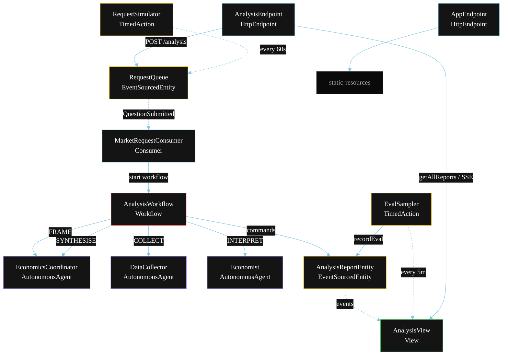
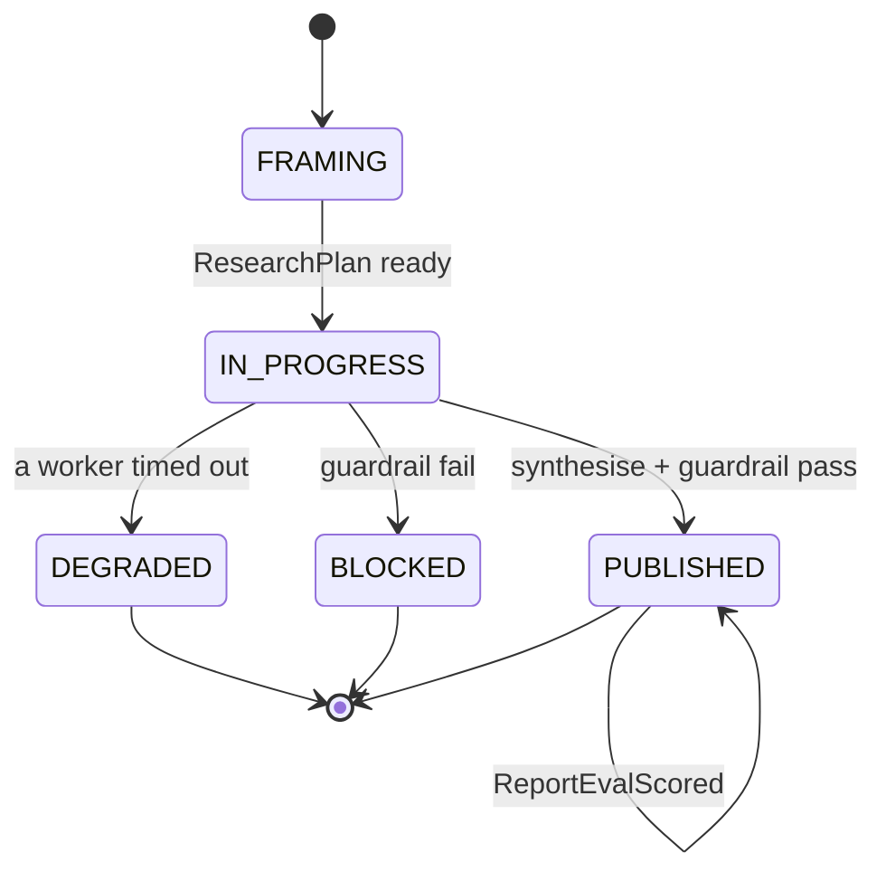
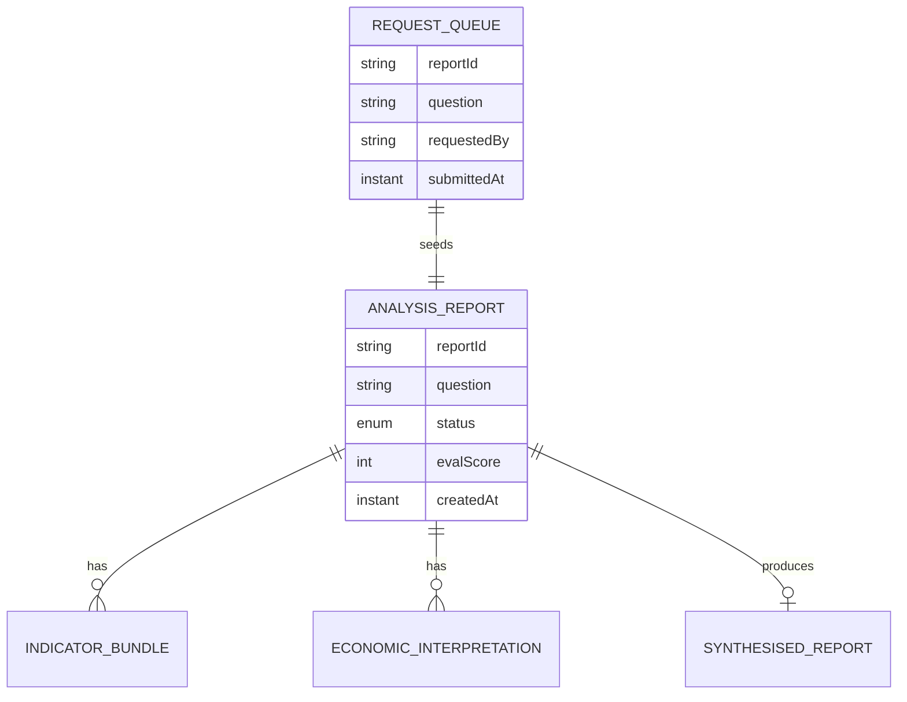

# PLAN — Economic Research Agent

Architectural sketch for `/akka:specify`. Mirrors `SPEC.md` Section 4 component names exactly. Mermaid sources here are rendered on the Architecture tab of the embedded UI; carry the Lesson 24 CSS overrides into the generated `index.html`.

## Component graph



Solid arrows: synchronous commands. Dashed arrows: event subscriptions. Dotted arrows: scheduled ticks.

## Interaction sequence

```mermaid
sequenceDiagram
  participant U as User / Simulator
  participant AE as AnalysisEndpoint
  participant RQ as RequestQueue
  participant WF as AnalysisWorkflow
  participant EC as EconomicsCoordinator
  participant DC as DataCollector
  participant ECO as Economist
  participant RE as AnalysisReportEntity

  U->>AE: POST /api/analysis {question}
  AE->>RQ: enqueueQuestion
  RQ-->>WF: MarketRequestConsumer starts workflow
  WF->>RE: createReport (FRAMING)
  WF->>EC: FRAME -> ResearchPlan
  WF->>RE: status IN_PROGRESS
  par parallel fan-out
    WF->>DC: COLLECT -> IndicatorBundle
  and
    WF->>ECO: INTERPRET -> EconomicInterpretation
  end
  Note over WF: join; if either step times out (60s) -> degradeStep
  WF->>EC: SYNTHESISE(indicators, interpretation) -> SynthesisedReport
  WF->>WF: guardrailStep vets the report
  alt guardrail passes
    WF->>RE: publishReport (PUBLISHED)
  else guardrail fails
    WF->>RE: block (BLOCKED)
  end
```

## State machine



## Entity model



## Component table

| Component | Akka primitive | File path |
|---|---|---|
| `EconomicsCoordinator` | AutonomousAgent | `application/EconomicsCoordinator.java` |
| `DataCollector` | AutonomousAgent | `application/DataCollector.java` |
| `Economist` | AutonomousAgent | `application/Economist.java` |
| `EconomicsTasks` | Task constants | `application/EconomicsTasks.java` |
| `AnalysisWorkflow` | Workflow | `application/AnalysisWorkflow.java` |
| `AnalysisReportEntity` | EventSourcedEntity | `domain/AnalysisReportEntity.java` |
| `RequestQueue` | EventSourcedEntity | `domain/RequestQueue.java` |
| `AnalysisView` | View | `application/AnalysisView.java` |
| `MarketRequestConsumer` | Consumer | `application/MarketRequestConsumer.java` |
| `RequestSimulator` | TimedAction | `application/RequestSimulator.java` |
| `EvalSampler` | TimedAction | `application/EvalSampler.java` |
| `AnalysisEndpoint` | HttpEndpoint | `api/AnalysisEndpoint.java` |
| `AppEndpoint` | HttpEndpoint | `api/AppEndpoint.java` |

## Concurrency notes

- **Step timeouts (Lesson 4):** `collectStep` and `interpretStep` get 60s; `synthesiseStep` gets 90s. The 5s default fails every LLM call. `WorkflowSettings` is nested inside `Workflow` — no import.
- **Parallel fan-out:** `collectStep` and `interpretStep` run concurrently via `CompletionStage` zip, not two sequential step calls.
- **Idempotency:** the workflow id is the `reportId`. Re-delivery of the same `QuestionSubmitted` event resolves to the same workflow instance — no duplicate report.
- **Degrade path (compensation):** if either worker times out, `defaultStepRecovery` routes to `degradeStep`, which synthesises from whichever partial output exists and ends with `ReportDegraded`. No infinite retry.
- **Eval sampling:** `EvalSampler` reads `AnalysisView.getAllReports` (no enum WHERE clause) and filters client-side for the oldest `PUBLISHED` report lacking an `evalScore`.
