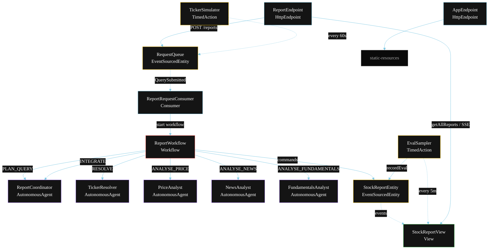
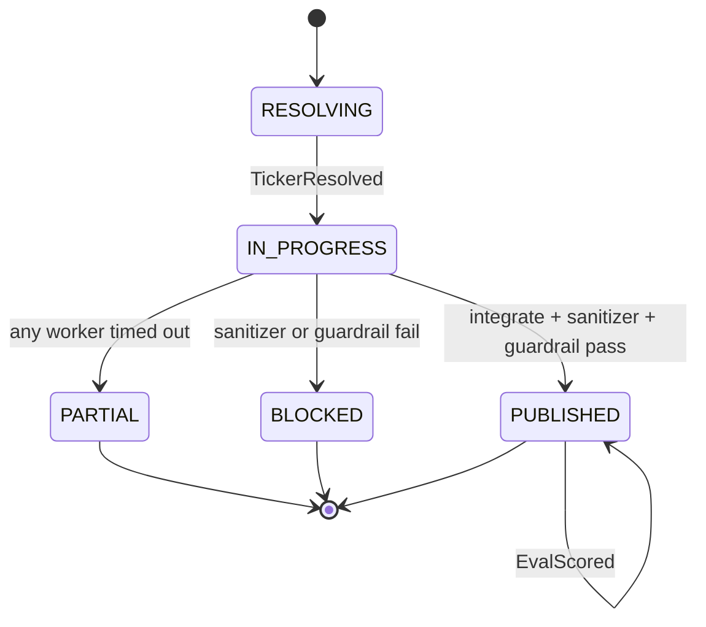
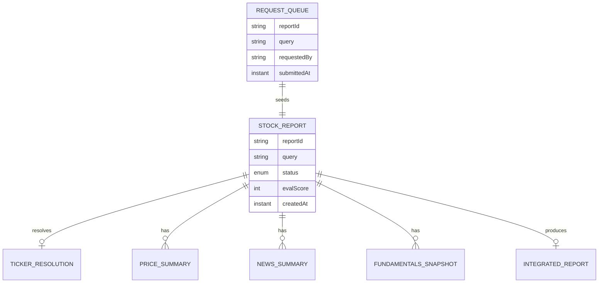

# PLAN — Finance Assistant Swarm Agent

Architectural sketch for `/akka:specify`. Mirrors `SPEC.md` Section 4 component names exactly. Mermaid sources here are rendered on the Architecture tab of the embedded UI; carry the Lesson 24 CSS overrides into the generated `index.html`.

## Component graph



Solid arrows: synchronous commands. Dashed arrows: event subscriptions. Dotted arrows: scheduled ticks.

## Interaction sequence

```mermaid
sequenceDiagram
  participant U as User / Simulator
  participant RE as ReportEndpoint
  participant RQ as RequestQueue
  participant WF as ReportWorkflow
  participant CO as ReportCoordinator
  participant TR as TickerResolver
  participant PA as PriceAnalyst
  participant NA as NewsAnalyst
  participant FA as FundamentalsAnalyst
  participant SE as StockReportEntity

  U->>RE: POST /api/reports {query}
  RE->>RQ: enqueueQuery
  RQ-->>WF: ReportRequestConsumer starts workflow
  WF->>SE: createReport (RESOLVING)
  WF->>CO: PLAN_QUERY -> QueryPlan
  WF->>TR: RESOLVE -> TickerResolution
  WF->>SE: resolveTicker (IN_PROGRESS)
  par parallel fan-out
    WF->>PA: ANALYSE_PRICE -> PriceSummary
  and
    WF->>NA: ANALYSE_NEWS -> NewsSummary
  and
    WF->>FA: ANALYSE_FUNDAMENTALS -> FundamentalsSnapshot
  end
  Note over WF: join; if any step times out (60s) -> partialStep
  WF->>CO: INTEGRATE(price, news, fundamentals) -> IntegratedReport
  WF->>WF: sanitizerStep scrubs compliance phrases
  WF->>WF: guardrailStep vets numeric accuracy
  alt both checks pass
    WF->>SE: publish (PUBLISHED)
  else either check fails
    WF->>SE: block (BLOCKED)
  end
```

## State machine



## Entity model



## Component table

| Component | Akka primitive | File path |
|---|---|---|
| `ReportCoordinator` | AutonomousAgent | `application/ReportCoordinator.java` |
| `TickerResolver` | AutonomousAgent | `application/TickerResolver.java` |
| `PriceAnalyst` | AutonomousAgent | `application/PriceAnalyst.java` |
| `NewsAnalyst` | AutonomousAgent | `application/NewsAnalyst.java` |
| `FundamentalsAnalyst` | AutonomousAgent | `application/FundamentalsAnalyst.java` |
| `FinanceTasks` | Task constants | `application/FinanceTasks.java` |
| `ReportWorkflow` | Workflow | `application/ReportWorkflow.java` |
| `StockReportEntity` | EventSourcedEntity | `domain/StockReportEntity.java` |
| `RequestQueue` | EventSourcedEntity | `domain/RequestQueue.java` |
| `StockReportView` | View | `application/StockReportView.java` |
| `ReportRequestConsumer` | Consumer | `application/ReportRequestConsumer.java` |
| `TickerSimulator` | TimedAction | `application/TickerSimulator.java` |
| `EvalSampler` | TimedAction | `application/EvalSampler.java` |
| `ReportEndpoint` | HttpEndpoint | `api/ReportEndpoint.java` |
| `AppEndpoint` | HttpEndpoint | `api/AppEndpoint.java` |

## Concurrency notes

- **Step timeouts (Lesson 4):** `priceStep`, `newsStep`, and `fundamentalsStep` each get 60s; `integrateStep` gets 90s. The 5s default fails every LLM call. `WorkflowSettings` is nested inside `Workflow` — no import.
- **Parallel fan-out:** `priceStep`, `newsStep`, and `fundamentalsStep` run concurrently via `CompletionStage` zip, not three sequential step calls.
- **Idempotency:** the workflow id is the `reportId`. Re-delivery of the same `QuerySubmitted` event resolves to the same workflow instance — no duplicate report.
- **Degrade path (compensation):** if any worker times out, `defaultStepRecovery` routes to `partialStep`, which integrates from whichever partial outputs exist and ends with `ReportPartial`. No infinite retry.
- **Sanitizer before guardrail:** `sanitizerStep` runs first (deterministic phrase-scrub); `guardrailStep` runs second (LLM judge). Either failure → `BLOCKED`.
- **Eval sampling:** `EvalSampler` reads `StockReportView.getAllReports` (no enum WHERE clause) and filters client-side for the oldest `PUBLISHED` report lacking an `evalScore`.
