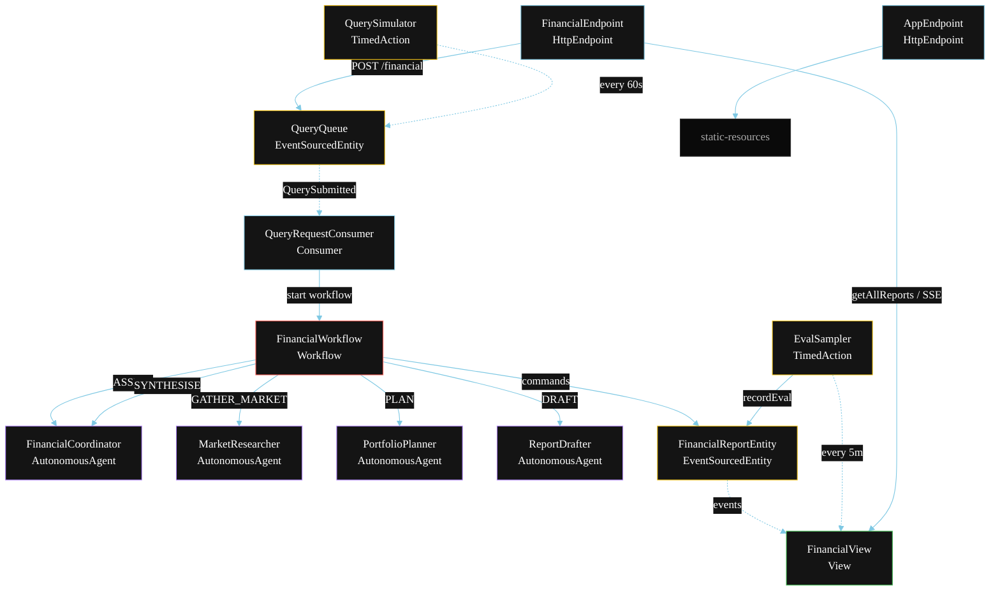
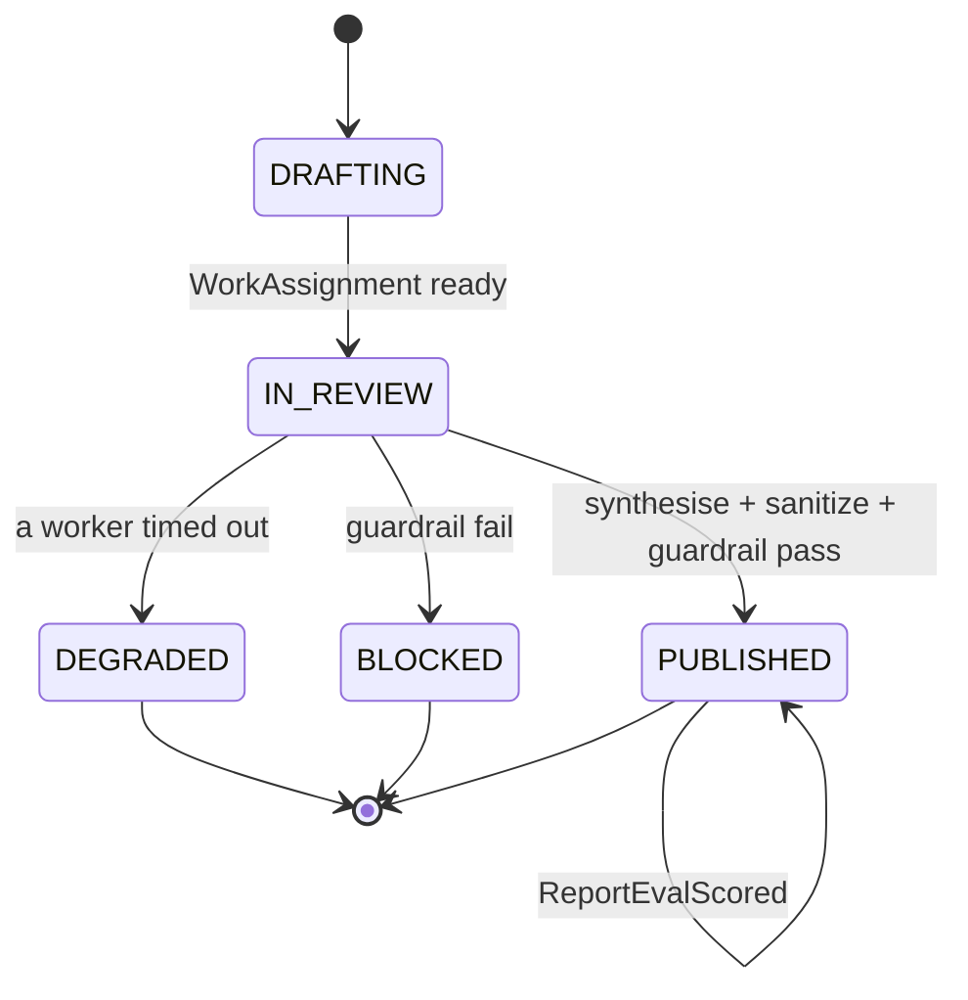
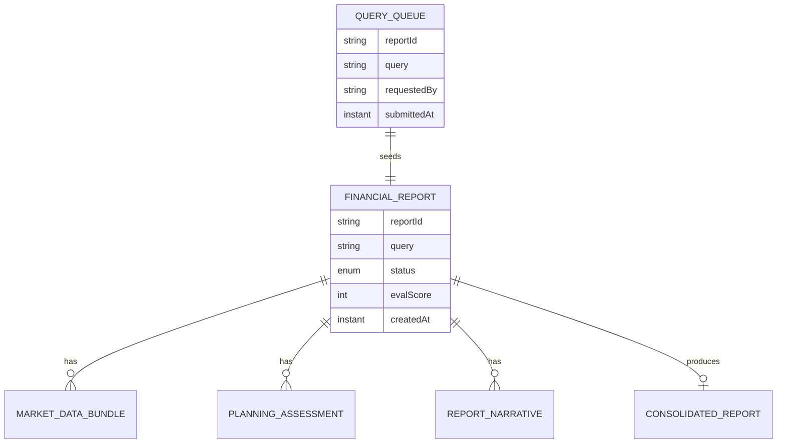

# PLAN — Financial Assistant (Multi-Agent)

Architectural sketch for `/akka:specify`. Mirrors `SPEC.md` Section 4 component names exactly. Mermaid sources here are rendered on the Architecture tab of the embedded UI; carry the Lesson 24 CSS overrides into the generated `index.html`.

## Component graph



Solid arrows: synchronous commands. Dashed arrows: event subscriptions. Dotted arrows: scheduled ticks.

## Interaction sequence

```mermaid
sequenceDiagram
  participant U as User / Simulator
  participant FE as FinancialEndpoint
  participant QQ as QueryQueue
  participant WF as FinancialWorkflow
  participant FC as FinancialCoordinator
  participant MR as MarketResearcher
  participant PP as PortfolioPlanner
  participant RD as ReportDrafter
  participant RE as FinancialReportEntity

  U->>FE: POST /api/financial {query}
  FE->>QQ: enqueueQuery
  QQ-->>WF: QueryRequestConsumer starts workflow
  WF->>RE: createReport (DRAFTING)
  WF->>FC: ASSIGN -> WorkAssignment
  WF->>RE: status IN_REVIEW
  par parallel fan-out
    WF->>MR: GATHER_MARKET -> MarketDataBundle
  and
    WF->>PP: PLAN -> PlanningAssessment
  and
    WF->>RD: DRAFT -> ReportNarrative
  end
  Note over WF: join; if any step times out (60s) -> degradeStep
  WF->>FC: SYNTHESISE(market, planning, narrative) -> ConsolidatedReport
  WF->>WF: sanitizerStep scrubs regulated phrases
  WF->>WF: guardrailStep vets the consolidated report
  alt guardrail passes
    WF->>RE: publish (PUBLISHED)
  else guardrail fails
    WF->>RE: block (BLOCKED)
  end
```

## State machine



## Entity model



## Component table

| Component | Akka primitive | File path |
|---|---|---|
| `FinancialCoordinator` | AutonomousAgent | `application/FinancialCoordinator.java` |
| `MarketResearcher` | AutonomousAgent | `application/MarketResearcher.java` |
| `PortfolioPlanner` | AutonomousAgent | `application/PortfolioPlanner.java` |
| `ReportDrafter` | AutonomousAgent | `application/ReportDrafter.java` |
| `FinancialTasks` | Task constants | `application/FinancialTasks.java` |
| `FinancialWorkflow` | Workflow | `application/FinancialWorkflow.java` |
| `FinancialReportEntity` | EventSourcedEntity | `domain/FinancialReportEntity.java` |
| `QueryQueue` | EventSourcedEntity | `domain/QueryQueue.java` |
| `FinancialView` | View | `application/FinancialView.java` |
| `QueryRequestConsumer` | Consumer | `application/QueryRequestConsumer.java` |
| `QuerySimulator` | TimedAction | `application/QuerySimulator.java` |
| `EvalSampler` | TimedAction | `application/EvalSampler.java` |
| `FinancialEndpoint` | HttpEndpoint | `api/FinancialEndpoint.java` |
| `AppEndpoint` | HttpEndpoint | `api/AppEndpoint.java` |

## Concurrency notes

- **Step timeouts (Lesson 4):** `gatherMarketStep`, `planStep`, and `draftStep` each get 60s; `synthesiseStep` gets 90s. The 5s default fails every LLM call. `WorkflowSettings` is nested inside `Workflow` — no import.
- **Parallel fan-out:** `gatherMarketStep`, `planStep`, and `draftStep` run concurrently via `CompletionStage` allOf/zip chain, not three sequential step calls.
- **Idempotency:** the workflow id is the `reportId`. Re-delivery of the same `QuerySubmitted` event resolves to the same workflow instance — no duplicate report.
- **Degrade path (compensation):** if any worker times out, `defaultStepRecovery` routes to `degradeStep`, which synthesises from whichever partial outputs exist and ends with `ReportDegraded`. No infinite retry.
- **Sanitizer step:** runs deterministic regex replacement on the `ConsolidatedReport` before the guardrail. Replaced phrases are recorded in `sanitizerVerdict`. Only content that cannot be safely replaced propagates a block signal.
- **Eval sampling:** `EvalSampler` reads `FinancialView.getAllReports` (no enum WHERE clause) and filters client-side for the oldest `PUBLISHED` report lacking an `evalScore`.
