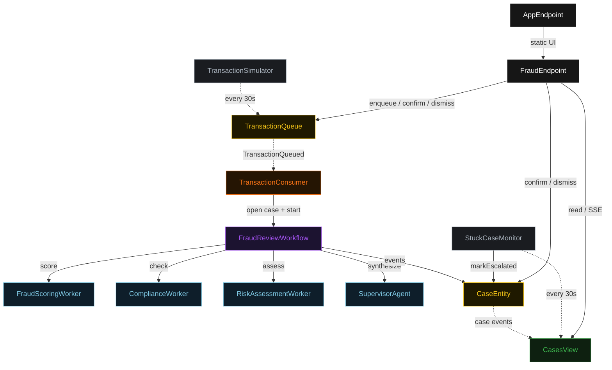
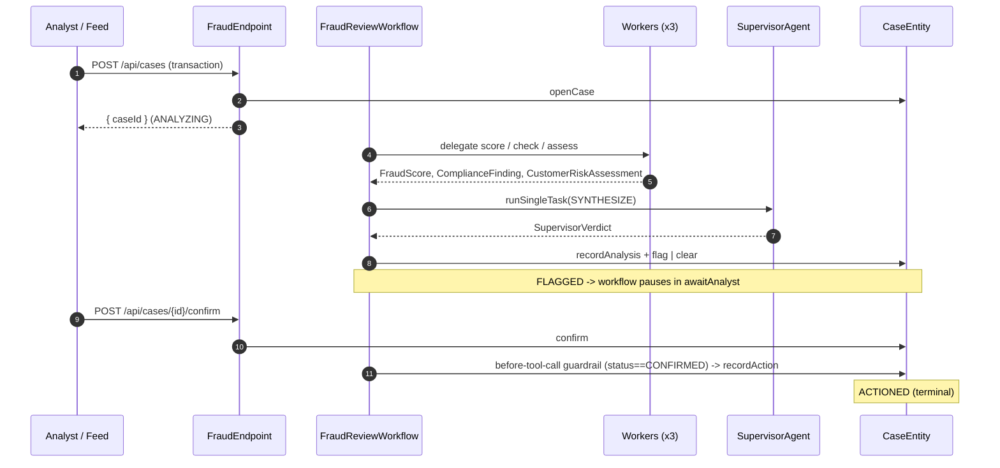
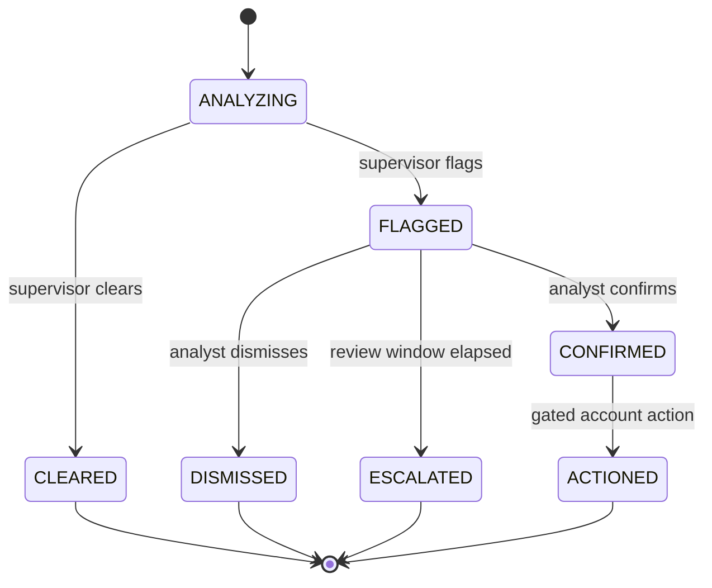
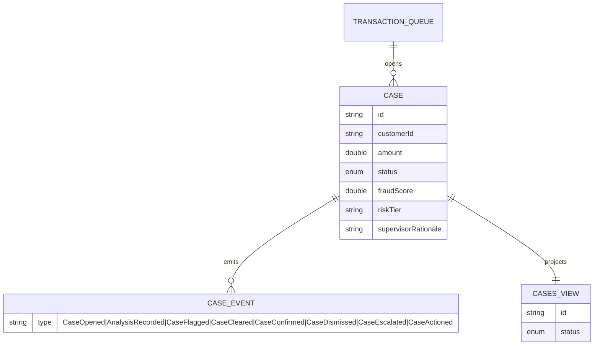

# PLAN — fraud-flagging-team

Architectural sketch for the delegation-supervisor-workers × finance-analysis cell. All four mermaid diagrams + the component table are required. The generated system renders these on the Architecture tab; include the Lesson 24 theme variables and CSS overrides in `index.html`.

---

## Component graph

## Interaction sequence

## State machine

## Entity model

## Component table

| Component | Akka primitive | Path (generated) |
|---|---|---|
| FraudReviewWorkflow | Workflow | `application/FraudReviewWorkflow.java` |
| SupervisorAgent | AutonomousAgent | `application/SupervisorAgent.java` |
| FraudTasks | task constants | `application/FraudTasks.java` |
| FraudScoringWorker | Agent | `application/FraudScoringWorker.java` |
| ComplianceWorker | Agent | `application/ComplianceWorker.java` |
| RiskAssessmentWorker | Agent | `application/RiskAssessmentWorker.java` |
| CaseEntity | EventSourcedEntity | `application/CaseEntity.java` |
| TransactionQueue | EventSourcedEntity | `application/TransactionQueue.java` |
| CasesView | View | `application/CasesView.java` |
| TransactionConsumer | Consumer | `application/TransactionConsumer.java` |
| TransactionSimulator | TimedAction | `application/TransactionSimulator.java` |
| StuckCaseMonitor | TimedAction | `application/StuckCaseMonitor.java` |
| FraudEndpoint | HttpEndpoint | `api/FraudEndpoint.java` |
| AppEndpoint | HttpEndpoint | `api/AppEndpoint.java` |
| FraudCase / events / records | domain | `domain/*.java` |
| Redaction | helper | `domain/Redaction.java` |

## Concurrency notes

- **Step timeouts.** `delegateStep`, `synthesizeStep`, and `actionStep` call LLM agents; each sets `stepTimeout(ofSeconds(60))` (default 5s is too short — Lesson 4). `defaultStepRecovery(maxRetries(2).failoverTo(error))`.
- **Idempotency.** One workflow per case, keyed by the case UUID. `TransactionConsumer` derives the case id deterministically from the queued transaction event offset so a redelivered event does not open a second case.
- **Human gate.** `awaitAnalystStep` self-schedules a 5-second resume timer while the case is `FLAGGED`; the confirm/dismiss endpoints write to `CaseEntity` and the next poll observes the new status. No external queue.
- **Compensation.** The account action is the only side-effecting step and runs after the human gate; the before-tool-call guardrail re-checks `status == CONFIRMED` so a stale resume cannot trigger an action on a dismissed or escalated case.
- **Escalation.** `StuckCaseMonitor` filters `getAllCases` client-side (no enum WHERE — Lesson 2) for `FLAGGED` cases past the review window and calls `markEscalated`, which ends the paused workflow on its next poll.
